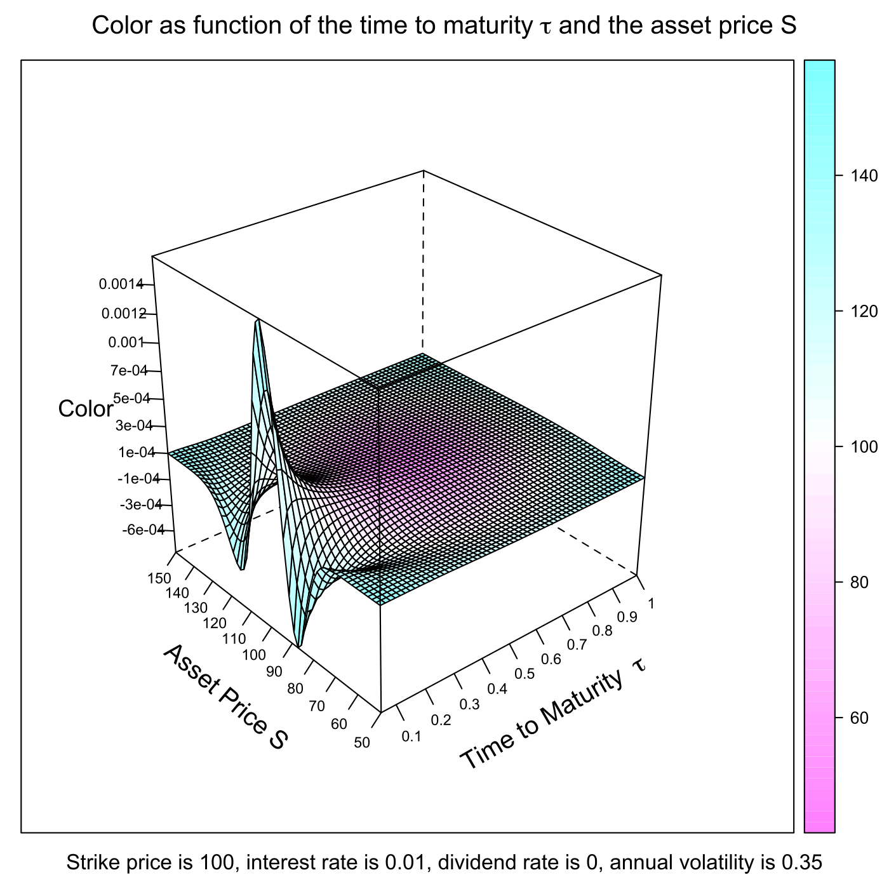

[](http://quantlet.de/index.php?p=info)

## [](http://quantlet.de/) **SFEcolor** [](http://quantlet.de/d3/ia)

```yaml

Name of QuantLet : SFEcolor

Published in : Statistics of Financial Markets

Description : 'Plots the Color of a call option (Color or Gamma bleed or DgammaDtime) as a function
of the time to maturity and the asset price. Color is divided by 365 to reflect the effect of a
single day passing by.'

Keywords : 'asset, black-scholes, call, european-option, financial, graphical representation,
greeks, option, option-price, plot'

Author : Andreas Golle, Awdesch Melzer

Submitted : Tue, July 14 2015 by quantomas

Example : 'User inputs [lower, upper] bound of asset price S like [50,150], [lower, upper] bound of
time to maturity tau like [0.05, 1], then the plot of the Color of a call option is given.'

```




```r
# clear variables and close windows
rm(list = ls(all = TRUE))
graphics.off()

# install and load packages
libraries = c("lattice")
lapply(libraries, function(x) if (!(x %in% installed.packages())) {
    install.packages(x)
})
lapply(libraries, library, quietly = TRUE, character.only = TRUE)

# parameter settings
s1    = 50         # lower bound of Asset Price
s2    = 150        # upper bound of Asset Price 
t1    = 0.05       # lower bound of Time to Maturity
t2    = 1          # upper bound of Time to Maturity
K     = 100        # exercise price 
r     = 0.01       # interest rate
sig   = 0.35       # volatility
d     = 0          # dividend rate
b     = r - d      # cost of carry
steps = 60

meshgrid = function(a, b) {
    list(x = outer(b * 0, a, FUN = "+"), y = outer(b, a * 0, FUN = "+"))
}

first  = meshgrid(seq(t1, t2, -(t1 - t2)/(steps - 1)), seq(t1, t2, -(t1 - t2)/(steps - 1)))
tau    = first$x
dump   = first$y

second = meshgrid(seq(s1, s2, -(s1 - s2)/(steps - 1)), seq(s1, s2, -(s1 - s2)/(steps - 1)))
dump2  = second$x
S      = second$y

# Black-Scholes formula for the option price and the color
d1     = (log(S/K) + (r - d + sig^2/2) * tau)/(sig * sqrt(tau))
d2     = d1 - sig * sqrt(tau)
gamma  = dnorm(d1)/(S * (sig * sqrt(tau)))
color  = gamma * (r - b + b * d1/(sig * sqrt(tau)) + (1 - d1 * d2)/(2 * tau))

# plot
title = bquote(expression(paste("Strike price is ", .(K), ", interest rate is ", 
    .(r), ", dividend rate is ", .(d), ", annual volatility is ", .(sig))))

wireframe((color/365) ~ tau * S, drape = T, ticktype = "detailed", main = expression(paste("Color as function of the time to maturity ", 
    tau, " and the asset price S")), sub = title, scales = list(arrows = FALSE, 
    col = "black", distance = 1, tick.number = 8, cex = 0.7, x = list(labels = round(seq(t1, 
        t2, length = 11), 1)), y = list(labels = round(seq(s1, s2, length = 11), 
        1)), z = list(labels = round(seq(min(color/365), max(color/365), length = 11), 
        4))), xlab = list(expression(paste("Time to Maturity  ", tau)), rot = 30, 
    cex = 1.2), ylab = list("Asset Price S", rot = -40, cex = 1.2), zlab = list("Color", 
    cex = 1.1)) 
```
