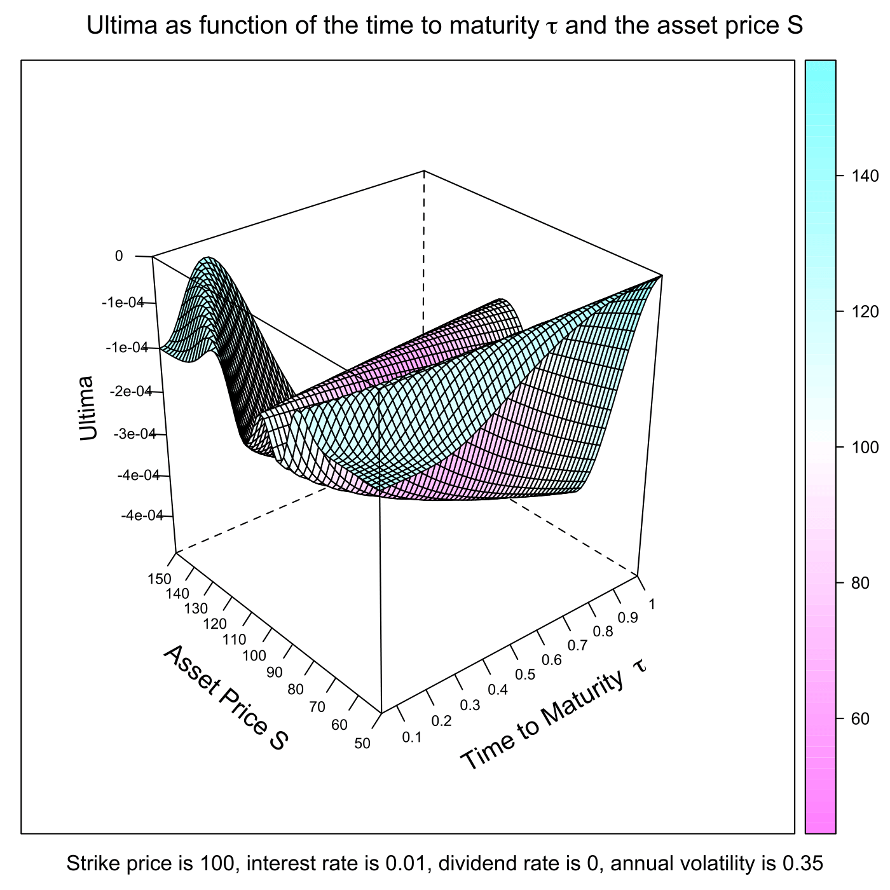

[](http://quantlet.de/)

## [](http://quantlet.de/) **SFEultima** [](http://quantlet.de/)

```yaml

Name of QuantLet : SFEultima

Published in : Statistics of Financial Markets

Description : 'Plots the Ultima of a call option (Ultima or DvommaDvol) as a function of the time
to maturity and the asset price. Ultima is divided by 1,000,000 to reflect a one-percentage point
change in volatility.'

Keywords : 'asset, black-scholes, call, european-option, financial, graphical representation,
greeks, option, option-price, plot'

Author : Andreas Golle, Awdesch Melzer

Submitted : Tue, July 14 2015 by quantomas

Example : 'User inputs [lower, upper] bound of asset price S like [50,150], [lower, upper] bound of
time to maturity tau like [0.05, 1], then the plot of the Ultima of a call option is given.'

```




### R Code:
```r
# clear variables and close windows
rm(list = ls(all = TRUE))
graphics.off()

# install and load packages
libraries = c("lattice")
lapply(libraries, function(x) if (!(x %in% installed.packages())) {
  install.packages(x)
})
lapply(libraries, library, quietly = TRUE, character.only = TRUE)

# parameter settings
s1    = 50      # lower bound of Asset Price
s2    = 150     # upper bound of Asset Price 
t1    = 0.05    # lower bound of Time to Maturity
t2    = 1       # upper bound of Time to Maturity
K     = 100     # exercise price 
r     = 0.01    # interest rate
sig   = 0.35    # volatility
d     = 0       # dividend rate
b     = r - d   # cost of carry
steps = 60

meshgrid = function(a, b) {
    list(x = outer(b * 0, a, FUN = "+"), y = outer(b, a * 0, FUN = "+"))
}

first  = meshgrid(seq(t1, t2, -(t1 - t2)/(steps - 1)), seq(t1, t2, -(t1 - t2)/(steps - 1)))
tau    = first$x
dump   = first$y

second = meshgrid(seq(s1, s2, -(s1 - s2)/(steps - 1)), seq(s1, s2, -(s1 - s2)/(steps - 1)))
dump2  = second$x
S      = second$y

# Black-Scholes formula for the option price and the ultima
d1     = (log(S/K) + (r - d - sig^2/2) * tau)/(sig * sqrt(tau))
d2     = d1 - sig * sqrt(tau)
vega   = S * exp(-d * tau) * dnorm(d1) * sqrt(tau)
vomma  = vega * (d1 * d2/sig)
ultima = vomma * (1/sig) * (d1 * d2 - d1/d2 - d2/d1 - 1)

# plot
title = bquote(expression(paste("Strike price is ", .(K), ", interest rate is ", 
    .(r), ", dividend rate is ", .(d), ", annual volatility is ", .(sig))))

wireframe((ultima/1e+06) ~ tau * S, drape = T, ticktype = "detailed", main = expression(paste("Ultima as function of the time to maturity ", 
    tau, " and the asset price S")), sub = title, scales = list(arrows = FALSE, 
    col = "black", distance = 1, tick.number = 8, cex = 0.7, x = list(labels = round(seq(t1, 
        t2, length = 11), 1)), y = list(labels = round(seq(s1, s2, length = 11), 
        1)), z = list(labels = round(seq(min(ultima/1e+06), max(ultima/1e+06), 
        length = 11), 4))), xlab = list(expression(paste("Time to Maturity  ", 
    tau)), rot = 30, cex = 1.2), ylab = list("Asset Price S", rot = -40, cex = 1.2), 
    zlab = list("Ultima", rot = 95, cex = 1.1)) 

```
