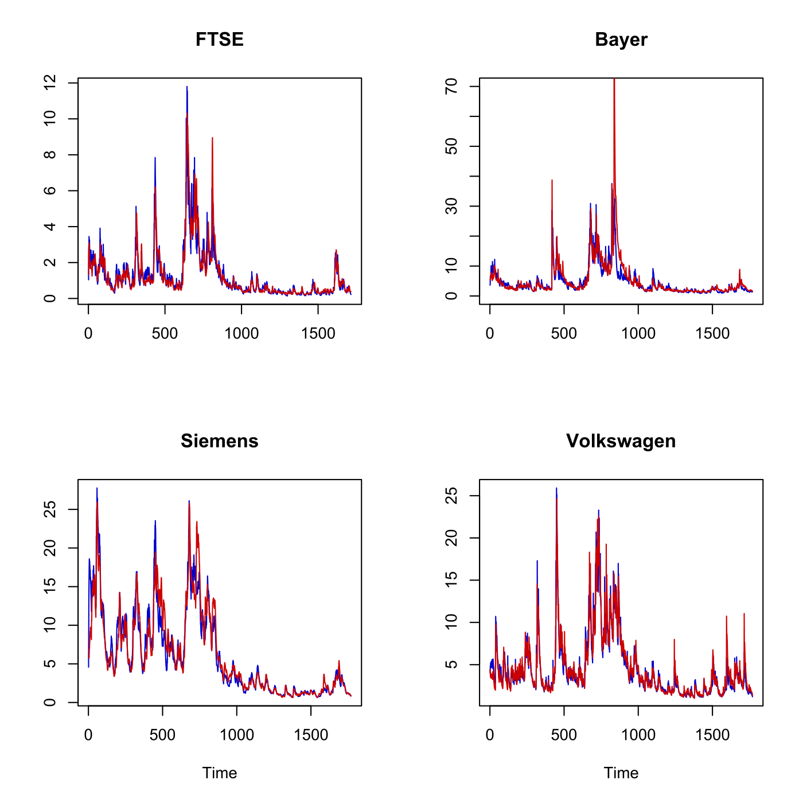
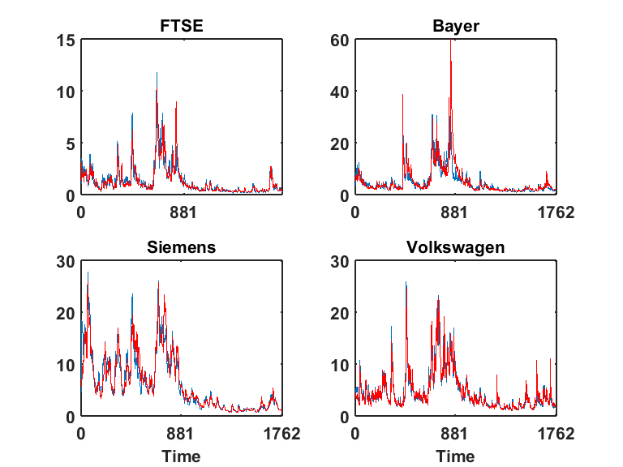

[](http://quantlet.de/)

## [](http://quantlet.de/) **SFECondVola** [](http://quantlet.de/)

```yaml

Name of QuantLet : SFECondVola

Published in : Statistics of Financial Markets

Description : 'Plots conditional volatility forecasts for log-returns of FTSE and DAX stocks
(Bayer, Siemens and Volkswagen) based on the Fractional Integrated Asymmetric Power ARCH (FIAPARCH,
blue) model and the Hyperbolic-GARCH (HYGARCH, red) model.'

Keywords : 'arch, asset, data visualization, dax, descriptive-statistics, financial, forecast,
ftse100, garch, graphical representation, index, log-returns, plot, process, returns, simulation,
stochastic, stochastic-process, stock-price, time-series, volatility'

Author : Awdesch Melzer

Author[Matlab] : Julius Mungo

Submitted : Thu, July 16 2015 by quantomas

Submitted[Matlab] : Tue, May 17 2016 by Christoph Schult

Datafiles : 'ConVola(FIAPARCH)bayer.txt, ConVola(FIAPARCH)ftse.txt, ConVola(FIAPARCH)siemens.txt,
ConVola(FIAPARCH)vw.txt, ConVola(HYGARCH)bayer.txt, ConVola(HYGARCH)ftse.txt,
ConVola(HYGARCH)siemens.txt, ConVola(HYGARCH)vw.txt'

```






### R Code:
```r
# setwd("C:/...")

# clear variables and close windows
rm(list = ls(all = TRUE))
graphics.off()

# FTSE 
x = read.table("ConVola(FIAPARCH)ftse.txt")
n = length(as.matrix(x))

# 2 x 2 plot matrix
par(mfrow = c(2, 2))

plot(as.matrix(x), type = "l", ylab = "", xlab = "", col = "blue3")
title("FTSE")
x1 = read.table("ConVola(HYGARCH)ftse.txt")
lines(as.matrix(x1), col = "red3")

# Bayer
x = read.table("ConVola(FIAPARCH)bayer.txt")
n = length(as.matrix(x))
plot(as.matrix(x), type = "l", ylab = "", xlab = "", col = "blue3", ylim = c(0, 70))
title("Bayer")
x1 = read.table("ConVola(HYGARCH)bayer.txt")
x1 = as.matrix(x1)
lines(x1, col = "red3")

# Siemens
x = read.table("ConVola(FIAPARCH)siemens.txt")
x = as.matrix(x)
plot(x, type = "l", ylab = "", xlab = "Time", col = "blue3")
n = length(x)
title("Siemens")
x1 = read.table("ConVola(HYGARCH)siemens.txt")
x1 = as.matrix(x1)
lines(x1, col = "red3")

# VW
x = read.table("ConVola(FIAPARCH)vw.txt")
x = as.matrix(x)
plot(x, type = "l", ylab = "", xlab = "Time", col = "blue3")
n = length(x)
title("Volkswagen")
x1 = read.table("ConVola(HYGARCH)VW.txt")
lines(x1, col = "red3")

```

### MATLAB Code:
```matlab
close all
clear all
clc

% create plot for FTSE
subplot(2, 2, 1)
x = load('ConVola(FIAPARCH)ftse.txt');
n = length(x);
plot(x)
box on
set(gca, 'LineWidth', 1.6, 'FontSize', 16, 'FontWeight', 'Bold')
hold on;

title('FTSE', 'FontSize', 16, 'FontWeight', 'Bold');
xlabel('');
ylabel('');
set(gca, 'XTick', [0:881:n], 'FontSize', 16, 'FontWeight', 'Bold')
xlim([0 n])

y = load('ConVola(HYGARCH)ftse.txt');
plot(y, '-r')
hold on;

% create plot for Bayer
subplot(2, 2, 2)
x = load('ConVola(FIAPARCH)bayer.txt');
n = length(x);
plot(x)
box on
set(gca, 'LineWidth', 1.6, 'FontSize', 16, 'FontWeight', 'Bold')
hold on;

title('Bayer', 'FontSize', 16, 'FontWeight', 'Bold');
xlabel('');
ylabel('');
set(gca, 'XTick', [0:881:n], 'FontSize', 16, 'FontWeight', 'Bold')
xlim([0 n])
ylim([0 70])

y = load('ConVola(HYGARCH)bayer.txt');

plot(y, '-r')
hold on;

% create plot for Siemens
subplot(2, 2, 3)
x = load('ConVola(FIAPARCH)siemens.txt');
n = length(x);
plot(x)
box on
set(gca, 'LineWidth', 1.6, 'FontSize', 16, 'FontWeight', 'Bold')
hold on;

title('Siemens', 'FontSize', 16, 'FontWeight', 'Bold');
xlabel('Time', 'FontSize', 16, 'FontWeight', 'Bold');
ylabel('');
set(gca, 'XTick', [0:881:n], 'FontSize', 16, 'FontWeight', 'Bold')
xlim([0 n])

y = load('ConVola(HYGARCH)siemens.txt');
plot(y, '-r')
hold on;

% create plot for VW
subplot(2, 2, 4)
x = load('ConVola(FIAPARCH)vw.txt');
n = length(x);
plot(x)
box on
set(gca, 'LineWidth', 1.6, 'FontSize', 16, 'FontWeight', 'Bold')
hold on;

title('Volkswagen', 'FontSize', 16, 'FontWeight', 'Bold');
xlabel('Time', 'FontSize', 16, 'FontWeight', 'Bold');
ylabel('');
set(gca, 'XTick', [0:881:n], 'FontSize', 16, 'FontWeight', 'Bold')
xlim([0 n])

y = load('ConVola(HYGARCH)VW.txt');
plot(y, '-r')
box on
set(gca, 'LineWidth', 1.6, 'FontSize', 16, 'FontWeight', 'Bold')
hold on;

```
