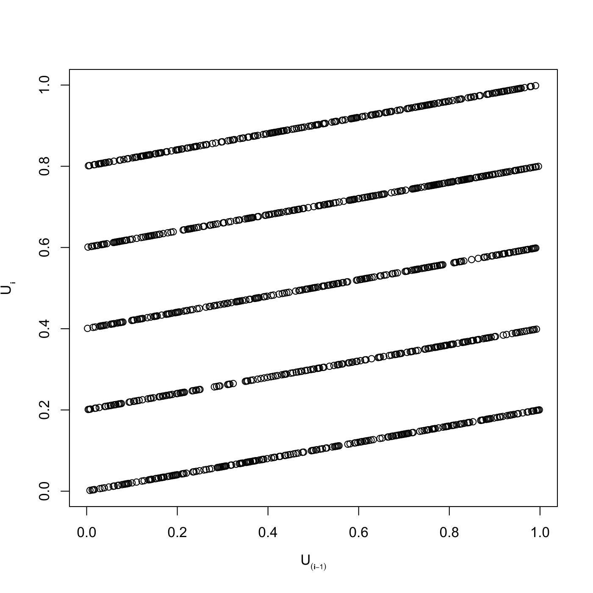

[](http://quantlet.de/)

## [](http://quantlet.de/) **SFErangen2** [](http://quantlet.de/)

```yaml

Name of QuantLet : SFErangen2

Published in : Statistics of Financial Markets

Description : 'Generates uniform random numbers using RANDU generator and produces a 2d plot of
generated numbers where the pairs from the hyperplains can be visible. Shows that the points
generated by the algorithm are lying on 5 straight lines, with c = 0; 1; 2; 3; 4.'

Keywords : 'graphical representation, hyperplain, plot, random, random-number-generation, randu,
scatterplot, simulation, uniform'

See also : SFEfibonacci, SFErandu, SFErangen1

Author : Awdesch Melzer

Submitted : Thu, July 16 2015 by quantomas

Example : 'A plot is provided for the following parameter values: n=1000, a=1229, b=1, M= 2048,
seed=12.'

```




### R Code:
```r
# clear variables and close windows
rm(list = ls(all = TRUE))
graphics.off()

# parameter settings
n    = 1000
a    = 1229
b    = 1
M    = 2048
seed = 12

# main computation
y    = NULL
y[1] = seed
i    = 2
while (i <= n) {
    y[i] = (a * y[i - 1] + b)%%M
    i = i + 1
}
y = y/M

# output
plot(y[1:(n - 2)], y[2:(n - 1)], col = "black", xlab = c(expression(U * bold(scriptstyle(atop(phantom(1), 
    (i - 1)))))), ylab = c(expression(U * bold(scriptstyle(atop(phantom(1), 
    i)))))) 
```
