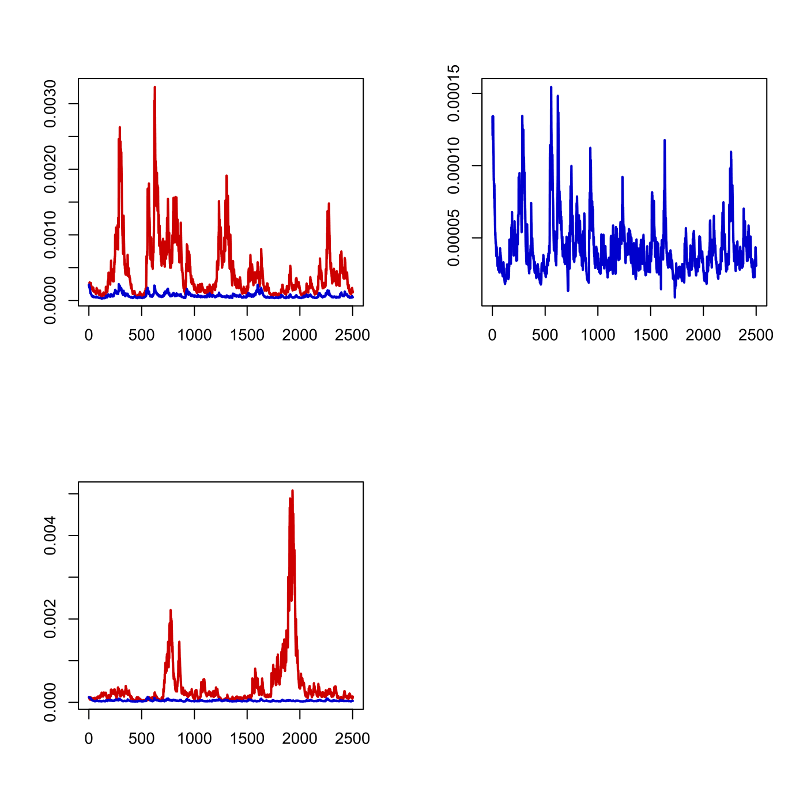

[](http://quantlet.de/)

## [](http://quantlet.de/) **SFEmvol03** [](http://quantlet.de/)

```yaml

Name of QuantLet : SFEmvol03

Published in : Statistics of Financial Markets

Description : 'Reads the date, DAX index values, stock prices of 20 largest companies at Frankfurt
Stock Exchange (FSE), FTSE 100 index values and stock prices of 20 largest companies at London
Stock Exchange (LSE), estimates parameters of a multivariate GARCH model and plots the estimated
variance and covariance processes for the DAX and FTSE 100 daily return processes from 1998 to
2007.'

Keywords : 'asset, covariance, data visualization, dax, descriptive-statistics, financial, ftse100,
garch, graphical representation, index, plot, returns, simulation, stock-price, time-series,
variance'

See also : SFElshill, SFEmvol01, SFEtail, SFEtimeret, SFEvolgarchest, SFEvolnonparest

Author : Andrija Mihoci, Awdesch Melzer

Submitted : Thu, July 16 2015 by quantomas

Datafiles : FSE_LSE.dat

Example : 'Plots of the estimated variance and covariance processes with a bivariate (blue) and two
univariate (red) GARCH processes.'

```




### R Code:
```r
# clear variables and close windows
rm(list = ls(all = TRUE))
graphics.off()

# set pseudo random numbers
set.seed(10)

# Read data for FSE and LSE
DS  = read.table("FSE_LSE.dat")
D   = DS[, 1]                           # date
S   = DS[, 2:43]                        # S(t)
s   = log(S)                            # log(S(t))
end = dim(s)[1]                         # last observation
r   = s[2:end, ] - s[1:(end - 1), ]     # r(t)
n   = dim(r)[1]                         # sample size
t   = 1:n                               # time index, t

# Main computation
C            = t(matrix(c(0.001669, 0.001028, 0, 0.000786), nrow = 2))
A            = t(matrix(c(0.324305, -1e-06, -1e-06, 0.324306), nrow = 2))
B            = t(matrix(c(0.942145, -1e-06, -7e-06, 0.94214), nrow = 2))
sigma_0      = t(cbind(r[, 1], r[, 22])) %*% cbind(r[, 1], r[, 22])/n
vecsigma     = matrix(sigma_0, nrow = dim(sigma_0)[1] * dim(sigma_0)[2], 1)
C_uni        = diag(diag(t(C) %*% C))
A_uni        = diag(diag(A))
B_uni        = diag(diag(B))
sigma_0_uni  = diag(diag(sigma_0))
vecsigma_uni = matrix(sigma_0_uni, dim(sigma_0_uni)[1] * dim(sigma_0_uni)[2], 1)

N = 2500
i = 1
while (i <= N) {
    x_i           = rnorm(2)
    decomp        = svd(sigma_0)  # X = U %*% L %*% t(V)
    U             = decomp$u
    L             = diag(decomp$d)
    V             = decomp$v
    returns_i     = t((U %*% (L^0.5 * t(U))) %*% x_i)
    E_i           = t(returns_i) %*% returns_i
    sigma_i       = t(C) %*% C + t(A) %*% E_i %*% A + t(B) %*% sigma_0 %*% B
    vecsigma      = rbind(vecsigma, matrix(sigma_i, dim(sigma_i)[1] * dim(sigma_i)[2], 1))
    sigma_0       = sigma_i
    returns_i_uni = t(sigma_0_uni^0.5 %*% x_i)
    E_i_uni       = diag(diag(t(returns_i_uni) %*% returns_i_uni))
    sigma_i_uni   = C_uni + t(A_uni) %*% E_i_uni %*% A_uni + t(B_uni) %*% sigma_0_uni %*% B_uni
    vecsigma_uni  = rbind(vecsigma_uni, matrix(sigma_i_uni, dim(sigma_i_uni)[1] * dim(sigma_i_uni)[2], 1))
    sigma_0_uni   = sigma_i_uni
    i             = i + 1
}

vecsigma     = matrix(vecsigma, 4, N + 1)
vecsigma_uni = matrix(vecsigma_uni, 4, N + 1)

# Plots
par(mfrow = c(2, 2))
plot((1:(N + 1)), t(vecsigma_uni[1, ]), type = "l", col = "red3", lwd = 2, xlab = "", 
    ylab = "")
lines((1:(N + 1)), t(vecsigma[1, ]), col = "blue3", lwd = 2)
plot((1:(N + 1)), t(vecsigma[2, ]), type = "l", col = "blue3", lwd = 2, xlab = "", 
    ylab = "")
plot((1:(N + 1)), t(vecsigma_uni[4, ]), type = "l", col = "red3", lwd = 2, xlab = "", 
    ylab = "")
lines((1:(N + 1)), t(vecsigma[4, ]), col = "blue3", lwd = 2) 
```
