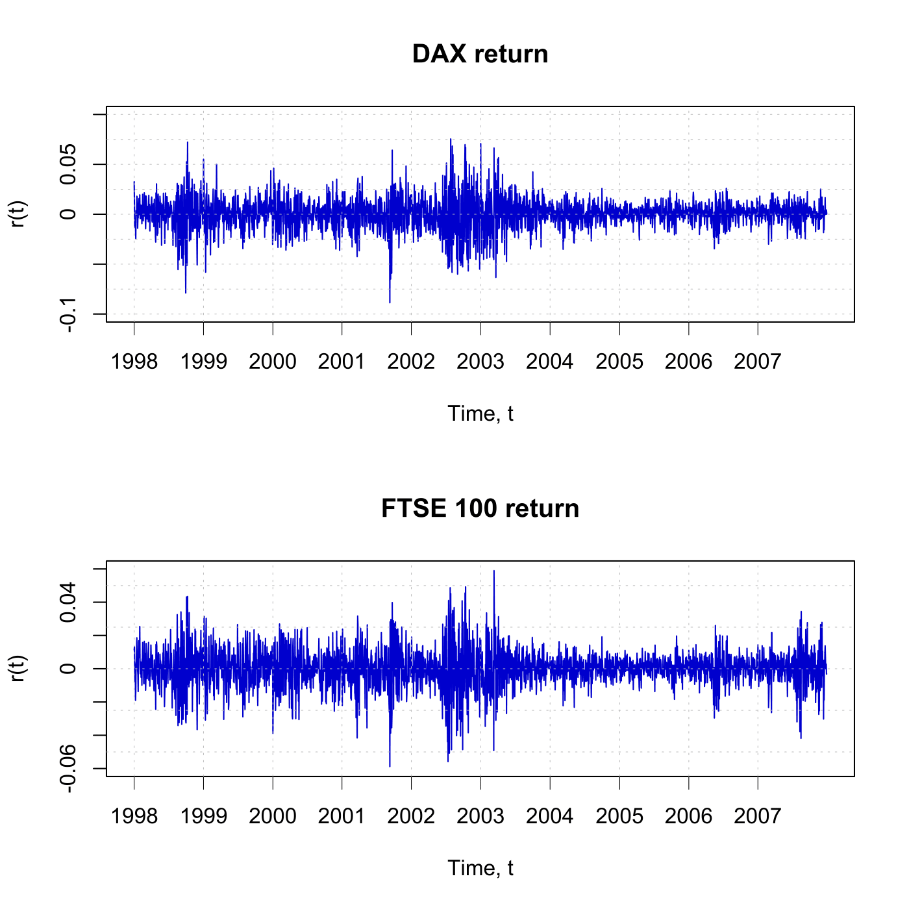

[](http://quantlet.de/)

## [](http://quantlet.de/) **SFEtimeret** [](http://quantlet.de/)

```yaml

Name of QuantLet : SFEtimeret

Published in : Statistics of Financial Markets

Description : 'Reads the date, DAX index values, stock prices of 20 largest companies at Frankfurt
Stock Exchange (FSE), FTSE 100 index values and stock prices of 20 largest companies at London
Stock Exchange (LSE) and plots the time series of the DAX and FTSE 100 daily returns from 1998 to
2007.'

Keywords : 'asset, data visualization, dax, descriptive-statistics, financial, ftse100, graphical
representation, index, plot, returns, stock-price, time-series'

See also : SFElshill, SFEmvol01, SFEmvol03, SFEtail, SFEvolgarchest, SFEvolnonparest

Author : Andrija Mihoci

Submitted : Thu, July 16 2015 by quantomas

Datafiles : FSE_LSE.dat

```




### R Code:
```r
# clear variables and close windows
rm(list = ls(all = TRUE))
graphics.off()

# Read data for FSE and LSE
DS  = read.table("FSE_LSE.dat")
D   = DS[, 1]                       # date
S   = DS[, 2:43]                    # S(t)
s   = log(S)                        # log(S(t))
n1  = dim(s)						
end = n1[1]                         # end of sample
r   = s[-1, ] - s[1:(end - 1), ]    # r(t)
n   = dim(r)[1]                     # sample size
t   = 1:n                           # time index, t

# Labels
time      = strptime(D, format = "%Y%m%d")
labels    = as.numeric(format(as.Date(time, "%Y-%m-%d"), "%Y"))
where.put = c(1, which(diff(labels) == 1) + 1)

# Time series plot of the DAX daily returns
par(mfrow = c(2, 1))
plot(1:n, r[, 1], main = "DAX return", xlab = "Time, t", ylab = "r(t)", frame = TRUE, 
    axes = FALSE, col = "blue3", ylim = c(-0.1, 0.1), type = "l", cex.lab = 1)
axis(side = 2, at = seq(-0.1, 0.1, by = 0.05), label = seq(-0.1, 0.1, 0.05), 
    lwd = 1, cex.axis = 1)
axis(side = 1, at = where.put, label = labels[where.put], lwd = 0.5, cex.axis = 1)
abline(h = seq(-0.1, 0.1, by = 0.025), lty = "dotted", lwd = 0.5, col = "grey")
abline(v = where.put, lty = "dotted", lwd = 0.5, col = "grey")

# Time series plots of the FTSE 100 daily returns
plot(1:n, r[, 22], main = "FTSE 100 return", xlab = "Time, t", ylab = "r(t)", 
    frame = TRUE, axes = FALSE, col = "blue3", ylim = c(-0.06, 0.06), type = "l", 
    cex.lab = 1)
axis(side = 2, at = seq(-0.06, 0.06, by = 0.02), label = seq(-0.06, 0.06, by = 0.02), 
    lwd = 1, cex.axis = 1)
axis(side = 1, at = where.put, label = labels[where.put], lwd = 0.5, cex.axis = 1)
abline(h = seq(-0.1, 0.1, by = 0.025), lty = "dotted", lwd = 0.5, col = "grey")
abline(v = where.put, lty = "dotted", lwd = 0.5, col = "grey") 
```
