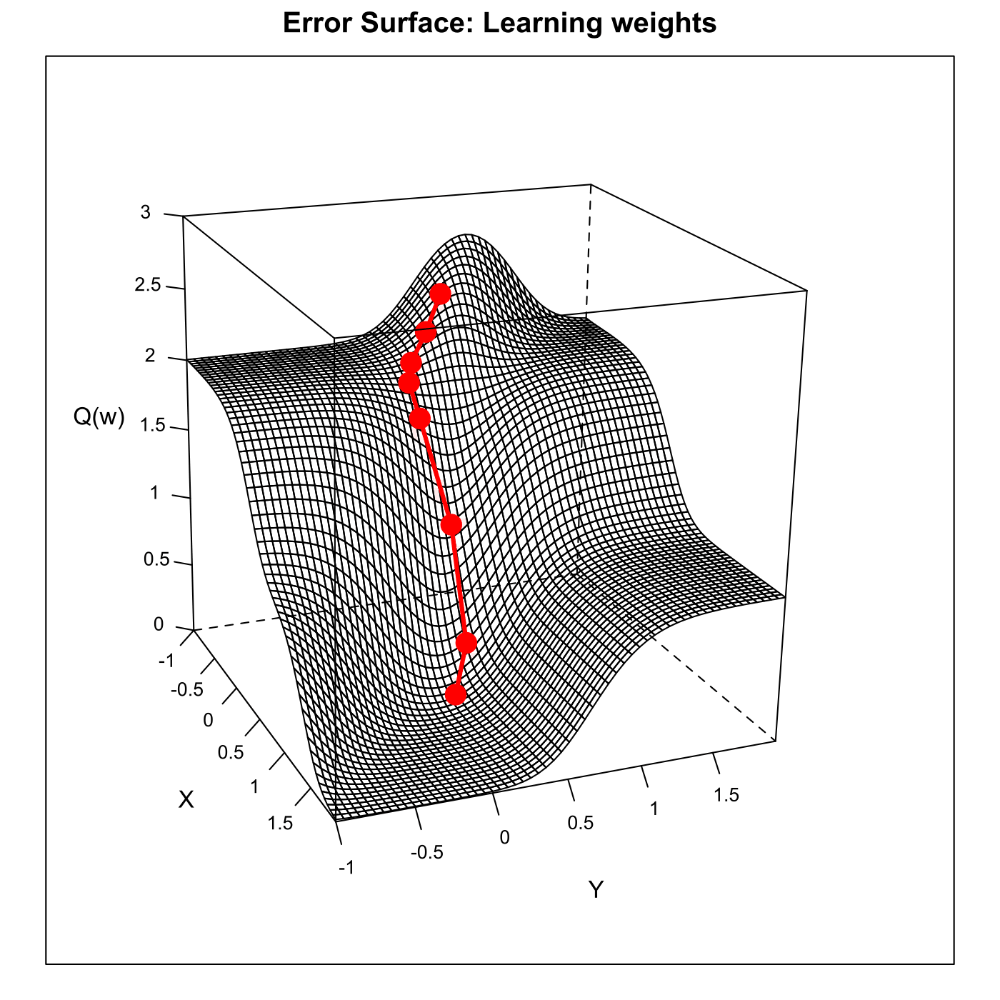

[](http://quantlet.de/index.php?p=info)

## [](http://quantlet.de/) **SFEdescgrad** [](http://quantlet.de/d3/ia)

```yaml

Name of QuantLet : SFEdescgrad

Published in : Statistics of Financial Markets

Description : 'Minimizes the error function Q(w) using sigmoid function as activation function,
following method of descending gradients.'

Keywords : 'descending-gradients, graphical representation, learning-rule, neural-network,
optimization, plot, sigmoid'

See also : SFEerrorsurf, SFEerrorsurf

Author : Joanna Tomanek, Awdesch Melzer

Submitted : Thu, July 16 2015 by quantomas

Example : Plot of gradients descent proceedings.

```




```r
# clear variables and close windows
rm(list = ls(all = TRUE))
graphics.off()

# install and load packages
libraries = c("lattice")
lapply(libraries, function(x) if (!(x %in% installed.packages())) {
    install.packages(x)
})
lapply(libraries, library, quietly = TRUE, character.only = TRUE)

# parameter settings
x     = matrix(c(0, 1, 0, 1, 0, 0, 1, 1), ncol = 2)
y     = c(0, 1, 0, 1)
bias  = 0.5                             # bias
p     = 5   
epoch = 8
activ = 1                               # use activity function
k     = 60                              # of steps
s     = -1                              # starting point
b     = 0.05                            # bandwidth
q     = seq(s, by = b, length.out = k)  # compute sequence
q     = as.matrix(q)

# Main computation 

# use Widrow-Hoff learning rule
w = matrix(1, k^2, 2)
for (i in 1:k) {
    for (j in 1:k) {
        w[i + (j - 1) * k, 1] = q[i]
        w[i + (j - 1) * k, 2] = q[j]
    }
}

# sigmoid function
w4 = matrix(0, nrow = nrow(w), 1)
i  = 1
while (i <= nrow(x)) {
    w1 = x[i, 1] * w[, 1] + x[i, 2] * w[, 2] - bias
    if (activ == 1) 
        w2 = 1/(1 + exp(-p * w1))
    if (activ == 0) {
        w2 = w1/abs(w1)
        w2 = replace(w2, c(NaN, -1), 0)
    }
    w3 = (y[i] - w2)^2
    w4 = w4 + w3
    i  = i + 1
}
aa = cbind(w, w4)
w  = t(c(-0.7, 0.7))            # initial weights 
e  = 1                          # initializes epochs
aa = matrix(0, 1, ncol = 3)
while (e <= epoch) {
    sumerro = 0
    sumgrad = 0
    i = 1
    # calculates for each weight
    while (i <= nrow(x)) {
        inp     = (sum(w * t(x[i, ])) - bias)   # the error function Q(w)
        activ   = 1/(1 + exp(-p * inp))         # activation function
        deriv   = activ * (1 - activ)           # derivative of activation function
        erro    = (y[i] - activ)
        sqerr   = erro^2                        # squared error
        sumerro = sumerro + sqerr
        grad    = 2 * erro * deriv * t(x[i, ])  # gradient
        sumgrad = sumgrad + grad                # sum up gradients
        i       = i + 1
    }
    bb = cbind(w, sumerro)
    w  = w + sumgrad                            # corrects weights
    aa = rbind(aa, bb)
    d1 = aa[2:nrow(aa), 1]
    d2 = aa[2:nrow(aa), 2]
    d3 = aa[2:nrow(aa), 3]
    e  = e + 1                                  # next training period
}
w4res = matrix(w4, 60, byrow = T)               # reshape w4
pts = cbind(d1, d2, d3)                         # redefine points

meshgrid = function(a, b) {
    # define meshfunction
    list(x = outer(b * 0, a, FUN = "+"), y = outer(b, a * 0, FUN = "+"))
}
a = meshgrid(seq(s, by = b, length.out = k), seq(s, by = b, length.out = k))  

# plot
wireframe(w4res ~ a$x + a$y, pts = pts, main = "Error Surface: Learning weights", 
    screen = list(z = -70, x = -70, y = 3), aspect = c(1, 1), scales = list(arrows = FALSE, 
        x = list(labels = seq(-1, 2, 0.5)), y = list(labels = seq(-1, 2, 0.5)), z = list(labels = seq(0, 
            3, 0.5))), xlab = "X", ylab = "Y", zlab = "Q(w)", zlim = c(0, 3), panel.3d.wireframe = function(x, 
        y, z, xlim, ylim, zlim, xlim.scaled, ylim.scaled, zlim.scaled, pts, drape = drape, 
        ...) {
        panel.3dwire(x, y, z, xlim = xlim, ylim = ylim, zlim = zlim, xlim.scaled = xlim.scaled, 
            ylim.scaled = ylim.scaled, zlim.scaled = zlim.scaled, drape = TRUE, ...)
        
        panel.3dscatter(pts[, 1], pts[, 2], pts[, 3], xlim = xlim, ylim = ylim, zlim = zlim, 
            xlim.scaled = xlim.scaled, ylim.scaled = ylim.scaled, zlim.scaled = zlim.scaled, 
            type = "o", col = c(2), lwd = 3, cex = 1.7, pch = c(19), .scale = TRUE, 
            ...)
    })
```
