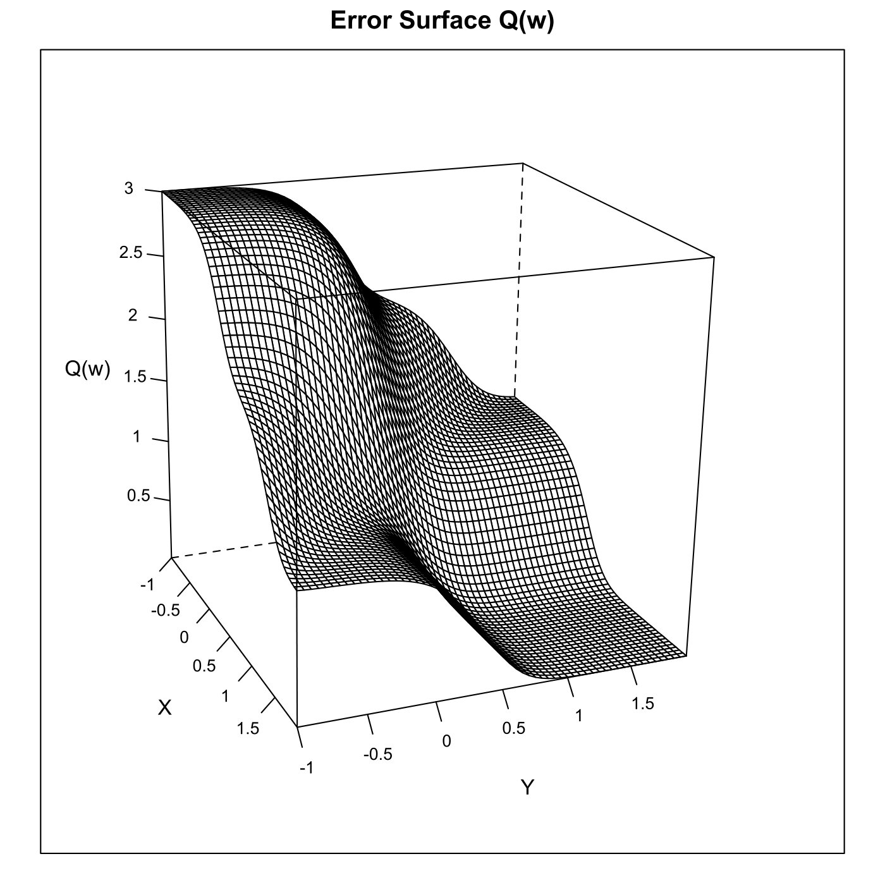
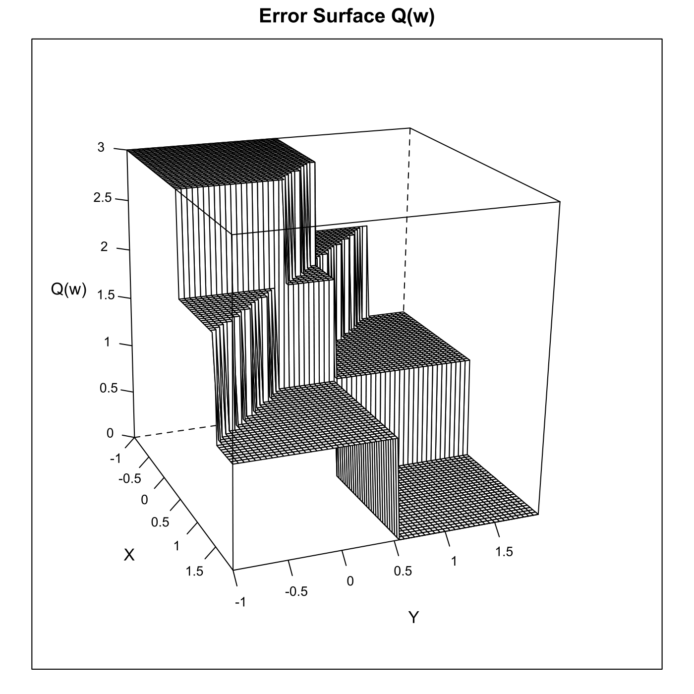

[](http://quantlet.de/index.php?p=info)

## [](http://quantlet.de/) **SFEerrorsurf** [](http://quantlet.de/d3/ia)

```yaml

Name of QuantLet : SFEerrorsurf

Published in : Statistics of Financial Markets

Description : 'Plots the error surface of Q(w) with sigmoid function and threshold function as
activation function.'

Keywords : 'error-surface, graphical representation, learning-rule, neural-network, optimization,
plot, sigmoid, threshold'

See also : SFEdescgrad

Author : Joanna Tomanek, Awdesch Melzer

Submitted : Thu, July 16 2015 by quantomas

Example : 'Error surface of Q(w) with sigmoid function as activation function., Error surface of
Q(w) with threshold function as activation function.'

```






```r
# clear variables and close windows
rm(list = ls(all = TRUE))
graphics.off()

# install and load packages
libraries = c("lattice")
lapply(libraries, function(x) if (!(x %in% installed.packages())) {
    install.packages(x)
})
lapply(libraries, library, quietly = TRUE, character.only = TRUE)

# parameter settings
x    = matrix(c(0, 1, 0, 1, 0, 0, 1, 1), ncol = 2)
y    = cbind(0, 1, 1, 1)   # boolean function OR
bias = 0.5
p    = 5
k    = 60
s    = -1
b    = 0.05
q    = seq(s, by = b, length.out = k)
q    = as.matrix(q)

# Main computation 

# use Widrow-Hoff learning rule
w = matrix(1, k^2, 2)
for (i in 1:k) {
    for (j in 1:k) {
        w[i + (j - 1) * k, 1] = q[i]
        w[i + (j - 1) * k, 2] = q[j]
    }
}

# sigmoid function
w4 = matrix(0, nrow = nrow(w), 1)
i  = 1
while (i <= nrow(x)) {
    w1 = x[i, 1] * w[, 1] + x[i, 2] * w[, 2] - bias
    w2 = 1/(1 + exp(-p * w1))
    w3 = (y[i] - w2)^2
    w4 = w4 + w3
    i  = i + 1
}
aa    = cbind(w, w4)
w4res = matrix(w4, 60, byrow = T)  # reshape w4

meshgrid = function(a, b) {
    # define meshfunction
    list(x = outer(b * 0, a, FUN = "+"), y = outer(b, a * 0, FUN = "+"))
}
a = meshgrid(seq(s, by = b, length.out = k), seq(s, by = b, length.out = k))  # compute meshgrid

# plot 1 - for sigmoid function
wireframe(w4res ~ a$x + a$y, main = "Error Surface Q(w)", screen = list(z = -70, 
    x = -70, y = 3), aspect = c(1, 1), scales = list(arrows = FALSE, x = list(labels = seq(-1, 
    2, 0.5)), y = list(labels = seq(-1, 2, 0.5)), z = list(labels = seq(0, 3, 0.5))), 
    xlab = "X", ylab = "Y", zlab = "Q(w)")

# theshold function
w4 = matrix(0, nrow = nrow(w), 1)
i = 1
while (i <= nrow(x)) {
    w1 = x[i, 1] * w[, 1] + x[i, 2] * w[, 2] - bias
    w2 = w1/abs(w1)
    w2 = cbind(w2)
    w2[w2 == -1] = 0                # replace -1 with 0
    w2[is.nan(w2) == TRUE] = 0      # replace NaN with 0
    w3 = (y[i] - w2)^2
    w4 = w4 + w3
    i = i + 1
}
w4res = matrix(w4, 60, 60)  # reshape

# plot 2 - for theshold function
dev.new()
wireframe(w4res ~ a$x + a$y, main = "Error Surface Q(w)", screen = list(z = -70, 
    x = -70, y = 3), aspect = c(1, 1), scales = list(arrows = FALSE, x = list(labels = seq(-1, 2, 0.5)), y = list(labels = seq(-1, 2, 0.5)), z = list(labels = seq(0, 3, 0.5))), 
    xlab = "X", ylab = "Y", zlab = "Q(w)") 

```
