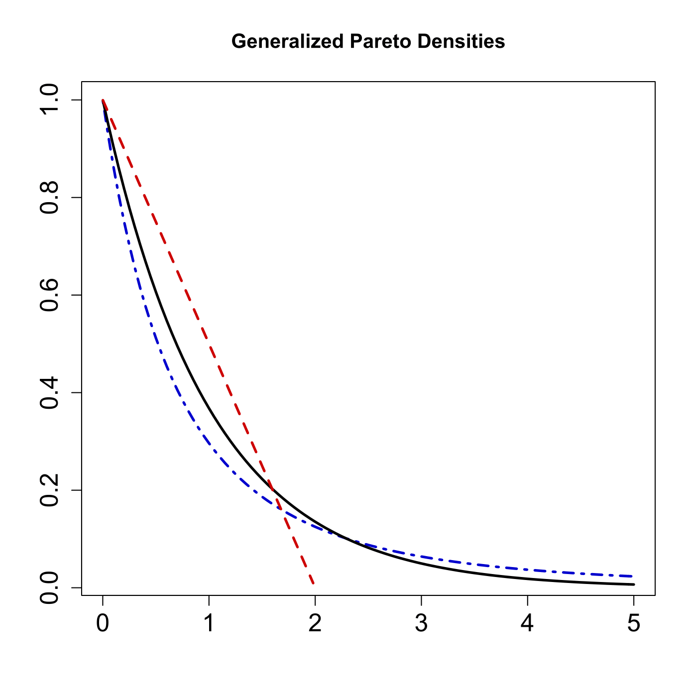

[](http://quantlet.de/)

## [](http://quantlet.de/) **SFEgpdist** [](http://quantlet.de/)

```yaml

Name of QuantLet : SFEgpdist

Published in : Statistics of Financial Markets

Description : 'Generates and plots generalized standard Pareto densities for different shape
parameters: gamma=0.5 (dash-dot line), gamma=0 (solid line), gamma=-0.5 (broken line).'

Keywords : 'density, distribution, extreme-value, generalized-pareto-model, graphical
representation, pareto, plot, simulation, standard'

See also : SFEtailGEV_pp, SFEtailGEV_qq, SFEtailGPareto_pp, SFEtailGPareto_qq, SFStailGPareto

Author : Joanna Tomanek

Submitted : Thu, July 16 2015 by quantomas

```




### R Code:
```r
# clear variables and close windows
rm(list = ls(all = TRUE))
graphics.off()

# install and load packages
libraries = c("evd")
lapply(libraries, function(x) if (!(x %in% installed.packages())) {
    install.packages(x)
})
lapply(libraries, library, quietly = TRUE, character.only = TRUE)

# parameter settings
n  = 100
sp = 5
r  = c(0.5, 0, -0.5)  # values of shape parameter gamma

# x>0 with gamma>0
x1	= seq(0.001, by = 0.05, length.out = 101)  
dist1 = cbind(x1, dgpd(x1, shape = r[1]))  # generate standard Pareto density given parameter gamma

# x>=0 with gamma=0
x2 = c(0.001, sp * (1:n)/n) 
dist2 = cbind(x2, dgpd(x2, shape = r[2]))

# 0<x<-1/gamma with gamma<0
x3 = seq(0.001, by = -1/r[3]/n, length.out = 100)  
dist3 = cbind(x3, dgpd(x3, shape = r[3]))

# Plot
plot(dist1, type = "l", lty = 4, col = "blue3", lwd = 2.5, ylab = "", xlab = "", 
    main = "Generalized Pareto Densities", cex.axis = 1.5)
lines(dist2, lty = 1, col = "black", lwd = 2.5)
lines(dist3, lty = 2, col = "red3", lwd = 2.5) 
```
