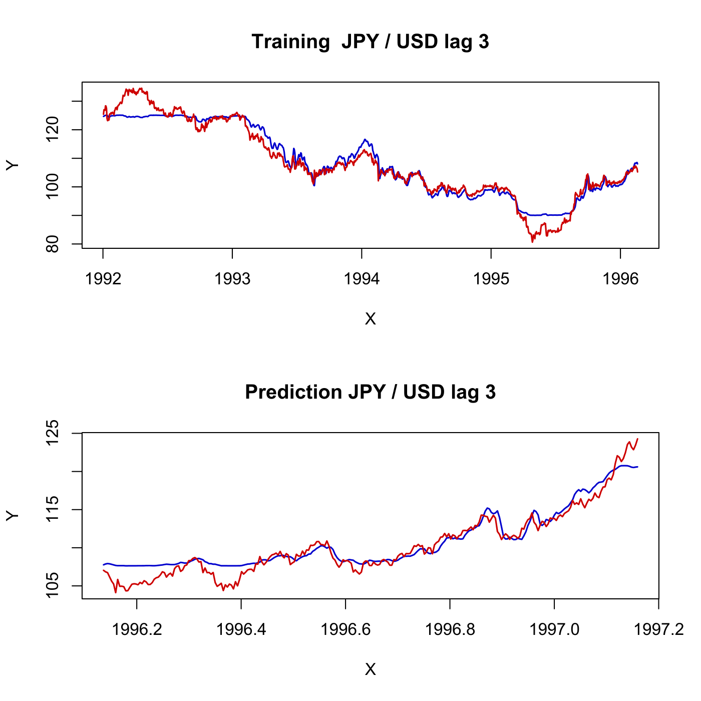

[](http://quantlet.de/)

## [](http://quantlet.de/) **SFEnnjpyusd** [](http://quantlet.de/)

```yaml

Name of QuantLet : SFEnnjpyusd

Published in : Statistics of Financial Markets

Description : 'Shows the forecasting of the exchange rate time series JPY/USD using RBF (radial
basis function) neural networks considering 3 periods of time dependency. 80% of data is taken as
training set and 20% as validation set.'

Keywords : 'approximation, data visualization, exchange-rate, financial, forecast, graphical
representation, neural-network, plot, rbf, time-series, visualization'

See also : SFEnnarch

Author : Awdesch Melzer

Submitted : Thu, July 16 2015 by quantomas

Datafiles : XFGTHBbasket1.dat

Example : 'Plots the real exchange rate JPY/USD (red) versus its approximation through RBF neural
network (blue): training set(above) and forecasts(below).'

```




### R Code:
```r
# clear variables and close windows
rm(list = ls(all = TRUE))
graphics.off()

# SUBROUTINES 

rbftrain = function(x, y, clusters, learn, epochs, mMSE, activ) {
# RBFTRAIN    trains a radial basis function neural network
# ---------------------------------------------------------------------
# Usage       {inp,net,err} = rbftrain(x,y,clusters,learn,epochs,mMSE{,activ})
# ---------------------------------------------------------------------
# Input   
# x           - (n x p) matrix, predictor variables
# y           - (n x q) matrix, response variables
# clusters    - scalar, number of clusters to be built in the hidden layer
# learn       - (3 x 1) vector, minimum learning rate and maximum learning rate for building the clusters respectively, learn[3] is the learning rate for training the output layer. learn must be from (0,1).
# epochs      - (2 x 1) vector, number of epochs to train the cluster and output units respectively
# mMSE        - scalar, minimum value of the mean squared error to stop the training
# activ       - optional scalar, 0 for binary (default) or 1 for bipolar activation sigmoid function.
# ---------------------------------------------------------------------
# Output      
# inp - list of input parameters which define the network# it consists of elements:
#             inputs (scalar, number of predictors),
#             clusters (see Input), 
#             outputs (scalar, number of responses),
#             samples (scalar, number of samples),
#             learn, epochs, mMSE and activ (see Input).
# net - list of network characteristics containing: 
#             clustersWeights ((clusters x inputs) matrix, weights of the hidden layer),
#             trFonDev ((clusters x 1) vector, deviance of the transfer function),
#             outputsWeights ((outputs x clusters) matrix, weights of the output layer),
#             bias ((outputs x 1) vector, weights of the bias).
# err - list of output error functions containing:
#             MSE ((epochs[2] x 1) vector, mean squared error for the network in each training epoch),
#             maxDiff ((epochs[2] x outputs) matrix, maximum difference between the real and predicted output in each output unit for each training epoch),
#             meanDiff ((epochs[2] x outputs) matrix, mean differences in every training epoch).
    
    if (NROW(x) != NROW(y)) {
        stop("rbftrain: rows(x) <> rows(y)")
    }
    if (clusters < 2) {
        stop("rbftrain: clusters < 2")
    }
    if ((NCOL(learn) > 1) || (NROW(learn) != 3)) {
        stop("rbftrain: learn must be (3x1) vector")
    }
    if (sum(learn) <= 0 || sum(learn) >= 1) {
        stop("rbftrain: each parameter of learn must be from (0,1)")
    }
    if ((NCOL(epochs) > 1) || (NROW(epochs) != 2)) {
        stop("rbftrain: epochs must be (2x1) vector")
    }
    if (sum(epochs) < 1) {
        stop("rbftrain: epochs < 1")
    }
    if (mMSE <= 0) {
        stop("rbftrain: mMSE must be positive")
    }
    if (missing(activ)) {
        activ = 0
    }
    if ((activ != 0) && (activ != 1)) {
        stop("rbftrain: activ must be 0 or 1")
    }
    
    # parameter settings
    inputs  = NCOL(x)   # dimension of the signal
    outputs = NCOL(y)   # number of output units
    samples = NROW(x)   # number of observations
    # warning((inputs > 24)||(outputs > 10),'rbftrain: the dimensions of the data are
    # too high')
    interimLR = 1       # initialize the learning rate
    
    # unsupervised learning
    
    # declare arrays
    clustersOutput  = matrix(1, clusters, 1)    # output signal from the cluster nodes
    clustersWeights = runif(clusters * inputs)  # centers of the clusters
    clustersWeights = matrix(clustersWeights, clusters, inputs, byrow = T)
    trFonDev        = matrix(0, clusters, 1)    # deviance of the transfer function
    
    # normalize
    minx = apply(x, 2, min)
    maxx = apply(x, 2, max)
    miny = apply(y, 2, min)  # used in the supervised learning also
    maxy = apply(y, 2, max)  # tt- || -
    if (sum((maxx == minx)) > 0) {
        stop("rbftrain: x has a constant variable")
    }
    if (sum((maxy == miny)) > 0) {
        stop("rbftrain: y has a constant variable")
    }
    x = (x - matrix(minx, NROW(x), NCOL(x), byrow = T))/(matrix(maxx, NROW(x), NCOL(x), 
        byrow = T) - matrix(minx, NROW(x), NCOL(x), byrow = T))
    y = (y - matrix(miny, NROW(y), NCOL(y), byrow = T))/(matrix(maxy, NROW(y), NCOL(y), 
        byrow = T) - matrix(miny, NROW(y), NCOL(y), byrow = T))
    
    # train the clusters
    e1 = 1
    while (e1 <= epochs[1]) {
        i = 1
        while (i <= samples) {
            # find the nearest cluster
            X = matrix(x[i, ], clusters, NCOL(x), byrow = T)
            clustersOutput = sqrt(apply((clustersWeights - X) * (clustersWeights - 
                X), 1, sum))  		# eucl. distance: i-th point from cluster centers
            tmp = (1:clusters) * (clustersOutput == min(clustersOutput))  # choose the nearest cluster
            tmp = tmp[which(tmp > 0)]
            clusterChamp = tmp[1]	# just in case of multiple minima
            
            # update weights of the nearest cluster
            clustersWeights[clusterChamp, ] = clustersWeights[clusterChamp, ] + (interimLR * 
                (x[i, ] - clustersWeights[clusterChamp, ]))
            i = i + 1
        }  
        
        interimLR = (learn[2] - (learn[2] - learn[1])/max(c(1, (epochs[1] - 1))) * 
            (e1 - 1)) * interimLR  #//!!! was above 'clustersWeights[clusterChamp,] = ...'
        if (interimLR == 0) {
            e1 = epochs[1] + 1
        }
        e1 = e1 + 1
    }
    
    # calculate standard deviation of the transfer function
    c = 1
    while (c <= clusters) {
        W = matrix(clustersWeights[c, ], clusters, ncol(clustersWeights), byrow = T)
        trFonDev[c] = sum(rowSums((W - clustersWeights) * (W - clustersWeights)))  # sum of distances of the center c from other centres
        trFonDev[c] = sqrt(trFonDev[c]/(clusters - 1))
        c = c + 1
    }
    
    # supervised learning
    
    # declare arrays
    gaussOut          = matrix(1, clusters, 1)          # output of the Gaussian function of each cluster
    uniform           = runif(outputs * clusters)
    outputsWeights    = 2 * matrix(uniform, outputs, clusters, byrow = T) - 1  # weights of the output layer
    outWeightsCorrect = matrix(1, outputs, clusters)    # correction weights
    bias              = 2 * runif(outputs) - 1          # bias of each output node
    maxDiff           = matrix(-1, epochs[2], outputs)  # max difference of each output node in each epoch
    meanDiff          = matrix(0, epochs[2], outputs)   # mean          ---  |  |  ---
    MSE               = matrix(0, epochs[2], 1)         # mean squared error for each epoch
    aMSE              = +Inf                            # actual mean squared error
    
    e2 = 1
    while (e2 <= epochs[2]) {
        i = 1
        while (i <= samples) {
            outError = 0  # error of this output unit
    
            # calculate the Gaussian output of clusters
            X = matrix(x[i, ], clusters, NCOL(x), byrow = T)
            clustersOutput = sqrt(rowSums((clustersWeights - X) * (clustersWeights - 
                X)))  # euclidean distance      
            gaussOut = exp(-(clustersOutput/trFonDev)^2)
            
            # calculate output signals and their derivative for each cluster
            G = matrix(1, outputs, ncol((gaussOut))) %*% t(gaussOut)
            sumOfWeightedInputs = rowSums(outputsWeights * G) + bias  # lin. comb. of the inputs and weights of the output layer
            if (!activ) {
                # binary sigmoid function
                outputSignal = 1/(1 + exp(-sumOfWeightedInputs))
                outSigDeriv = outputSignal * (1 - outputSignal)  # first derivative of the output signal
            } else {
                # bipolar sigmoid function
                outputSignal = 2/(1 + exp(-sumOfWeightedInputs)) - 1
                outSigDeriv = 0.5 * (1 + outputSignal) * (1 - outputSignal)  # first derivative of the output signal
            }
            
            # calculate output errors
            errInfoTerm = (t(y[i, ]) - outputSignal) * outSigDeriv 
            realErrDiff = abs(t(y[i, ]) - outputSignal) * (t(maxy) - t(miny))  # it was normalized
            outError    = sum(realErrDiff^2)		# instantaneous SSE (Haykin, 1994)
            meanDiff[e2, ] = meanDiff[e2, ] + t(realErrDiff)/samples
            tmp = realErrDiff > t(maxDiff[e2, ])	# save the max. real error into maxDiff
            if (sum(tmp) > 0) {
                tmp = (1:outputs) * tmp
                ind = tmp[which(tmp > 0)]
                maxDiff[e2, ind] = t(realErrDiff[ind])
            }
            
            MSE[e2] = MSE[e2] + outError/samples
            
            # correct weights and bias
            outWeightsCorrect	= learn[3] * matrix(errInfoTerm) %*% t(gaussOut)
            outputsWeights      = outputsWeights + outWeightsCorrect   # correct the output weights
            bias = bias + learn[3] * errInfoTerm                       # correct bias 
            
            i = i + 1
        }
        
        if (MSE[e2] < aMSE) {
            aMSE = MSE[e2]
        }
        if (aMSE <= mMSE) {
            br = e2
            e2 = epochs[2] + 1
        }
        
        e2 = e2 + 1
    } 
    
    # give some info
    t = toString(paste(" An", inputs, "-", clusters, "-", outputs, "RBF-network"))
    t = rbind(t, toString(paste(" training epochs:", epochs[1], ",", epochs[2])))
    t = rbind(t, toString(paste(" cluster's learning rates: ", learn[2], ",", learn[1])))
    t = rbind(t, toString(paste(" output's learning rate: ", learn[3])))
    t = rbind(t, toString(paste(" minimum mean squared error: ", mMSE)))
    if (!activ) {
        # binary
        t = rbind(t, toString(paste(" BINARY sigmoid activation function")))
    } else {
        # bipolar
        t = rbind(t, toString(paste(" BIPOLAR sigmoid activation function")))
    }
    if (e2 == epochs[2] + 2) {
        # break used
        t = rbind(t, toString(paste(" mMSE reached in the epoch: ", br)))
    } else {
        t = rbind(t, toString(paste(" minimum MSE reached: ", aMSE)))
    }
    print(t)
    
    inp = list(inputs = inputs, clusters = clusters, outputs = outputs, samples = samples, 
        learn = learn, epochs = epochs, mMSE = mMSE, activ = activ)  # 1|1|1|1|3|2|1|1
    net = list(clustersWeights = clustersWeights, trFonDev = trFonDev, outputsWeights = outputsWeights, 
        bias = bias)  # (clusters,inputs), (clusters), (outputs,clusters), (outputs)
    err = list(MSE = MSE, maxDiff = maxDiff, meanDiff = meanDiff)  # (epochs[2],1), (epochs[2],outputs), (epochs[2],outputs)
    
    return(list(inp = inp, net = net, err = err))
}

rbfpredict = function(x, rbfnet, miny, maxy) {
# RBFPREDICT  predicts the output of given RBF neural network
# ---------------------------------------------------------------------
# Usage       netOut = rbfpredict(x,rbfnet,miny,maxy)
# ---------------------------------------------------------------------
# Input       
# x         - (n x p) matrix, predictor variables
# rbfnet    - composed object (list), RBF network as computed by rbftrain or rbftrain2
# miny      - (q x 1) vector, minimum values for the output vector
# maxy      - (q x 1) vector, maximum values for the output vector
# ---------------------------------------------------------------------
# Output      
# netOut - (n x q) matrix, output of the rbfnet
# ---------------------------------------------------------------------
        if (sum(miny >= maxy) > 0) {
        stop("rbfpredict: miny >= maxy")
    }
    samples         = NROW(x)                       # number of observations
    clustersWeights = rbfnet$net$clustersWeights    # centers of the clusters
    trFonDev        = rbfnet$net$trFonDev           # deviance of the transfer function
    outputsWeights  = rbfnet$net$outputsWeights     # weights of the output layer
    bias            = rbfnet$net$bias               # bias of each output node
    activ           = rbfnet$inp$activ              # activation function
    clusters        = NROW(clustersWeights)         # number of clusters used in rbfnet
    inputs          = NCOL(clustersWeights)         # dimension of the signal of the net
    outputs         = NROW(outputsWeights)          # number of output units
    
    if (inputs != NCOL(x)) {
        stop("rbfpredict: cols(x) <> dimension of the input of rbfnet")
    }
    if (outputs != NROW(miny)) {
        stop("rbfpredict: rows(miny) <> dimension of the output of rbfnet")
    }
    if (outputs != NROW(maxy)) {
        stop("rbfpredict: rows(maxy) <> dimension of the output of rbfnet")
    }
    outputSignal = matrix(1, samples, outputs)  # normalized output of the network
    
    # normalize
    minx = apply(x, 2, min)
    maxx = apply(x, 2, max)
    if (sum((maxx == minx)) > 0) {
        stop("rbftest: x has a constant variable")
    }
    x = (x - matrix(minx, NROW(x), NCOL(x), byrow = T))/(matrix(maxx, NROW(x), NCOL(x), 
        byrow = T) - matrix(minx, NROW(x), NCOL(x), byrow = T))  
    i = 1
    while (i <= samples) {
        # calculate the Gaussian output of clusters
        X = matrix(x[i, ], clusters, NCOL(x), byrow = T)
        clustersOutput = sqrt(rowSums((clustersWeights - X) * (clustersWeights - X)))  # euclidean distance      
        gaussOut = exp(-(clustersOutput/trFonDev)^2)
        
        # calculate output signals of each cluster
        G = matrix(outputs) %*% t(gaussOut)
        sumOfWeightedInputs = rowSums(outputsWeights * G) + bias  # lin. comb. of the inputs and weights of the output layer
        if (!activ) {
            # binary sigmoid function
            outputSignal[i, ] = 1/(1 + exp(-sumOfWeightedInputs))
        } else {
            # bipolar sigmoid function
            outputSignal[i, ] = 2/(1 + exp(-sumOfWeightedInputs)) - 1
        }
        i = i + 1
    }
    netOut = miny + outputSignal * (maxy - miny)  # real output of the network
    return(netOut)
}

# MAIN PROGRAM 

set.seed(78)
x  = read.table("XFGTHBbasket1.dat")
r  = nrow(x)
xt = x[4:(4 * nrow(x)/5), 11]   # 80% of data as training set
xt = as.matrix(as.numeric(as.character(xt)))
l  = 3                          # sets lag and prepares input matrix, output target

# lagging
r  = nrow(xt)
tt = xt[(l + 1):(r), ]
tt = as.matrix(tt)
yt = matrix(xt, ncol = 1)

i = 1
while (i <= (l - 1)) {
    a  = matrix(yt[2:r], ncol = 1)
    b  = yt[1]
    yt = rbind(a, b)
    xt = cbind(xt, yt)
    i  = i + 1
}
yt       = xt[1:(r - l), ]
train.tt = tt
train.yt = yt

# selects number of clusters, learning rate, number of iterations, tolerance
clusters = 3
learn    = c(0.1, 0.2, 0.1)
epochs   = c(15, 15)
mMSE     = 0.05
activ    = 0

# IN SAMPLE: trains rbf - neural network
rbfnet = rbftrain(x = train.yt, y = train.tt, clusters, learn, epochs, mMSE, activ)

# runs network on used data
rbf = rbfpredict(train.yt, rbfnet, min(train.tt), max(train.tt))  # prediction

# plots real data (red) versus result from network (blue)
time = (1:nrow(train.tt))/257 + (1992)
tr   = cbind(time, rbf)  # blue thin line
ytr  = cbind(time, train.tt)  # red thin line  

# OUT OF SAMPLE: 20% of data, prepares matrix
xt = x[(4 * NROW(x)/5 + 1):NROW(x), 11]
xt = as.matrix(as.numeric(as.character(xt)))

# lagging
r  = nrow(xt)
tt = xt[(l + 1):(r), ]
tt = as.matrix(tt)
yt = matrix(xt, ncol = 1)

i = 1
while (i <= (l - 1)) {
    a  = matrix(yt[2:r], ncol = 1)
    b  = yt[1]
    yt = rbind(a, b)
    xt = cbind(xt, yt)
    i  = i + 1
}
yt     = xt[1:(r - l), ]
try.tt = tt
try.yt = yt


# runs network on 20% of data for prediction
rbf = rbfpredict(try.yt, rbfnet, min(try.tt), max(try.tt))  # prediction

# plots real data (red) versus result from network (blue)
time = (1:NROW(try.tt))/257 + (time[length(time)])
ttt  = cbind(time, rbf)  #  blue thin line
yyy  = cbind(time, try.tt)  # red thin line

par(mfrow = c(2, 1))
plot(tr, type = "l", col = "blue3", lwd = 1.5, ylim = c(min(tr[, 2], ytr[, 2]), max(tr[, 
    2], ytr[, 2])), ylab = "Y", xlab = "X")
lines(ytr, col = "red3", lwd = 1.5)
title("Training  JPY / USD lag 3")

plot(ttt, type = "l", col = "blue3", lwd = 1.5, ylim = c(min(ttt[, 2], yyy[, 2]), 
    max(ttt[, 2], yyy[, 2])), xlab = "X", ylab = "Y")
lines(yyy, col = "red3", lwd = 1.5)
title("Prediction JPY / USD lag 3") 
```
