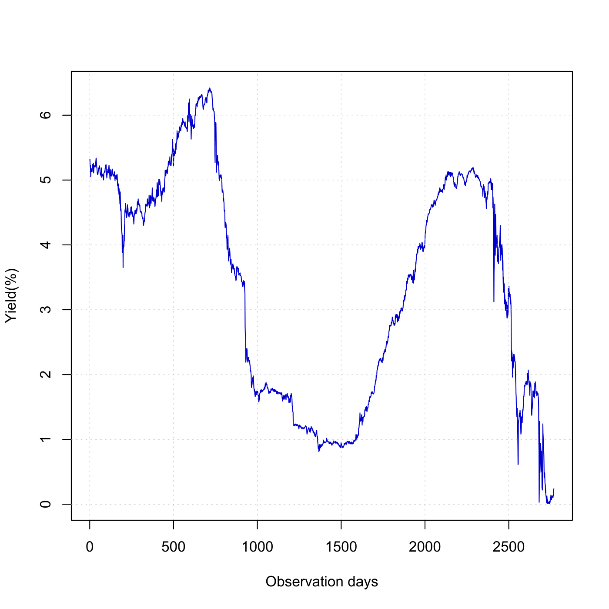

[](http://quantlet.de/)

## [](http://quantlet.de/) **SFEustb** [](http://quantlet.de/)

```yaml

Name of QuantLet : SFEustb

Published in : Statistics of Financial Markets

Description : 'Shows a 3-month U.S. Treasury bill daily yield from 1998 to 2008 as an approximation
of the short rate.'

Keywords : 'approximation, asset, data visualization, financial, graphical representation,
interest-rate, plot, short-rate, time-series, visualization, yield'

See also : SFECIRmle, SFEcir, SFEscomCIR

Author : Li Sun

Submitted : Thu, July 16 2015 by quantomas

Datafiles : yield_US3month9808.txt

Example : Plot of 3-month U.S. Treasury bill daily yield from 1998 to 2008.

```




### R Code:
```r
# clear variables and close windows
rm(list = ls(all = TRUE))
graphics.off()

x = read.table("yield_US3month9808.txt")  # load data
t = 1:dim(x)[1]  # time

# Plot
plot(t, t(x), type = "l", xlab = "Observation days", ylab = "Yield(%)", col = "blue3", 
    frame = TRUE)
abline(h = seq(0, 7, by = 1), lty = "dotted", lwd = 0.5, col = "grey")
abline(v = seq(0, 3000, by = 500), lty = "dotted", lwd = 0.5, col = "grey") 
```
