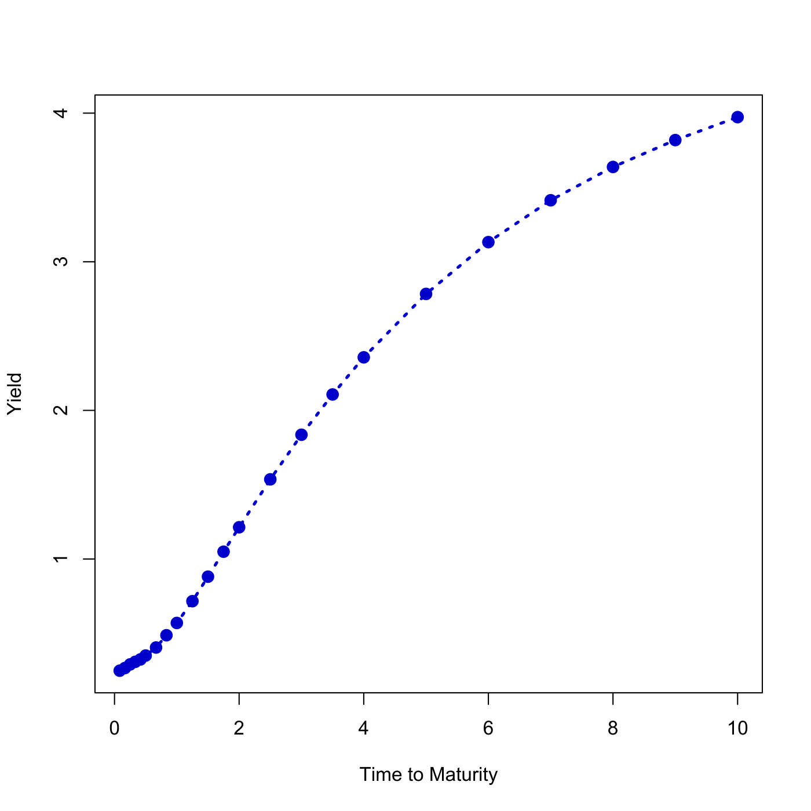

[](http://quantlet.de/)

## [](http://quantlet.de/) **SFEusycplot** [](http://quantlet.de/)

```yaml

Name of QuantLet : SFEusycplot

Published in : Statistics of Financial Markets

Description : 'Shows zero-coupon U.S Treasury bond yields with maturities from 1 month up to 10
years observed on 30 March 2010.'

Keywords : 'asset, bond, data visualization, financial, graphical representation, interest-rate,
plot, time-series, treasury, visualization, yield, zero-coupon'

See also : SFEcapvplot

Author : Piotr Majer, Awdesch Melzer

Submitted : Fri, July 17 2015 by quantomas

Datafiles : USY.txt

Example : Plot of the yield curve on 30 March 2010.

```




### R Code:
```r
# clear variables and close windows
rm(list = ls(all = TRUE))
graphics.off()

USY  = read.table("USY.txt")		# load data
time = c(seq(1/12, 1/2, by = 1/12), seq(4/6, 1, by = 1/6), seq(1.25, 2, by = 1/4), 
    seq(2.5, 4, by = 1/2), seq(5, 10, by = 1))
yc   = USY[NROW(USY), 1:23]

# Plot
plot(time, t(yc), type = "l", lty = 3, lwd = 2.5, col = "blue3", xlab = "Time to Maturity", 
    ylab = "Yield")
points(time, t(yc), col = "blue3", pch = 19, cex = 1.3) 
```
