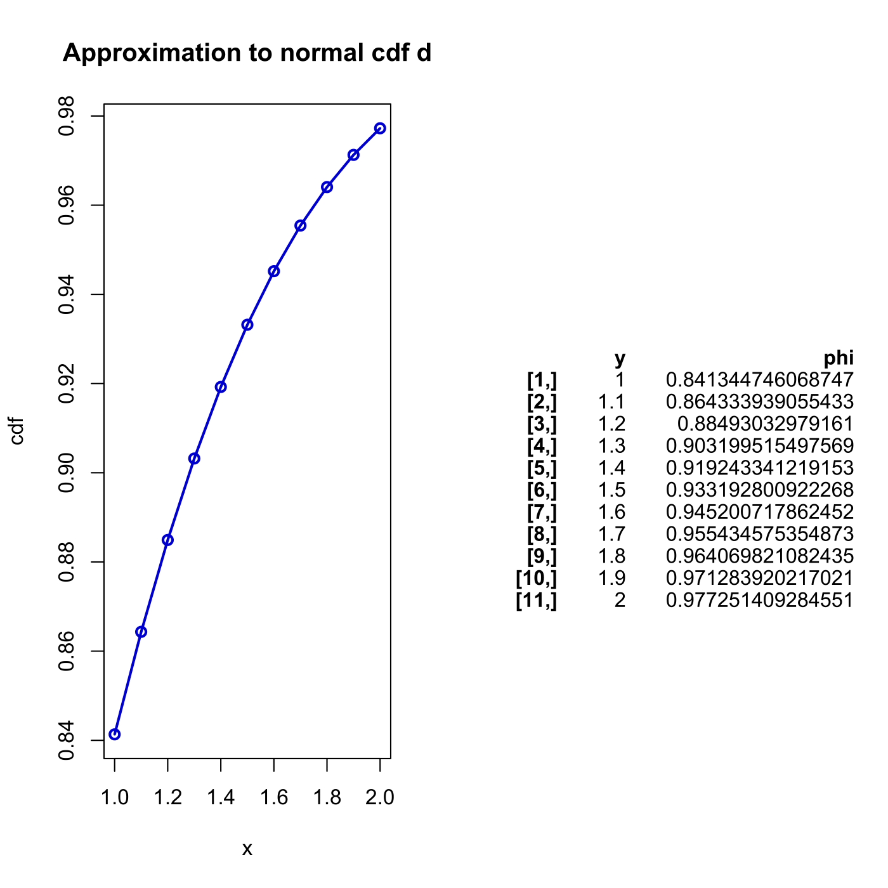
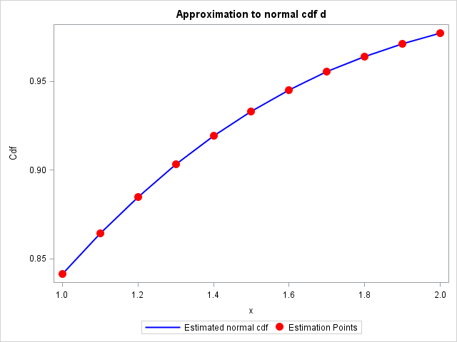

[](http://quantlet.de/)

## [](http://quantlet.de/) **SFENormalApprox4** [](http://quantlet.de/)

```yaml

Name of QuantLet : SFENormalApprox4

Published in : Statistics of Financial Markets

Description : 'Computes numerical approximation to a normal cumulative distribution function (cdf)
using method d).'

Keywords : 'approximation, cdf, distribution, graphical representation, normal,
normal-distribution, numeric, plot'

See also : SFENormalApprox1, SFENormalApprox1, SFENormalApprox2, SFENormalApprox3, SFENormalApprox3

Author : Wolfgang K. Härdle

Author[SAS] : Daniel T. Pele

Submitted : Fri, July 17 2015 by quantomas

Submitted[Matlab] : Wed, April 27 2016 by Ya Qian

Submitted[SAS] : Fri, June 06 2014 by Lukas Borke

Output: 
- phi: approximation of Normal cdf at different values

Example : 'Estimated normal cdf at that points 1:0.1:2 are given: [0.8413 0.8643 0.8849 0.9032
0.9192 0.9332 0.9452 0.9554 0.9641 0.9713 0.9772].'

```

.png)






### R Code:
```r
rm(list = ls(all = TRUE))
graphics.off()

# install and load packages
libraries = c("gplots")
lapply(libraries, function(x) if (!(x %in% installed.packages())) {
  install.packages(x)
})
lapply(libraries, library, quietly = TRUE, character.only = TRUE)

# main computation
y   = seq(1, 2, 0.1)   # estimation points
k   = 10               # order number 
n   = 0
sum	= 0
while (n < (k + 1)) {
    sum = sum + ((-1)^n) * y^(2 * n + 1)/(factorial(n) * 2^n * (2 * n + 1))
    n	= n + 1
}
phi = 0.5 + sum/sqrt(2 * pi)

# output
print("Estimation Points")
print(y)
print("Estimated Normal CDF")
print(phi)

# plot
par(mfrow = c(1, 2))
plot(y, phi, lwd = 2, xlab = "x", type = "o", ylab = "cdf", main = "Approximation to normal cdf d", col = "blue3")
textplot(cbind(y, phi)) 
```

### MATLAB Code:
```matlab

clear all
close all
clc

format long
% main computation
y = 1:0.1:2; % estimation points
k=10; % order number 
n = 0;
sum = 0 ;
while (n<(k+1))
	sum = sum + ( (-1)^n ).*y.^(2*n+1)/( factorial(n)*2^n*(2*n+1) );
	n = n+1;
end
phi = 0.5 + sum/sqrt(2*pi);

% output
disp(' ') ;
disp('Estimation Points')
disp(y)
disp('Estimated Normal CDF')
disp(phi)

subplot(1,2,1)
hold on
plot(y,phi,'LineWidth',2);
xlabel('x')
ylabel('cdf')
title('Approximation to normal cdf d')
scatter(y,phi,'r','o')
hold off

subplot(1,2,2)
axis off
hold on
w1=num2str(y','%10.2f');
w2=num2str(phi','%11.10f');
text(0.1,0.8,w1)
text(0.5,0.8,w2)
hold off

```

### SAS Code:
```sas

* Reset the working evironment;
goptions reset = all;
proc datasets lib = work nolist kill;
run;

Proc iml;
* main computation;
y  	=  0.1*(10:20)`; *Estimation points;
k  	= nrow(y); 
sum = j(nrow(y),1,0) ;
pi  = constant('pi');
n   = 0;

do while (n<(k+1));
	sum = sum + ( (-1)**n )*y##(2*n+1)/( fact(n)*2**n*(2*n+1) );
	n   = n+1;
end;

phi  = 0.5 + sum/sqrt(2*pi);
plot = y||phi;

create plot from plot;append from plot;
close plot;
quit;


data plot;set plot;
rename col1 = y col2 = phi ;

*Plot the approximation to normal cdf;

title Approximation to normal cdf d;

proc sgplot data  =  plot ;
series x  =  y y  =  phi / lineattrs = (color  =  blue THICKNESS  =  2) 
legendlabel = "Estimated normal cdf";

scatter x  =  y y  =  phi/ 
   markerattrs=( symbol=circlefilled color=red size=12 )
legendlabel = "Estimation Points" ;

yaxis label  =  'Cdf';
xaxis label = 'x' ;
run;
quit;

proc print data = plot;
run;

```
