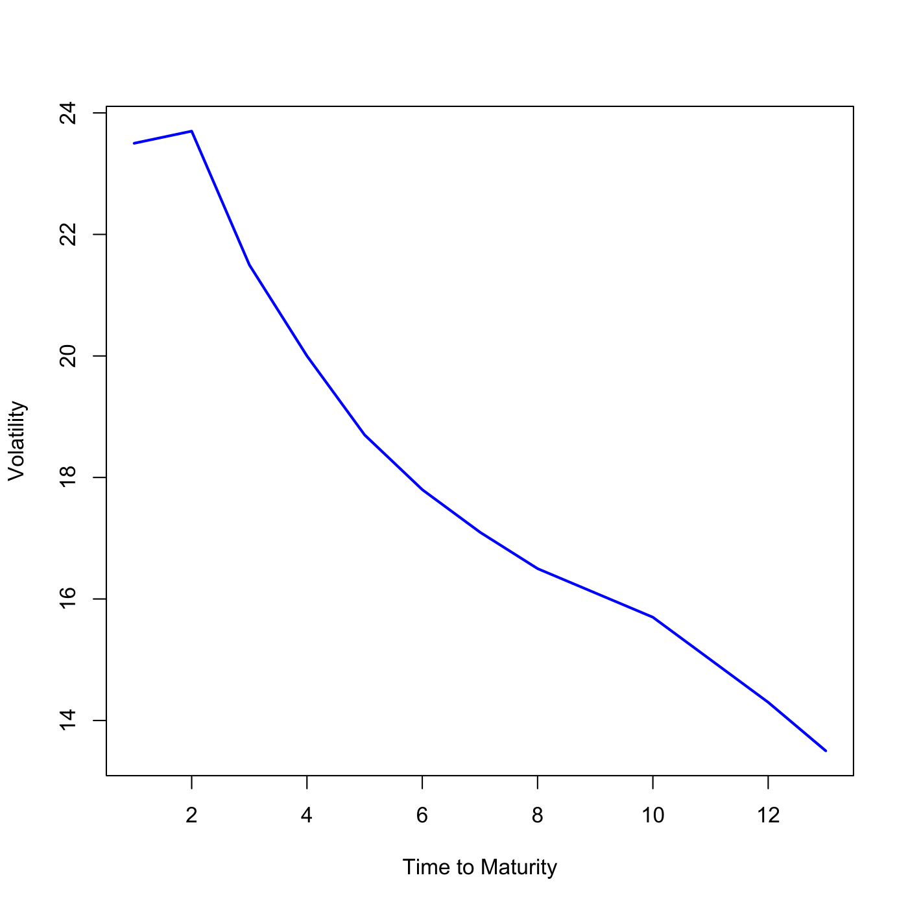

[](http://quantlet.de/)

## [](http://quantlet.de/) **SFEscap** [](http://quantlet.de/)

```yaml

Name of QuantLet : SFEscap

Published in : Statistics of Financial Markets

Description : Plots the Black implied volatility structure of EUR caplets.

Keywords : 'Black, caplet, financial, graphical representation, implied-volatility, interest-rate,
plot, volatility'

See also : SFEcapvplot, SFEcir, SFEscomCIR

Author : Awdesch Melzer, Li Sun

Submitted : Fri, July 17 2015 by quantomas

Datafiles : cap.txt

Input : Parameters (a, b, c, d) of time-homogeneous component of the volatility function

```




### R Code:
```r
# clear variables and close windows
rm(list = ls(all = TRUE))
graphics.off()

# Load caplet data
cap = read.table("cap.txt")

# Parameters (a, b, c, d) of time-homogeneous component of the volatility function
a     = 0.001651
b     = 1.238157
c     = 0.001036
d     = 6.757801
ti    = cap[, 1]
sig_b = cap[, 2]
h2    = -1/4 * (-2 * a^2 * c^2 - 2 * a * b * c - 8 * a * d * c^2 - b^2 - 8 * b * 
    d * c + 2 * exp(-c * ti)^2 * a^2 * c^2 + 4 * a * b * exp(-c * ti)^2 * c^2 * 
    ti + 2 * a * b * exp(-c * ti)^2 * c + 8 * exp(-c * ti) * a * d * c^2 + 
    2 * b^2 * exp(-c * ti)^2 * c^2 * ti^2 + 2 * b^2 * exp(-c * ti)^2 * c * 
    ti + b^2 * exp(-c * ti)^2 + 8 * b * d * exp(-c * ti) * c^2 * ti + 8 * b * 
    d * exp(-c * ti) * c - 4 * d^2 * c^3 * ti)/c^3
g     = ((sig_b^2) * ti)/h2
(k    = sqrt(g))

# Plot
plot(sig_b, col = "blue", type = "l", lwd = 2, xlab = c("Time to Maturity"), 
    ylab = c("Volatility")) 
```
