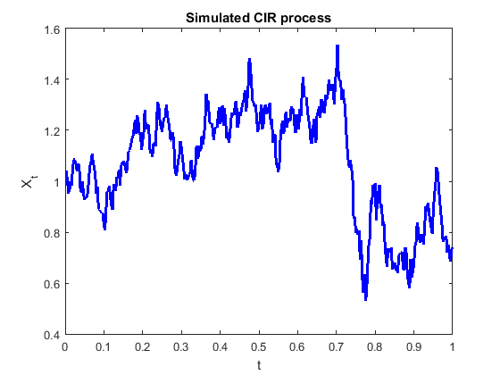
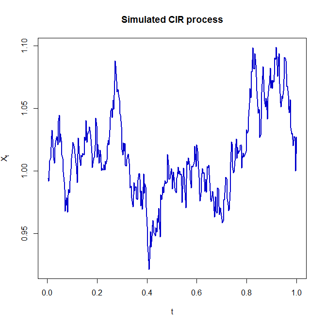

[](http://quantlet.de/)

## [](http://quantlet.de/) **SFEsimCIR** [](http://quantlet.de/)

```yaml

Name of QuantLet: SFEsimCIR

Published in: Statistics of Financial Markets

Description: 'Simulates a Cox-Ingersol-Ross process and plots 
              it. The number of observations to be simulated as well as the 
              parameters of the CIR model can be set by the user. The initial 
              value is assumed as the mean, but it can be set by the user as well.'

Keywords: cir, simulation, normal, plot, graphical representation

See also: SFEscomCIR

Author: Awdesch Melzer, Piedad Castro

Submitted: Thu, July 07 2016 by Piedad Castro

Input:
- Tobs: number of observations for the simulation
- alpha, mu, sigma: positive constants, parameters of the model

```





### R Code
```r

# clear variables and close windows
rm(list = ls(all = TRUE))
graphics.off()

# set parameters for the simulation
Tobs = 360
alpha = 5
mu    = 1
sigma = 0.2

dt = 1/Tobs

# initial value of X (X_0):
X = mu

# set a seed if you want this simmulation to be reproducible
# set.seed(123) 

# simulates a mean reverting square root process around mu
for (i in 1:Tobs) {
  dW = rnorm(1) * sqrt(dt)
  dX = alpha * (mu - X[i]) * dt + sigma * sqrt(abs(X[i])) * dW
  X  = c(X, X[i] + dX)
}
  
X = X[-1]

# plot
t = (1:Tobs)/Tobs
plot(t, X, main = 'Simulated CIR process', xlab = 't', ylab = expression(X[t]), type = "l", col = "blue3", lwd = 2)

```

automatically created on 2018-05-28

### MATLAB Code
```matlab

%% clear variables and console and close windows
clear
clc
close all

%% set parameters for the simulation
Tobs  = 360;
alpha = 5;
mu    = 1;
sigma = 0.2;

dt = 1/Tobs;

% initial value of X (X_0):
X(1) = mu;

% set a seed if you want this simmulation to be reproducible
% rng(123); 

%% simulates a mean reverting square root process around mu
for i = 1:Tobs
    dW = randn * sqrt(dt);
    dX = alpha * (mu - X(i)) * dt + sigma * sqrt(abs(X(i))) * dW;
    X  = [X, X(i) + dW];
end

X = X(2:end);

%% plot
t = (1:Tobs)/Tobs;
set(gcf,'color','w')
plot(t, X, 'Color', 'blue', 'LineWidth', 2)
title('Simulated CIR process')
xlabel('t')
ylabel('X_t')

```

automatically created on 2018-05-28