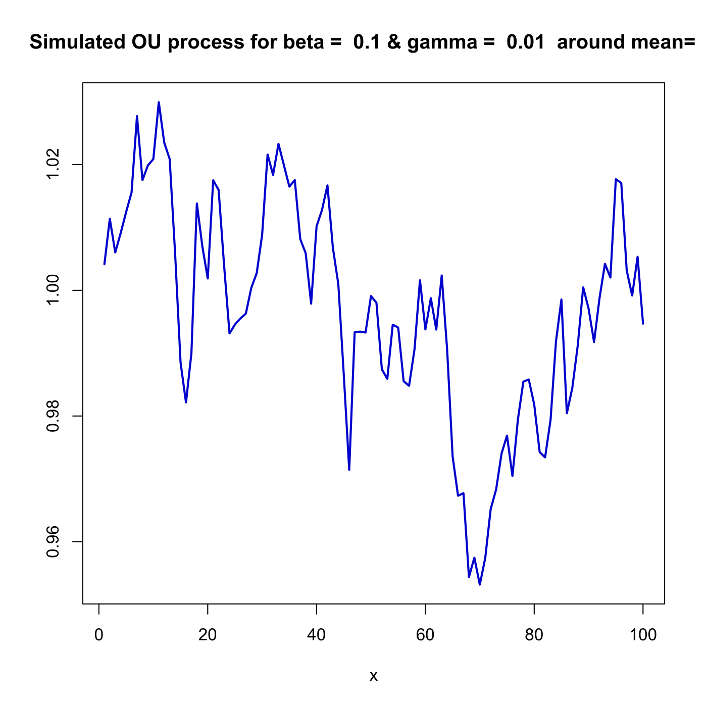

[](http://quantlet.de/)

## [](http://quantlet.de/) **SFEsimOU** [](http://quantlet.de/)

```yaml

Name of QuantLet : SFEsimOU

Published in : Statistics of Financial Markets

Description : 'Simulates and plots a path of a Ornstein-Uhlenbeck (OU) process with beta=0.1,
gamma=0.01 around mean=1.'

Keywords : 'gaussian, graphical representation, ornstein-uhlenbeck, plot, process, simulation,
stochastic, stochastic-process, wiener-process'

Author : Awdesch Melzer, Torsten Kleinow

Submitted : Fri, July 17 2015 by quantomas

Example : 'User inputs the parameters [number of observations, beta, gamma, mean] like [100, 0.1,
0.01, 1], then plot of a simulated Ornstein-Uhlenbeck process is given.'

```




### R Code:
```r
# clear all variables and close windows
rm(list = ls(all = TRUE))
graphics.off()

set.seed(1)     # set pseudo random numbers

# parameter settings
n     = 100     # number of observations
beta  = 0.1     # beta parameter
gamma = 0.01    # gamma parameter
m     = 1       # mean

# simulates a mean reverting square root process around m
i     = 0
delta = 0.1
x    = m        # start value

while (i < (n * 10)) {
    i = i + 1
    d = beta * (m - x[length(x)]) * delta + gamma * sqrt(delta) * rnorm(1, 0, 1)
    x = rbind(x, x[length(x)] + d)
}

x = x[2:length(x)]
x = x[10 * (1:n)]

# plot
plot(x, type = "l", col = "blue3", lwd = 2, xlab = "x", ylab = "")
title(paste("Simulated OU process for beta = ", beta, "& gamma = ", gamma, " around mean= ", m)) 
```
