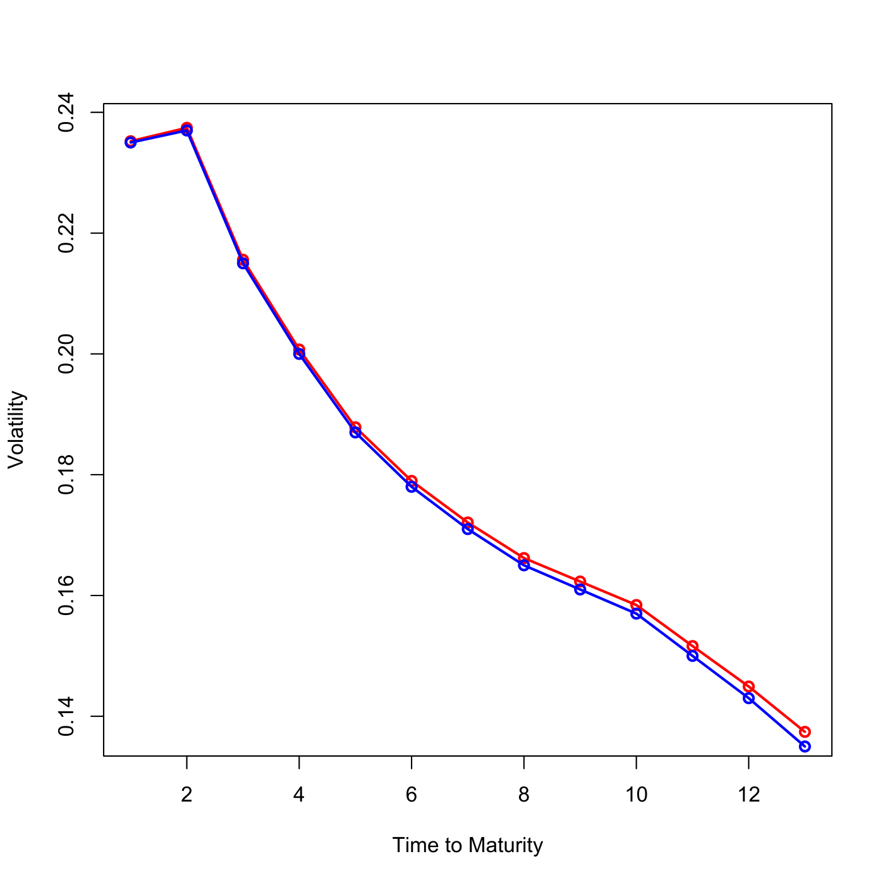

[](http://quantlet.de/index.php?p=info)

## [](http://quantlet.de/) **SFEcapvplot** [](http://quantlet.de/d3/ia)

```yaml

Name of QuantLet : SFEcapvplot

Published in : Statistics of Financial Markets

Description : 'Plots the Black implied volatility structure (blue) of LIBOR caplets observed on
2002-08-13 and the calibrated volatility structure (red) with parameters a, b, c, d.'

Keywords : 'Black, calibration, caplet, data visualization, financial, graphical representation,
implied-volatility, interest-rate, plot, visualization, volatility'

See also : SFEcir, SFEscap, SFEscomCIR, SFEusycplot

Author : Awdesch Melzer, Li Sun

Submitted : Sat, July 18 2015 by quantomas

Datafiles : cap.txt

```




```r
# clear variables and close windows
rm(list = ls(all = TRUE))
graphics.off()

# load data
cap = read.table("cap.txt")

# rescale
cap = cap/100

# parameters (a, b, c, d) of time-homogeneous component of the volatility function for LIBOR caplets observed on 20020813
a     = 0.0017
b     = 1.238157
c     = 0.001
d     = 6.7578
ti    = cap[, 1]
sig_b = cap[, 2]

h2 = -1/4 * (-2 * a^2 * c^2 - 2 * a * b * c - 8 * a * d * c^2 - b^2 - 8 * b * 
    d * c + 2 * exp(-c * ti)^2 * a^2 * c^2 + 4 * a * b * exp(-c * ti)^2 * c^2 * 
    ti + 2 * a * b * exp(-c * ti)^2 * c + 8 * exp(-c * ti) * a * d * c^2 + 
    2 * b^2 * exp(-c * ti)^2 * c^2 * ti^2 + 2 * b^2 * exp(-c * ti)^2 * c * 
    ti + b^2 * exp(-c * ti)^2 + 8 * b * d * exp(-c * ti) * c^2 * ti + 8 * b * 
    d * exp(-c * ti) * c - 4 * d^2 * c^3 * ti)/c^3
g  = ((sig_b^2) * ti)/h2
k  = sqrt(g)
h1 = k * ((a + b * ti) * exp(-c * ti) + d)

# Plot
plot(h1, col = "red", type = "o", lwd = 2, xlab = "Time to Maturity", ylab = "Volatility")
lines(sig_b, col = "blue", lwd = 2)
points(sig_b, col = "blue", lwd = 2) 
```
