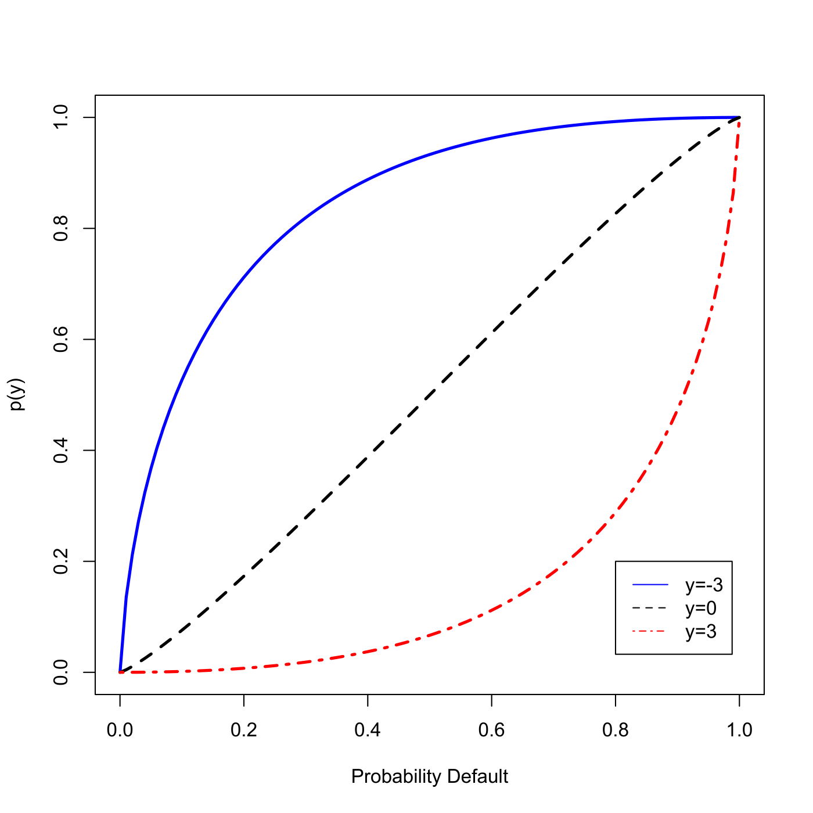
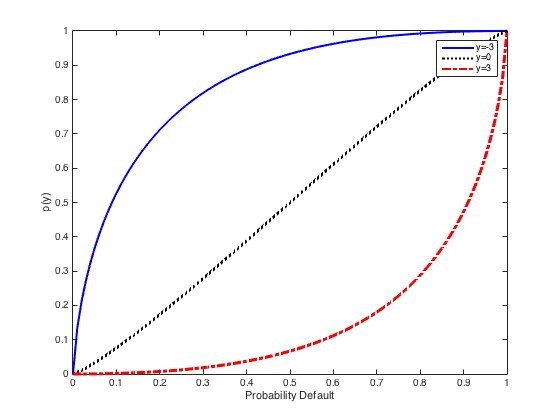

[](http://quantlet.de/)

## [](http://quantlet.de/) **SFEdefaproba** [](http://quantlet.de/)

```yaml

Name of QuantLet : SFEdefaproba 

Published in: Statistics of Financial Markets

Description: 'Plots the default probability for KMV model as a function of the state of the economy for 3 different states of the economy: bad (y=-3), typical (y=0) and good(y=3).'

Keywords: 'default, economy, factor-model, financial, graphical representation, one-factor-gaussian-model, plot, probability'

Author: Song Song, Yafei Xu
Author[Matlab]: Song Song

Submitted: Sat, July 18 2015 by quantomas
Submitted[Matlab]: Wed, April 27 2016 by Ya Qian
```





### R Code
```r

# clear variables and close windows
rm(list = ls(all = TRUE))
graphics.off()

# Main computation
x  = seq(0, 1, by = 0.01)
y1 = pnorm((qnorm(x) - sqrt(0.2) * (-3))/(sqrt(0.8)))
y2 = pnorm((qnorm(x) - sqrt(0.2) * (0))/(sqrt(0.8)))
y3 = pnorm((qnorm(x) - sqrt(0.2) * (3))/(sqrt(0.8)))

# Plot
plot(x, y1, col = "blue", type = "l", xlab = "Probability Default", ylab = "p(y)", lwd = 2.5)
lines(x, y2, col = "black", lty = 2, lwd = 2.5)
lines(x, y3, col = "red", lty = 4, lwd = 2.5)
legend(0.8, 0.2, c("y=-3", "y=0", "y=3"), col = c("blue", "black", "red"), lty = c(1, 2, 4)) 
```

automatically created on 2018-05-28

### MATLAB Code
```matlab


clear
clc
close all

%% Main computation

x=[0:0.01:1];
y1=normcdf((norminv(x)-sqrt(0.2)*(-3))/(sqrt(0.8)));
y2=normcdf((norminv(x)-sqrt(0.2)*(0))/(sqrt(0.8)));
y3=normcdf((norminv(x)-sqrt(0.2)*(3))/(sqrt(0.8)));

%% Plot

plot(x,y1,'b-','LineWidth',2)
hold on
plot(x,y2,'k:','LineWidth',2)
plot(x,y3,'r-.','LineWidth',2)
hold off

xlabel('Probability Default');ylabel('p(y)');legend('y=-3','y=0','y=3',4);
```

automatically created on 2018-05-28