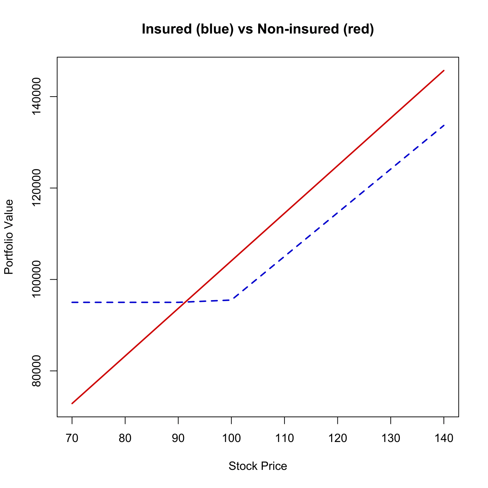

[](http://quantlet.de/)

## [](http://quantlet.de/) **SFEoptman** [](http://quantlet.de/)

```yaml

Name of QuantLet : SFEoptman

Published in : Statistics of Financial Markets

Description : 'Plots the performances of an insured and of a non-insured portfolio as a function of
the stock price. In the second part the table of portfolio values and returns for different stock
prices is given.'

Keywords : 'bond, financial, graphical representation, hedging, option, plot, portfolio,
portfolio-insurance, returns, stock-price'

Author : Christian M. Hafner, Danilo Mercurio

Submitted : Sat, July 18 2015 by quantomas

Input: 
- capital: Initial Capital
- floor: Minimum Insured Portfolio Value
- T: Time Horizon in Years
- i: Interest Rate
- v: Stock Volatility Sigma
- d: Continuous Dividend

Example : 'An example is produced for the values: capital=100000, floor=95000, T=2, i=0.1, v=0.3,
d=0.02.'

```




### R Code:
```r
# clear variables and close windows
rm(list = ls(all = TRUE))
graphics.off()

# Please input Capital, Floor, Horizon (years) as: [100000,95000,2]
para = c(1e+05, 95000, 2)

capital = para[1]
floor   = para[2]
T       = para[3]

# Please input Interest rate, Stock volatility sigma, Continuous dividend as: [0.1, 0.3, 0.02]
para = c(0.1, 0.3, 0.02)

i = para[1]
v = para[2]
d = para[3]

# Main computation
b        = i - d
S        = 100
t        = 0
start    = S/2
stop     = 2 * S
numpassi = 1000
step     = (stop - start)/(numpassi - 1)

Ks  = seq(start, 200, step)
y   = t((log(S/Ks) + (b - (v^2)/2) * T)/(sqrt(T) * v))
P1  = exp(-i * T) * Ks * t(pnorm(-y, 0, 1))
P   = P1 - exp(-(i - b) * T) * S * t(pnorm(-y - sqrt(T) * v, 0, 1))
phi = exp(-d * T) * S + P - Ks * (capital/floor)

if (min(phi) > 0 | max(phi) < 0) {
    print("Extreme value configuration")
}
tmp  = cbind(phi, Ks)
tmp1 = tmp[-1, ]

k = 1
for (j in 1:dim(tmp)[1]) {
    if (tmp[j, 1] < 0) {
        tmp1[k, ] = tmp[j, ]
        k = k + 1
    }
}
infi = tmp1[1, ]
l    = 1
tmp2 = tmp[-1, ]

for (j in 1:dim(tmp)[1]) {
    if (tmp[j, 1] > 0 | tmp[j, 1] == 0) {
        tmp2[l, ] = tmp[j, ]
        l = l + 1
    }
}
supi = tmp2[dim(tmp2)[1], ]
ab = solve(cbind(c(1, 1), c(supi[1], infi[1]))) %*% c(supi[2], infi[2])
K = ab[1]
y = (log(S/K) + (b - v/2) * T)/(sqrt(T * v))
P = exp(-i * T) * K * pnorm(-y, 0, 1) - exp(-(i - b) * T) * S * pnorm(-y - 
    sqrt(T * v), 0, 1)

Aktien = floor/K * exp(-d * T)
Puts = Aktien * exp(d * T)
Sg = seq(70, 140, 10)
unvPort = (capital/S) * Sg * exp(d * T)
verPort = Aktien * Sg * exp(d * T)
w = length(Sg)
verPort = verPort * (verPort > floor) + floor * (verPort <= floor)
unvPort = cbind(Sg, unvPort)
verPort = cbind(Sg, verPort)

plot(unvPort[, 1], unvPort[, 2], col = "red3", type = "l", lwd = 2, xlab = "Stock Price", 
    ylab = "Portfolio Value", main = "Insured (blue) vs Non-insured (red)")
lines(verPort[, 1], verPort[, 2], col = "blue3", lty = "dashed", lwd = 2)

# Table output
ustockp = unvPort
vstockp = verPort
uyield  = ((ustockp[, 2] - capital)/capital) * 100
vyield  = ((vstockp[, 2] - capital)/capital) * 100
uvrat   = (vstockp[, 2]/ustockp[, 2]) * 100

print("              Not insured Port.   Insured Port.   Insured Portfolio in %")
print("   Spot Price  Value    Yield     Value   Yield     of the not Insured")
print("------------------------------------------------------------------------")
print(cbind(ustockp[, 1], ustockp[, 2], uyield, vstockp[, 2], vyield, uvrat)) 
```
