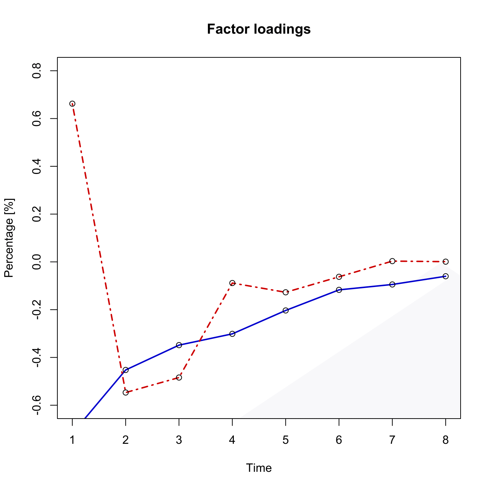
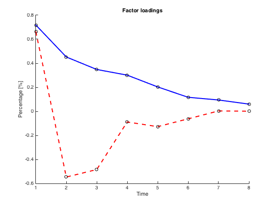

[](http://quantlet.de/)

## [](http://quantlet.de/) **SFEPCA** [](http://quantlet.de/)

```yaml

Name of QuantLet : SFEPCA

Published in : Statistics of Financial Markets

Description : 'Calculates and plots the factor loadings of the first and second principal
components of implied DAX volatilities at the money.'

Keywords : 'atm, black-scholes, data visualization, dax, factor-loadings, financial, graphical
representation, implied-volatility, index, option, pca, plot, principal-component-analysis,
principal-components, vdax, volatility'

See also : SFEVolSurfPlot, SFEVolaCov, SFEVolaPCA, SFEVolaTermStructure

Output : Plots of the first and second principal components of the VDAX index

Author : Juliane Scheffel, Mathias Fengler

Submitted : Sat, July 18 2015 by quantomas

Submitted[Matlab] : Mon, May 2 2016 by Meng Jou Lu

Datafiles : implvola.dat

```






### R Code:
```r

# clear variables and close windows
rm(list = ls(all = TRUE))
graphics.off()

# load data
x = read.table("implvola.dat")

# rescale
x = x/100

# number of rows
n = nrow(x)

# compute first differences
z = apply(x,2,diff)
# calculate covariance
s = cov(z) * 1e+05

# determine eigenvectors
e = eigen(s)
e = e$vectors

f1 = e[, 1]
f2 = e[, 2]

# Adjust second Eigenvector in R not necessary - the computation differs from R to Matlab 

# Plot
plot(f1, col = "blue3", ylim = c(-0.6, 0.8), lwd = 2, type = "l", xlab = "Time", 
    ylab = "Percentage [%]", main = "Factor loadings")
points(f1)
lines(f2, col = "red3", lwd = 2, lty = "dotdash")
points(f2)

```

### MATLAB Code:
```matlab

clear
clc
close all

%Load data
x     = load('implvola.dat');
x     = x/100;

n     = length(x);
z     = x(2:n,:) - x(1:(n-1),:);
s     = cov(z)*100000;

%Determine Eigenvectors
[v e] = eigs(s);

f1    = v(:,1)';
f2    = v(:,2)';

%Adjust second Eigenvector
if f1(:,1)<0
    f1 = f1*(-1);
end

if f2(:,1)<0
    f2 = f2*(-1);
end

gr1    = [1:8;f1(1,:)]';
gr2    = [1:8;f2(1,:)]';

%Plot
hold on
plot(gr1(:,1),gr1(:,2),'Color','b','LineWidth',2)
scatter(gr1(:,1),gr1(:,2),'k')
plot(gr2(:,1),gr2(:,2),'Color','r','LineWidth',2,'LineStyle','--')
scatter(gr2(:,1),gr2(:,2),'k')
xlabel('Time')
ylabel('Percentage [%]')
title('Factor loadings')
hold off

```
