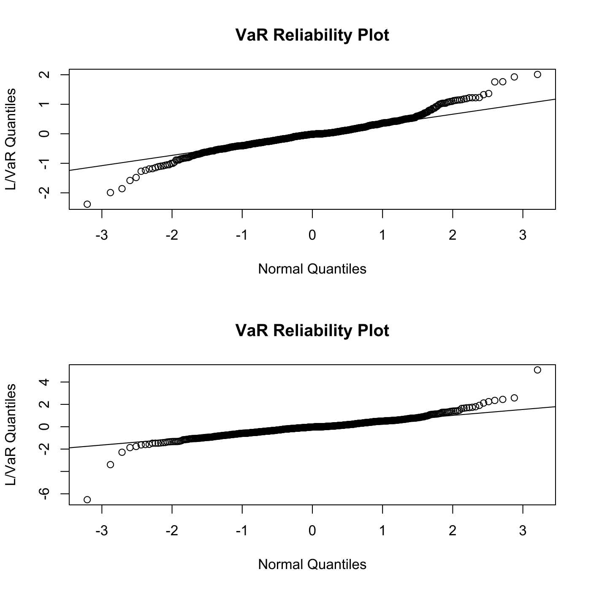
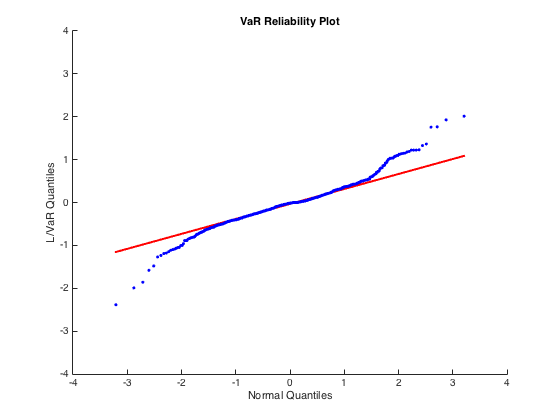
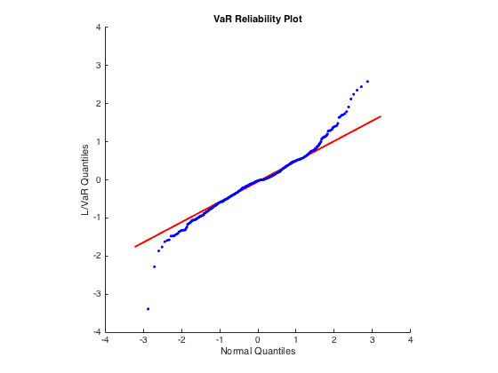

[](http://quantlet.de/)

## [](http://quantlet.de/) **SFEVaRqqplot** [](http://quantlet.de/)

```yaml

Name of QuantLet : SFEVaRqqplot

Published in : Statistics of Financial Markets

Description : 'Visualizes the reliability of the Value at Risk (VaR) forecasts based on Rectangular
Moving Average (RMA) and Exponentially Moving Average (EMA) models.'

Keywords : 'VaR, bond, data visualization, ema, estimation, exceedance, financial, forecast,
graphical representation, moving-average, multivariate normal, normal-distribution, plot,
portfolio, qq-plot, risk, rma, time-series'

See also : SFEVaRbank, SFEVaRtimeplot, SFEVaRtimeplot2, VaRest, VaRqqplot

Author : Wolfgang K. Härdle

Author[Matlab] : Marlene Mueller

Submitted : Sat, July 18 2015 by quantomas

Submitted[Matlab] : Mon, May 2 2016 by Meng Jou Lu

Datafiles : kupfer.dat

Example : QQ plots for RMA and EMA

```








### R Code:
```r

# clear variables and close windows
rm(list = ls(all = TRUE))
graphics.off()

VaRest = function(y, method) {
    # parameter settings
    n     = length(y)
    h     = 250
    lam   = 0.96
    dist  = 0
    alpha = 0.01
    w     = 1
    bw    = 0
    
    # RMA
    if (method == 1) {
        sigh = matrix(1, (n - h), (n - h)) - 1
        tmp  = cumsum(y * y)
        tmp1 = (tmp[(h + 1):n] - tmp[1:(n - h)])/h
        sigh = sqrt(((w * tmp1) * w))
    }
    grid = seq(h - 1, 0)
    
    # EMA
    if (method == 2) {
        sigh = matrix(1, (n - h), 1) - 1
        j    = h
        while (j < n) {
            j           = j + 1
            tmp         = (lam^grid) * y[(j - h):(j - 1)]
            tmp1        = sum(tmp * tmp)
            sigh[j - h] = sqrt(sum((tmp1)) * (1 - lam))
        }
    }
    if (dist == 0) {
        qf = qnorm(alpha, 0, 1)
    } else {
        sigh = sigh/sqrt(dist/(dist - 2))
        qf   = qt(alpha, dist)
    }
    VaR = qf * sigh
    VaR = cbind(VaR, (-VaR))
}

VaRqqplot = function(y, VaR) {
    # parameter settings 
    n   = length(y)
    d   = 1
    nov = 1
    h   = 250
    p   = y[(h+1):n]
    qn  = qnorm((seq(1, (n - h)) - 0.5)/(n - h), 0, 1)
    tmp = p/VaR[, 1]
    qqnorm(tmp, main = "VaR Reliability Plot", xlab = "Normal Quantiles", ylab = "L/VaR Quantiles")
    qqline(tmp)
}

# Main computation
x1 = read.table("kupfer.dat")
x  = x1[1:1001, 1]
y  = diff(log(x))
h  = 250

# Option 1=RMA, Option 2=EMA
opt1 = VaRest(y, 1)
opt2 = VaRest(y, 2)

# Plots
par(mfrow = c(2, 1))
VaRqqplot(y, opt1)
VaRqqplot(y, opt2)

```

### MATLAB Code:
```matlab

clear
close all
x1   = load('kupfer.dat');
x    = x1(1:1001);
y    = diff(log(x));
h    = 250;

% Option 1=RMA, 2=EMA
% opt1 = RMA;
% opt2 = EMA;

opt1 = VaRest(y,1);
opt2 = VaRest(y,2);

figure(1)
VaRqqplot(y,opt1)
figure(2)
VaRqqplot(y,opt2)
daspect([1 1 1])
```
