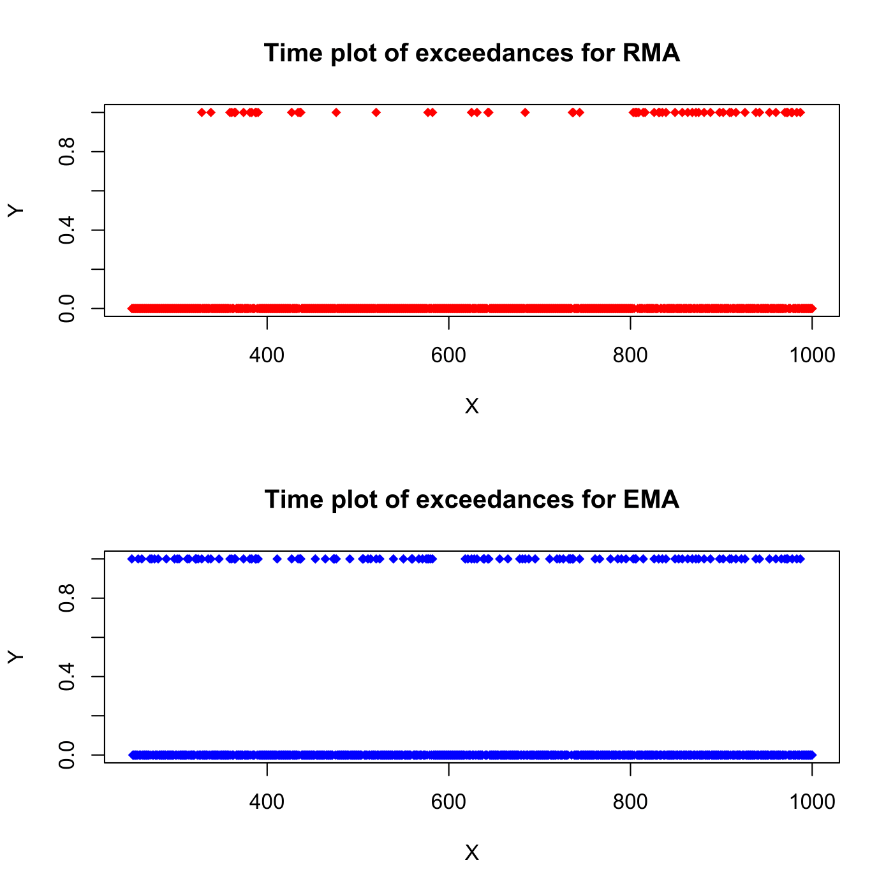
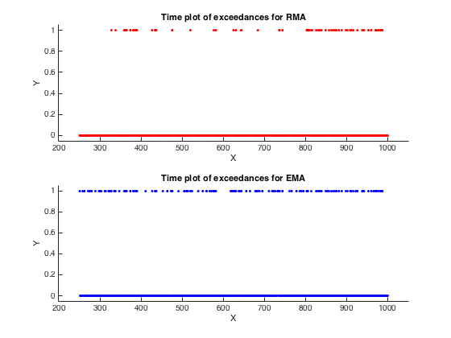

[](http://quantlet.de/)

## [](http://quantlet.de/) **SFEVaRtimeplot2** [](http://quantlet.de/)

```yaml

Name of QuantLet : SFEVaRtimeplot2
Published in: Statistics of Financial Markets
Description: 'Shows the time plot of the exceedances at the 80% significance level from the Value at Risk (VaR) forecasts for Rectangular Moving Average (RMA) and Exponentially Moving Average (EMA) models.'
Keywords:
- VaR
- bond
- data visualization
- ema
- estimation
- exceedance
- financial
- forecast
- graphical representation
- moving-average
- multivariate normal
- normal-distribution
- plot
- portfolio
- risk
- rma
- time-series
See also:
- SFEVaRbank
- SFEVaRqqplot
- SFEVaRtimeplot
- VaRest
- VaRqqplot
Author:
- Wolfgang K. Härdle
- Ying Chen
Author[Matlab]: Marlene Müller
Submitted: Wed, July 22 2015 by quantomas
Submitted[Matlab]: Mon, May 3 2016 by Meng Jou Lu
Output[Matlab]: 'Time plot of VaR forecasts and the associated changes of the P&L of the portfolio.'
Datafiles: kupfer.dat

```





### R Code
```r

# clear variables and close windows
rm(list = ls(all = TRUE))
graphics.off()

VaRest = function(y, method) {
    # parameter settings
    n     = length(y)
    h     = 250
    lam   = 0.96
    dist  = 0
    alpha = 0.01
    w     = 1
    bw    = 0
    
    # RMA
    if (method == 1) {
        sigh = matrix(1, (n - h), (n - h)) - 1
        tmp  = cumsum(y * y)
        tmp1 = (tmp[(h + 1):n] - tmp[1:(n - h)])/h
        sigh = sqrt(((w * tmp1) * w))
    }
    grid = seq(h - 1, 0)
    
     # EMA
    if (method == 2) {
        sigh = matrix(1, (n - h), 1) - 1
        j    = h
        while (j < n) {
            j           = j + 1
            tmp         = (lam^grid) * y[(j - h):(j - 1)]
            tmp1        = sum(tmp * tmp)
            sigh[j - h] = sqrt(sum((tmp1)) * (1 - lam))
        }
    }
    if (dist == 0) {
        qf = qnorm(alpha, 0, 1)
    } else {
        sigh = sigh/sqrt(dist/(dist - 2))
        qf   = qt(alpha, dist)
    }
    VaR = qf * sigh
    VaR = cbind(VaR, (-VaR))
}

# Main computation
x1    = read.table("kupfer.dat")
x     = x1[1:1001, 1]
y     = diff(log(x))

# Option 1=RMA, Option 2=EMA
opt1  = VaRest(y, 1)
opt2  = VaRest(y, 2)

# parameter settings
n     = length(y)
h     = 250
lam   = 0.04
dist  = 0
alpha = 0.01
w     = 1
p     = y

# For RMA
rmalt    = cbind(seq((h + 1), n), p[(h + 1):n])
rmaiup   = (p[(h + 1):n] > 0.8 * opt1[, 2])
rmailo   = (p[(h + 1):n] < 0.8 * opt1[, 1])
rmaiall1 = rmaiup + rmailo
rmaiall  = cbind(seq((h + 1), n), rmaiall1)

# subplotting in R
A = c(1, 2)
layout(A)
plot(rmaiall[, 1], rmaiall[, 2], pch = 18, col = "red", main = "Time plot of exceedances for RMA", 
    xlab = "X", ylab = "Y")

# For EMA
emalt    = cbind(seq((h + 1), n), p[(h + 1):n])
emaiup   = (p[(h + 1):n] > 0.8 * opt2[, 2])
emailo   = (p[(h + 1):n] < 0.8 * opt2[, 1])
emaiall1 = emaiup + emailo
emaiall  = cbind(seq((h + 1), n), emaiall1)

plot(emaiall[, 1], emaiall[, 2], pch = 18, col = "blue", main = "Time plot of exceedances for EMA", 
    xlab = "X", ylab = "Y") 

```

automatically created on 2018-05-28

### MATLAB Code
```matlab


clear
clc
close all

x1    = load('kupfer.dat');
x     = x1(1:1001);
y     = diff(log(x));

opt1  = VaRest(y,1);
opt2  = VaRest(y,2);

n     = length(y);
h     = 250;
lam   = 0.04;
dist  = 0;
alpha = 0.01;
w     = 1;
p     = sum(y,2);

% For RMA
rmalt    = [((h+1):n)', p((h+1):n)];
rmaiup   = (p((h+1):n)>0.8*opt1(:,2));
rmailo   = (p((h+1):n)<0.8*opt1(:,1));
rmaiall1 = rmaiup+rmailo;
rmaiall  = [((h+1):n)',rmaiall1];
   
subplot(2,1,1)
scatter(rmaiall(:,1),rmaiall(:,2),'.','r')
title('Time plot of exceedances for RMA')
xlabel('X')
ylabel('Y')
xlim([200, 1050])
ylim([-0.05, 1.05])
 
% For EMA
emalt    = [((h+1):n)', p((h+1):n)];
emaiup   = (p((h+1):n)>0.8*opt2(:,2));
emailo   = (p((h+1):n)<0.8*opt2(:,1));
emaiall1 = emaiup+emailo;
emaiall  = [((h+1):n)',emaiall1];
   
subplot(2,1,2)
scatter(rmaiall(:,1),emaiall(:,2),'.','b')
title('Time plot of exceedances for EMA')
xlabel('X')
ylabel('Y')
xlim([200, 1050])  
ylim([-0.05, 1.05])
```

automatically created on 2018-05-28