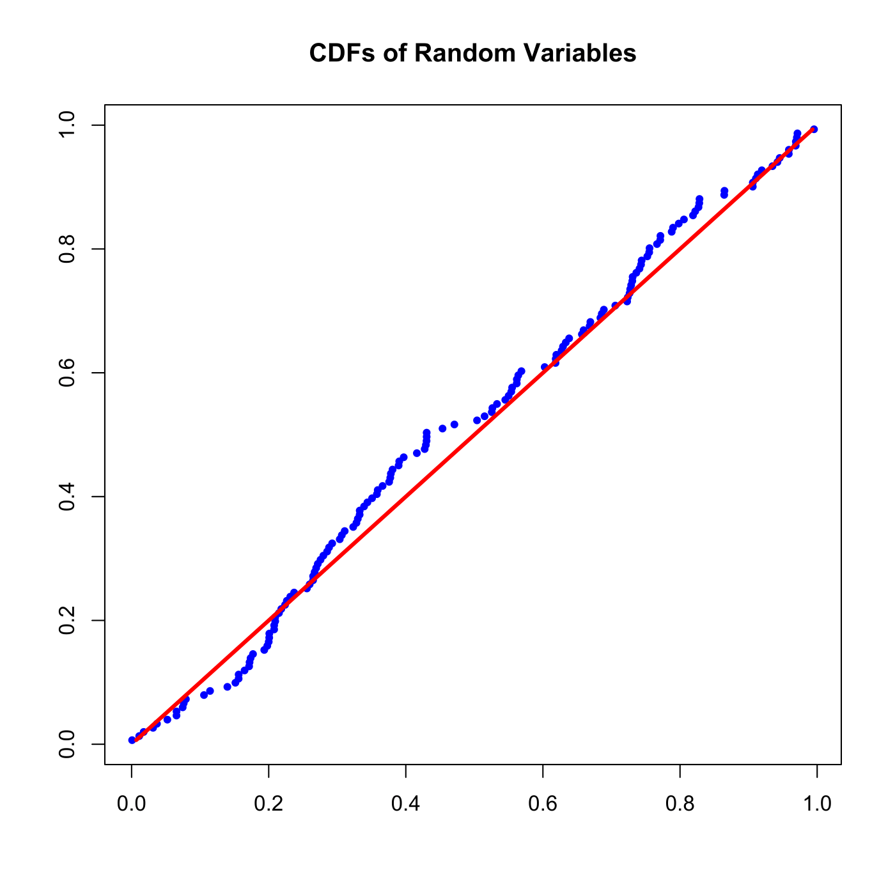
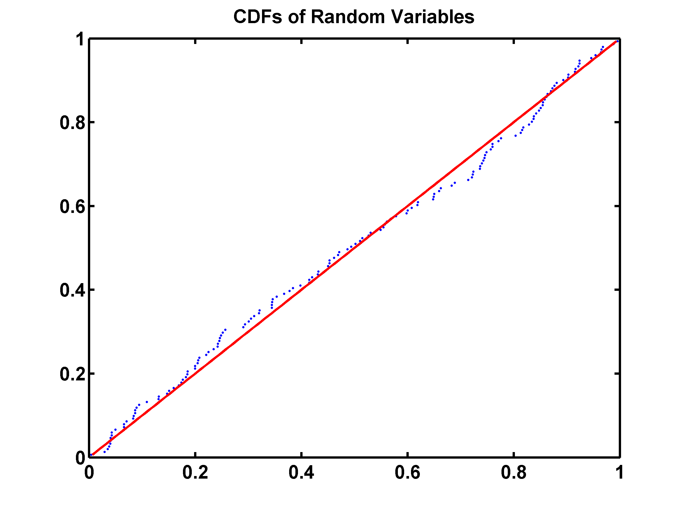

[](http://quantlet.de/)

## [](http://quantlet.de/) **SFEevt3** [](http://quantlet.de/)

```yaml

Name of QuantLet: SFEevt3 

Published in: Statistics of Financial Markets

Description: 'Produces a PP plot of the pseudo random variables with Gumbel distribution against theoretical Gumbel distribution.'

Keywords: cdf, distribution, extreme-value, graphical representation, gumbel, plot, pp-plot, random, random-number-generation

See also: SFEdenport, SFEevt1, SFEevt2

Author: Zografia Anastasiadou

Author[Matlab]: Wolfgang Haerdle, Barbara Choros

Submitted: Wed, July 22 2015 by quantomas
```





### R Code
```r

# clear variables and close windows
rm(list = ls(all = TRUE))
graphics.off()

# install and load packages
libraries = c("evd")
lapply(libraries, function(x) if (!(x %in% installed.packages())) {
    install.packages(x)
})
lapply(libraries, library, quietly = TRUE, character.only = TRUE)

# Main computation
set.seed(123)
n    = 150
xf1  = rgumbel(n)
xf   = sort(xf1)
t    = c(1:n)/(n + 1)
dat  = cbind(pgumbel(xf), t)
dat2 = cbind(t, t)

# Plot
plot(dat, col = "blue", pch = 20, xlab = "", ylab = "", main = "CDFs of Random Variables")
lines(dat2, col = "red", lwd = 3) 
```

automatically created on 2018-05-28

### MATLAB Code
```matlab

clear
close all
clc

n    = 150;
xf1  = evrnd(0, 1, n, 1);
xf   = sort(xf1);
t    = (1 : n) / (n + 1);
dat  = [evcdf(xf), t'];
dat2 = [t', t'];
hold on
scatter(dat(:, 1), dat(:, 2), '.')
plot(dat2(:, 1), dat2(:, 2), 'r', 'LineWidth', 2)
hold off
title('CDFs of Random Variables', 'FontSize', 16, 'FontWeight', 'Bold')
t    = 0 : 0.2 : 1;
t1   = 0 : 0.2 : 1;
set(gca, 'YTick', t)
set(gca, 'YTickLabel', t1)
box on
set(gca, 'FontSize', 16, 'LineWidth', 2, 'FontWeight', 'bold');
hold off

% print -painters -dpdf -r600 SFEevt3.pdf
% print -painters -dpng -r600 SFEevt3.png
```

automatically created on 2018-05-28