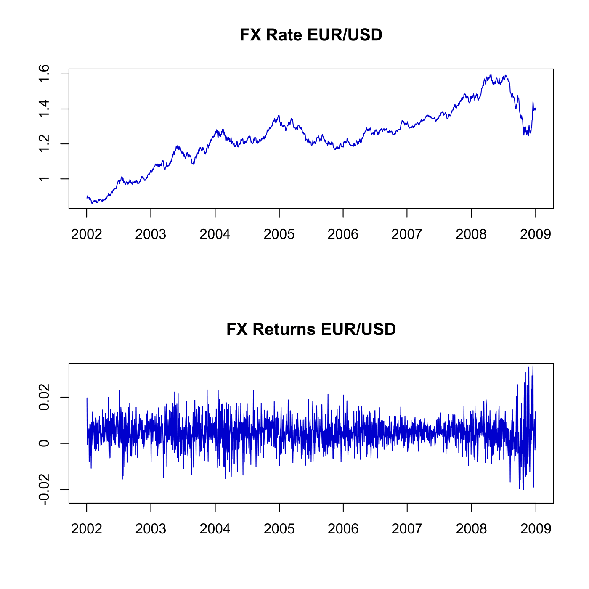

[](http://quantlet.de/)

## [](http://quantlet.de/) **SFEfxrate** [](http://quantlet.de/)

```yaml

Name of QuantLet : SFEfxrate

Published in : Statistics of Financial Markets

Description : 'Plots the time series of daily EUR/USD FX rates and returns with a window from
2002-01-01 to 2009-01-01.'

Keywords : 'data visualization, exchange-rate, financial, graphical representation, plot, returns,
time-series, visualization'

See also : SFEexratevol

Author : Maria Osipenko, Awdesch Melzer

Submitted : Wed, July 22 2015 by quantomas

Datafiles : exrate_GBR-USD_EUR-USD_20020101-20090101.txt

```




### R Code:
```r
# clear variables and close windows
rm(list = ls(all = TRUE))
graphics.off()

# Main computation
fx      = read.table("exrate_GBR-USD_EUR-USD_20020101-20090101.txt")
n       = nrow(fx)
returns = diff(log(as.matrix(fx[, 3])))  #Convert FX-rates to return series
par(mfrow = c(2, 1))

# Plot FX EUR/USD
plot(1:n, fx[, 3], type = "l", col = "blue3", ylab = "", xlab = "", axes = F, frame = T)
title("FX Rate EUR/USD")
axis(1, c(0, 261, 523, 784, 1044, 1304, 1566, 1828), c("2002", "2003", "2004", "2005", 
    "2006", "2007", "2008", "2009"))
axis(2, seq(0.8, 1.6, 0.2), round(seq(0.8, 1.6, 0.2), 2))

# Plot returns EUR/USD
plot(1:(n - 1), returns[, 1], type = "l", col = "blue3", ylab = "", xlab = "", axes = F, 
    frame = T, ylim = c(-0.028, 0.028))
title("FX Returns EUR/USD")
axis(1, c(0, 261, 523, 784, 1044, 1304, 1566, 1828), c("2002", "2003", "2004", "2005", 
    "2006", "2007", "2008", "2009"))
axis(2, seq(min(returns[, 1]), max(returns[, 1]), 0.02), round(seq(min(returns[, 
    1]), max(returns[, 1]), 0.02), 2)) 
```
