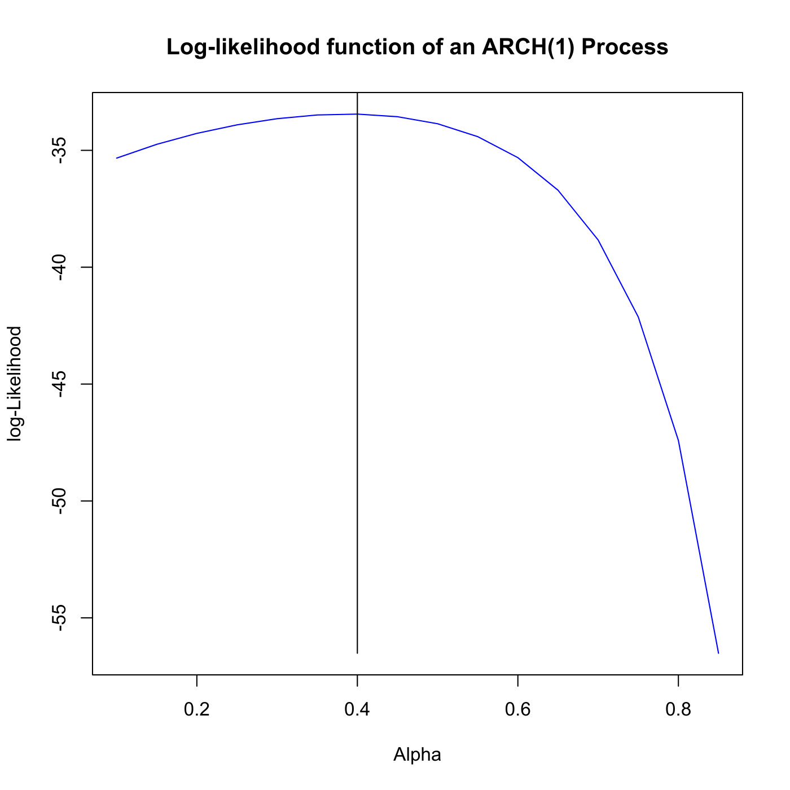

[](http://quantlet.de/)

## [](http://quantlet.de/) **SFElikarch1** [](http://quantlet.de/)

```yaml

Name of QuantLet : SFElikarch1

Published in : Statistics of Financial Markets

Description : Plots the conditional log-likelihood function of a generated ARCH(1) process.

Keywords : 'arch, autoregressive, discrete, graphical representation, likelihood, linear,
log-likelihood, plot, process, simulation, stochastic, stochastic-process, time-series'

See also : SFEkurgarch, SFElikgarch

Author : Joanna Tomanek, Lasse Groth

Submitted : Wed, July 22 2015 by quantomas

Input: 
- n: number of simulations
- alpha: true parameter for ARCH(1) process

Example : An example is produced for n=100 and alpha=0.5.

```




### R Code:
```r
# clear variables and close windows
rm(list = ls(all = TRUE))
graphics.off()

# install and load packages
libraries = c("fGarch")
lapply(libraries, function(x) if (!(x %in% installed.packages())) {
    install.packages(x)
})
lapply(libraries, library, quietly = TRUE, character.only = TRUE)

# parameter settings
n     = 100
alpha = 0.5
k     = 16

# Specify ARCH settings and simulate ARCH(1) process.
spec  = garchSpec(model = list(omega = 0.5, alpha, beta = 0), rseed = NULL)
x     = garchSim(spec, n = n + 100)
x     = x$garch[101:(n + 100)]
theta = seq(0.1, by = 0.05, length.out = k)
l1    = matrix(1, k, 1)

# Determine the log-likelihood values
i = 1
while (i <= k) {
    a = theta[i]
    omega = 1 - a
    l = 0
    t = 2
    while (t <= n) {
        l = l - 0.5 * log(omega + a * x[t - 1]^2) - 0.5 * x[t]^2/(omega + a * x[t - 1]^2)
        t = t + 1
    }
    l1[i] = l
    i = i + 1
}
dat1       = cbind(theta, l1)
maxl1      = matrix(dat1[l1 == max(l1)], ncol = 2)
maxl1[, 2] = maxl1[, 2] + 1
maxl10     = cbind(maxl1[1, 1], min(l1))
maxline    = rbind(maxl1, maxl10)

# Plot log-likelihood function
plot(dat1, type = "l", col = 4, main = "Log-likelihood function of an ARCH(1) Process", 
    xlab = "Alpha", ylab = "log-Likelihood")
points(maxline, type = "l") 

```
