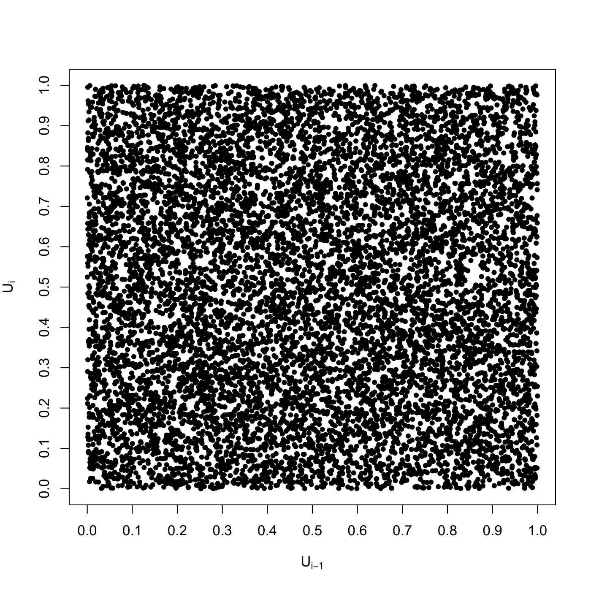

[](http://quantlet.de/)

## [](http://quantlet.de/) **SFEfibonacci** [](http://quantlet.de/)

```yaml

Name of QuantLet : SFEfibonacci

Published in : Statistics of Financial Markets

Description : 'Generates uniform random numbers using Fibonacci Algorithm and produces a plot of
generated numbers.'

Keywords : 'Fibonacci, graphical representation, plot, random, random-number-generation,
scatterplot, simulation, uniform'

See also : SFErandu, SFErangen1, SFErangen2

Author : Wolfgang K. Haerdle

Submitted : Wed, July 22 2015 by quantomas

Example : 'A plot is generated for the following parameter values: a=1366, b=150889, M=714025,
n=10000.'

```




### R Code:
```r
# clear variables and close windows
rm(list = ls(all = TRUE))
graphics.off()

# parameter settings
nn   = 18
a    = 1366
b    = 150889
M    = 714025
seed = 1234567
n    = 10000
yy   = c(seed)
i    = 2

# Main computation
while (i <= nn) {
    yy = cbind(yy, ((a * yy[i - 1] + b)%%M))
    i  = i + 1
}
y = yy/M
i = 19

while (i <= n + 18) {
    zeta = y[i - 17] - y[i - 5]
    if (zeta < 0) {
        zeta = zeta + 1
    }
    y[i] = zeta
    i = i + 1
}
y   = y[19:n + 18]
n1  = n - 2
n2  = n - 1
dat = c(y[1:n1], y[2:n2])

# Plot
plot(y[1:n1], y[2:n2], type = "p", pch = 20, xlab = expression(U[i - 1]), ylab = expression(U[i]), 
    xaxp = c(0, 1, 10), yaxp = c(0, 1, 10), xlim = c(0, 1), ylim = c(0, 1))

```
