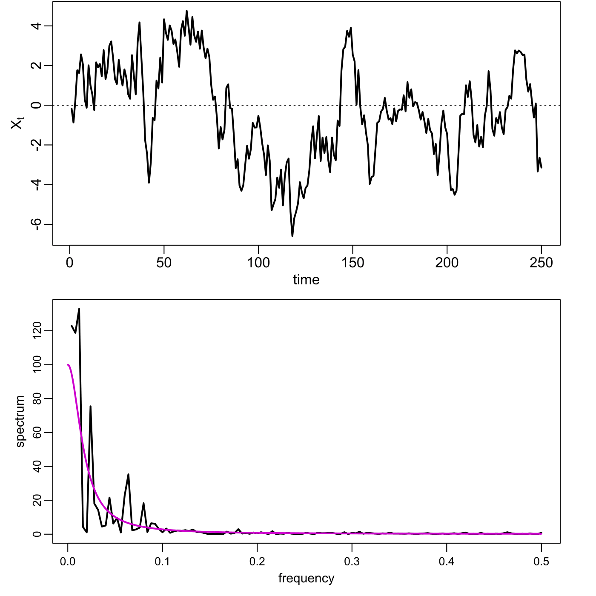
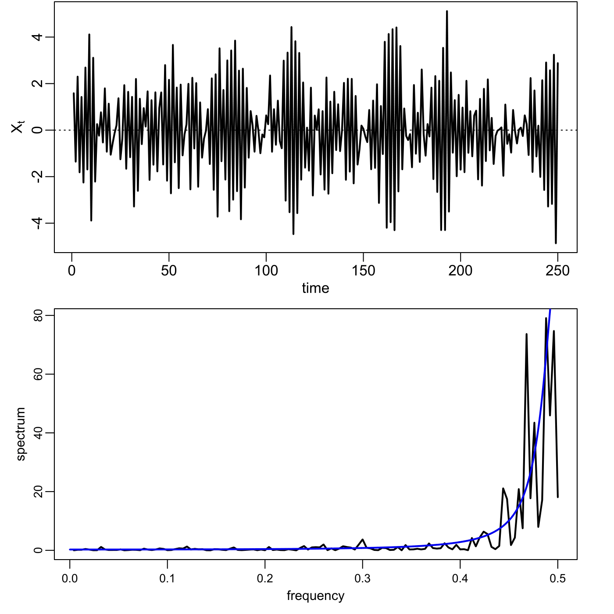
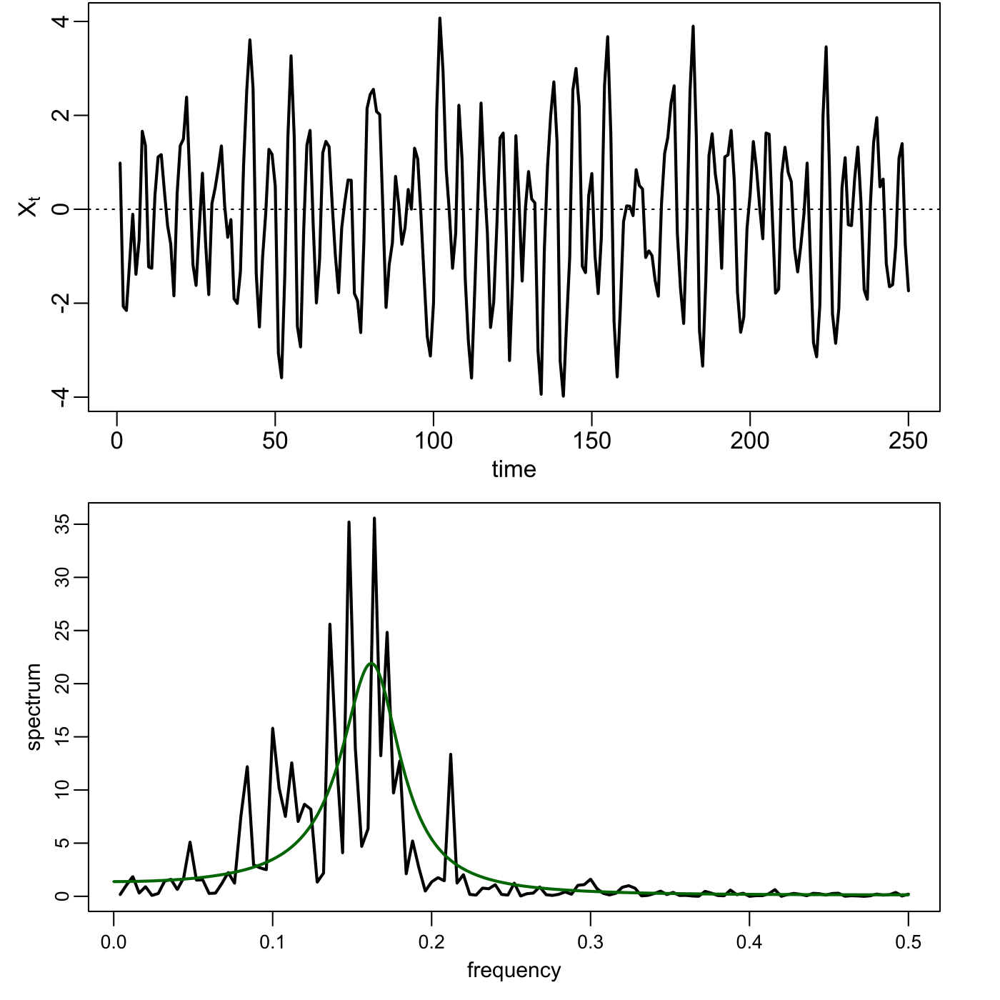
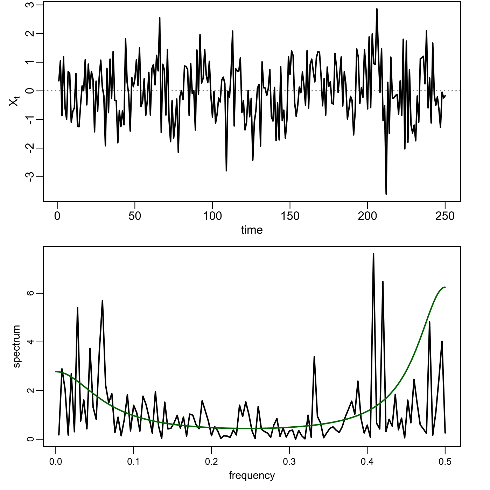
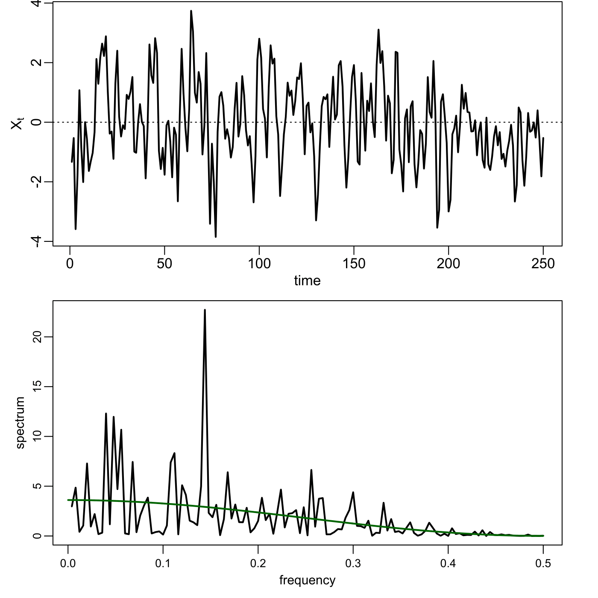
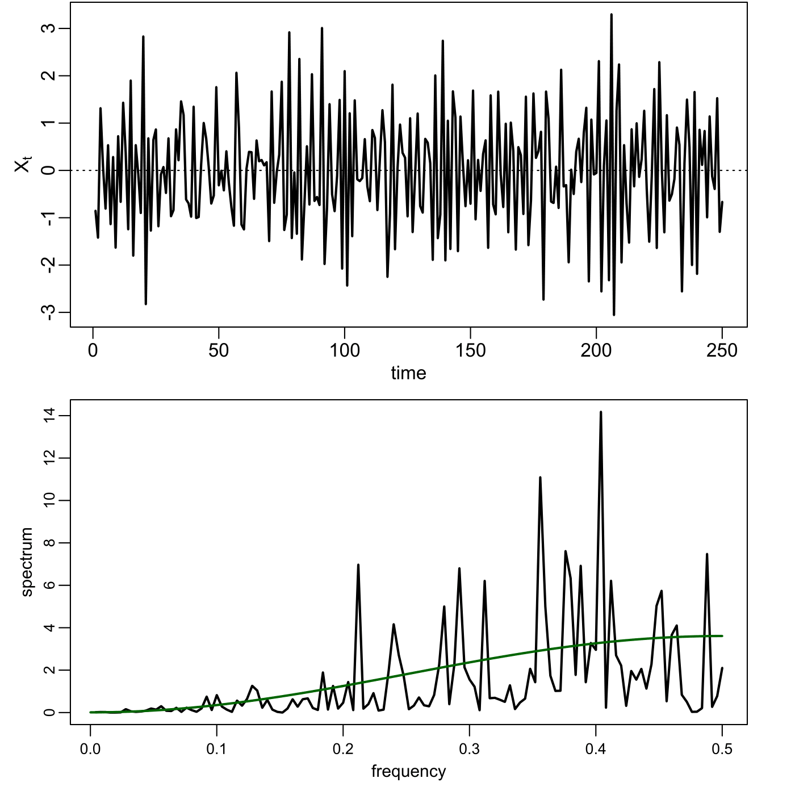
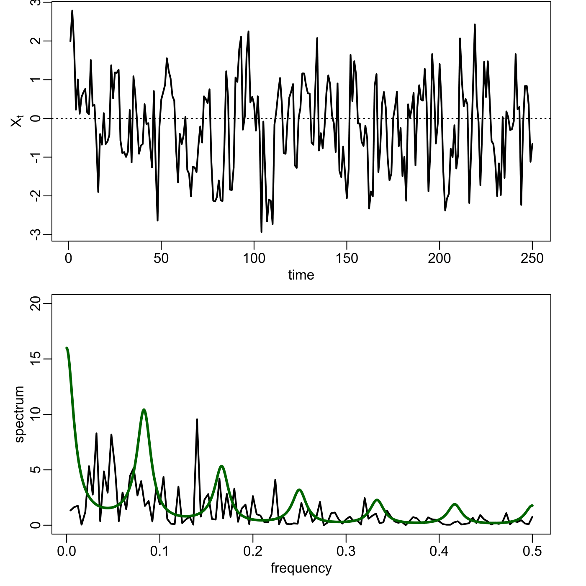

[](http://quantlet.de/)

## [](http://quantlet.de/) **SFESpecSim** [](http://quantlet.de/)

```yaml

Name of QuantLet : SFESpecSim

Published in : Statistics of Financial Markets

Description : 'Simulates AR(1), AR(2), MA(1), SAR(1) processes and computes the theoretical
spectral densities.'

Keywords : 'autoregressive, discrete, frequency, graphical representation, linear, moving-average,
plot, process, simulation, spectral, spectral-density, stochastic, stochastic-process, time-series'

See also : SFESpecWN, SFEPer, SFEFreqFilt, SFESignal, SFETsDecomp

Author : Caroline Kleist, Elisabeth Bommes

Submitted : Wed, July 22 2015 by quantomas

Output : Plots of the spectral density of the simulated processes.

Example: 
- 1: AR(1), phi=0.9
- 2: AR(1), phi=-0.9
- 3: AR(2), phi1=0.9 ; phi2=-0.75
- 4: AR(2), phi1=-0.1 ; phi2=0.5
- 5: MA(1), theta1=0.9
- 6: MA(1), theta1=-0.9
- 7: SAR(1), phi1=0.5, PHI1=0.5

```
















### R Code:
```r
# clear variables and close windows
rm(list = ls(all = TRUE))
graphics.off()

# install and load packages
libraries = c("TSA")  # library TSA is needed to compute theoretical spectral density
lapply(libraries, function(x) if (!(x %in% installed.packages())) {
    install.packages(x)
})
lapply(libraries, library, quietly = TRUE, character.only = TRUE)

# Main computation
par(mfrow = c(2, 1), mar = c(3, 3, 0, 2) + 0.1, mgp = c(1.5, 0.5, 0))
n      = 250        # number of simulated values
theta1 = 0.9        # parameter of MA(1)
sigma  = 1          # variance of error term
Fr     = 0:50/100

# AR(1) processes
phi1 = 0.9          # parameter of AR(1)
x = arima.sim(n = n, model = list(ar = phi1), rand.gen = function(n, ...) rnorm(n, 
    0, sigma))  # simulate process
l = ARMAspec(model = list(ar = c(phi1)), plot = F)  # compute theoretical spectral density

# Plot 1 - AR(1), phi = 0.9
plot(x, type = "l", xlab = "time", ylab = expression(X[t]), lwd = 2, cex.axis = 0.8, 
    cex.lab = 0.9)
abline(h = 0, lty = "dotted")
spec.pgram(x, log = "no", xlab = "frequency", ylab = "spectrum", main = "", sub = "", 
    lwd = 2, cex.axis = 0.8, cex.lab = 0.9)
lines(l$spec ~ l$freq, type = "l", lwd = 2, col = "magenta3")

phi1 = -0.9         # parameter of AR(1)
x = arima.sim(n = n, model = list(ar = phi1), rand.gen = function(n, ...) rnorm(n, 
    0, sigma))  # simulate process
l = ARMAspec(model = list(ar = c(phi1)), plot = F)  # compute theoretical spectral density

# Plot 2 - AR(1), phi = -0.9
dev.new()
par(mfrow = c(2, 1), mar = c(3, 3, 0, 2) + 0.1, mgp = c(1.5, 0.5, 0))
plot(x, type = "l", xlab = "time", ylab = expression(X[t]), lwd = 2, cex.axis = 0.8, 
    cex.lab = 0.9)
abline(h = 0, lty = "dotted")
spec.pgram(x, log = "no", xlab = "frequency", ylab = "spectrum", main = "", sub = "", 
    lwd = 2, cex.axis = 0.8, cex.lab = 0.9)
lines(l$spec ~ l$freq, type = "l", lwd = 2, col = "blue2")

# AR(2) processes
phi1 = 0.9
phi2 = -0.75         # AR(2) parameters
x = arima.sim(n = n, model = list(ar = c(phi1, phi2)), rand.gen = function(n, ...) rnorm(n, 
    0, sigma))  # simulate process
l = ARMAspec(model = list(ar = c(phi1, phi2)), plot = F)  # compute theoretical spectral density

# Plot 3 - AR(2), phi1 = 0.9, phi2 = -0.75
dev.new()
par(mfrow = c(2, 1), mar = c(3, 3, 0, 2) + 0.1, mgp = c(1.5, 0.5, 0))
plot(x, type = "l", xlab = "time", ylab = expression(X[t]), lwd = 2, cex.axis = 0.8, 
    cex.lab = 0.9)
abline(h = 0, lty = "dotted")
spec.pgram(x, log = "no", xlab = "frequency", ylab = "spectrum", main = "", sub = "", 
    lwd = 2, cex.axis = 0.8, cex.lab = 0.9)
lines(l$spec ~ l$freq, type = "l", lwd = 2, col = "darkgreen")

phi1 = -0.1
phi2 = 0.5          # AR(2) parameters
x = arima.sim(n = n, model = list(ar = c(phi1, phi2)), rand.gen = function(n, ...) rnorm(n, 
    0, sigma))  # simulate process
l = ARMAspec(model = list(ar = c(phi1, phi2)), plot = F)  # compute theoretical spectral density

# Plot 4 - AR(2), phi1 = -0.1, phi2 = 0.5
dev.new()
par(mfrow = c(2, 1), mar = c(3, 3, 0, 2) + 0.1, mgp = c(1.5, 0.5, 0))
plot(x, type = "l", xlab = "time", ylab = expression(X[t]), lwd = 2, cex.axis = 0.8, 
    cex.lab = 0.9)
abline(h = 0, lty = "dotted")
spec.pgram(x, log = "no", xlab = "frequency", ylab = "spectrum", main = "", sub = "", 
    lwd = 2, cex.axis = 0.8, cex.lab = 0.9)
lines(l$spec ~ l$freq, type = "l", lwd = 2, col = "darkgreen")

# MA(1) processes
theta1 = 0.9         # parameter of MA(1)
x = arima.sim(n = n, model = list(ma = theta1), rand.gen = function(n, ...) rnorm(n, 
    0, sigma))  # simulate process
l = ARMAspec(model = list(ma = c(theta1)), plot = F)  # compute theoretical spectral density

# Plot 5 - MA(1), theta1 = 0.9
dev.new()
par(mfrow = c(2, 1), mar = c(3, 3, 0, 2) + 0.1, mgp = c(1.5, 0.5, 0))
plot(x, type = "l", xlab = "time", ylab = expression(X[t]), lwd = 2, cex.axis = 0.8, 
    cex.lab = 0.9)
abline(h = 0, lty = "dotted")
spec.pgram(x, log = "no", xlab = "frequency", ylab = "spectrum", main = "", sub = "", 
    lwd = 2, cex.axis = 0.8, cex.lab = 0.9)
lines(l$spec ~ l$freq, type = "l", lwd = 2, col = "darkgreen")

theta1 = -0.9         # parameter of MA(1)
x = arima.sim(n = n, model = list(ma = theta1), rand.gen = function(n, ...) rnorm(n, 
    0, sigma))  # simulate process
l = ARMAspec(model = list(ma = c(theta1)), plot = F)  # compute theoretical spectral density

# Plot 6 - MA(1), theta1 = -0.9
dev.new()
par(mfrow = c(2, 1), mar = c(3, 3, 0, 2) + 0.1, mgp = c(1.5, 0.5, 0))
plot(x, type = "l", xlab = "time", ylab = expression(X[t]), lwd = 2, cex.axis = 0.8, 
    cex.lab = 0.9)
abline(h = 0, lty = "dotted")
spec.pgram(x, log = "no", xlab = "frequency", ylab = "spectrum", main = "", sub = "", 
    lwd = 2, cex.axis = 0.8, cex.lab = 0.9)
lines(l$spec ~ l$freq, type = "l", lwd = 2, col = "darkgreen")

# SAR(1) process
phi1 = 0.5
PHI1 = 0.5  # Reset theta for Seasonal AR
l = ARMAspec(model = list(ar = phi1, seasonal = list(sar = PHI1, period = 12)), col = "magenta3", 
    lwd = 3, cex.axis = 0.8, cex.lab = 0.9, plot = F)
x = arima.sim(n = n, model = list(ar = phi1, seasonal = list(sar = PHI1, period = 12)), 
    rand.gen = function(n, ...) rnorm(n, 0, sigma))

# Plot 7 - SAR(1), phi1 = 0.5, PHI1 = 0.5
dev.new()
par(mfrow = c(2, 1), mar = c(3, 3, 0, 2) + 0.1, mgp = c(1.5, 0.5, 0))
plot(x, type = "l", xlab = "time", ylab = expression(X[t]), lwd = 2)
abline(h = 0, lty = "dotted")
spec.pgram(x, log = "no", xlab = "frequency", ylab = "spectrum", main = "", lwd = 2, 
    sub = "", ylim = c(0, 20))
lines(l$spec ~ l$freq, type = "l", lwd = 3, col = "darkgreen") 

```
