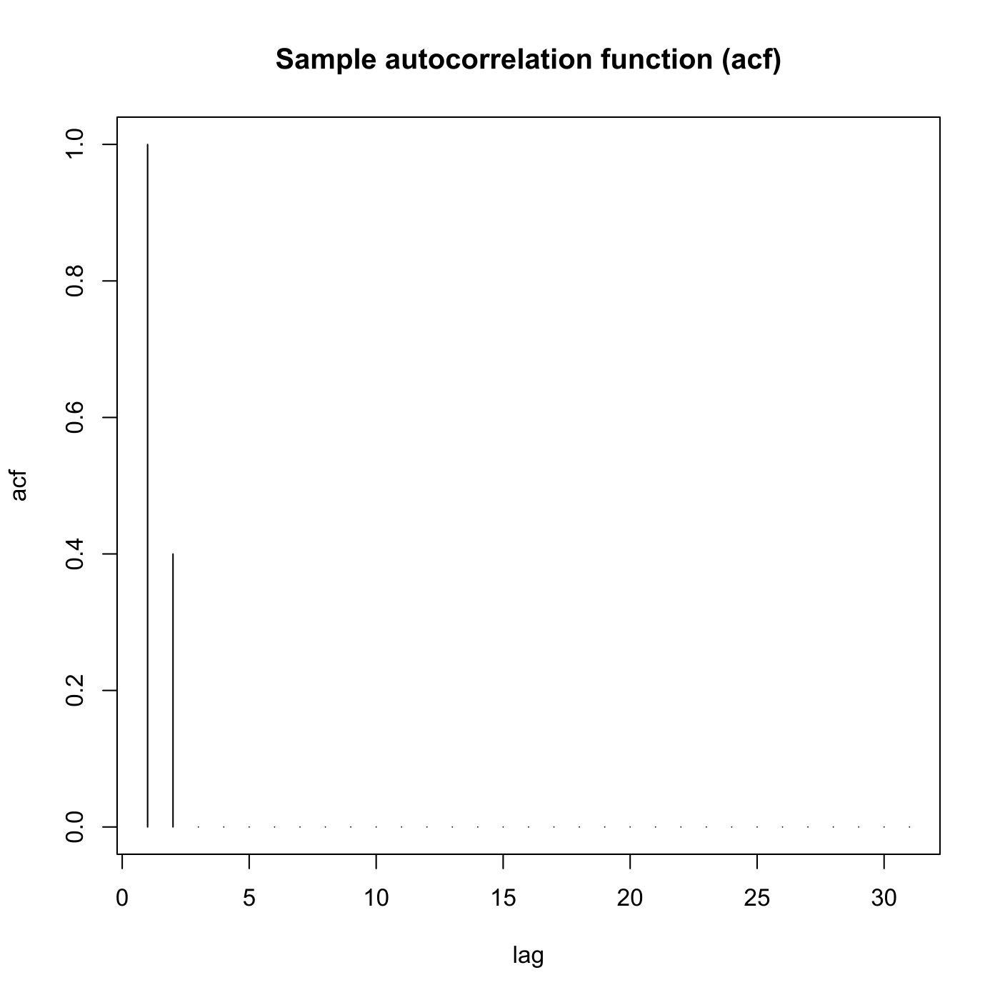
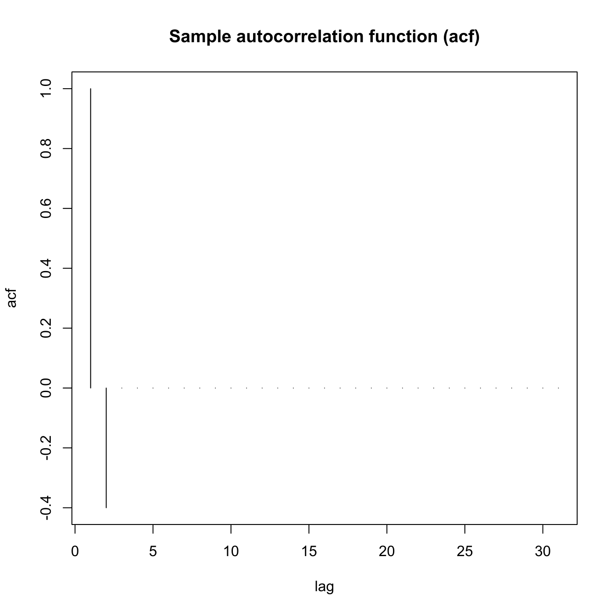

[](http://quantlet.de/)

## [](http://quantlet.de/) **SFEacfma1** [](http://quantlet.de/)

```yaml

Name of QuantLet : SFEacfma1

Published in : Statistics of Financial Markets

Description : Plots the autocorrelation function of an MA(1) (moving average) process.

Keywords : 'acf, autocorrelation, discrete, graphical representation, linear, moving-average, plot,
process, simulation, stationary, stochastic, stochastic-process, time-series'

See also : SFEacfar1, SFEacfar2, SFEacfma2, SFElikma1, SFEpacfar2, SFEpacfma2, SFEplotma1

Author : Joanna Tomanek

Submitted : Fri, July 24 2015 by quantomas

Input: 
- lag: lag value
- b: beta_1

Example: 
- 1: b = 0.5, lag = 30.
- 2: b = -0.5, lag = 30.

```






### R Code:
```r
# clear variables and close windows
rm(list = ls(all = TRUE))
graphics.off()

# parameter settings
lag = "30"      # lag value
b   = "0.5"     # value of beta_1

# Input beta_1
message = "      input beta"
default = b
b       = winDialogString(message, default)
b       = type.convert(b, na.strings = "NA", as.is = FALSE, dec = ".")

# Input lag value
message = "      input lag"
default = lag
lag     = winDialogString(message, default)
lag     = type.convert(lag, na.strings = "NA", as.is = FALSE, dec = ".")

# Plot
plot(ARMAacf(ar = numeric(0), ma = b, lag.max = lag, pacf = FALSE), type = "h", xlab = "lag", 
    ylab = "acf")
title("Sample autocorrelation function (acf)") 

```
