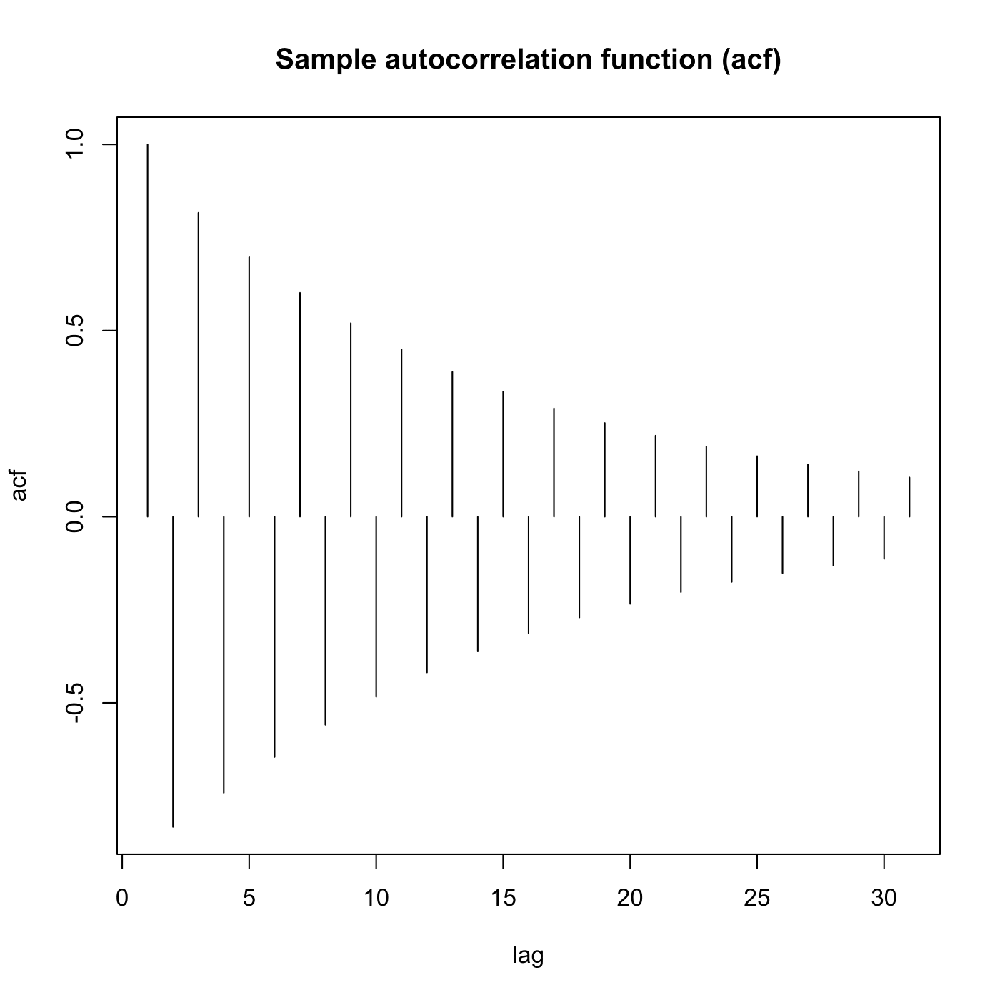

[](http://quantlet.de/)

## [](http://quantlet.de/) **SFEacfar2** [](http://quantlet.de/)

```yaml

Name of QuantLet : SFEacfar2

Published in : Statistics of Financial Markets

Description : Plots the autocorrelation function of an AR(2) (autoregressive) process.

Keywords : 'acf, autocorrelation, autoregressive, discrete, graphical representation, linear, plot,
process, simulation, stationary, stochastic, stochastic-process, time-series'

See also : SFEacfar1, SFEacfma1, SFEacfma2, SFElikma1, SFEpacfar2, SFEpacfma2, SFEplotma1

Author : Joanna Tomanek

Submitted : Fri, July 24 2015 by quantomas

Input: 
- lag: lag value
- a1: alpha_1
- a2: alpha_2

Example: 
- 1: a1=0.5, a2=0.4 and lag=30
- 2: a1=0.5, a2=-0.4 and lag=30.
- 3: a1=-0.5, a2=0.4 and lag=30.
- 4: a1=-0.5, a2=-0.4 and lag=30.

```





### R Code:
```r
# clear variables and close windows
rm(list = ls(all = TRUE))
graphics.off()

# parameter settings
lag = "30"  	# lag value
a1  = "0.5"  	# value of alpha_1
a2  = "0.4"  	# value of alpha_2

# Input alpha1
message = "input alpha1"
default = a1
a1      = winDialogString(message, default)
a1      = type.convert(a1, na.strings = "NA", as.is = FALSE, dec = ".")

# Input alpha2
message = "input alpha2"
default = a2
a2      = winDialogString(message, default)
a2      = type.convert(a2, na.strings = "NA", as.is = FALSE, dec = ".")

# Input lag
message = "input lag"
default = lag
lag     = winDialogString(message, default)
lag     = type.convert(lag, na.strings = "NA", as.is = FALSE, dec = ".")

# Plot ACF with alpha_1=a1, alpha_2=a2
plot(ARMAacf(ar = c(a1, a2), ma = numeric(0), lag.max = lag, pacf = FALSE), type = "h", 
    xlab = "lag", ylab = "acf")
title("Sample autocorrelation function (acf)") 

```
