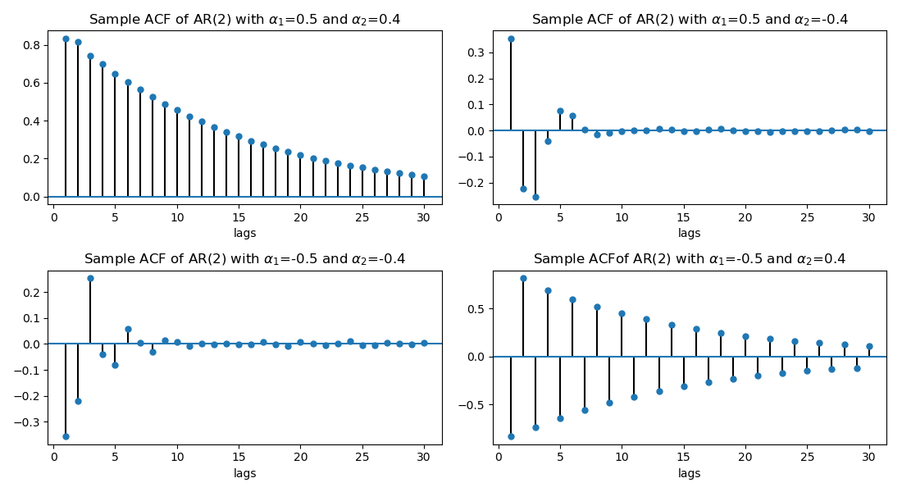

[](http://quantlet.de/)

## [](http://quantlet.de/) **SFEacfar2** [](http://quantlet.de/)

```yaml

Name of QuantLet : SFEacfar2 

Published in: Statistics of Financial Markets

Description: Plots the autocorrelation function of an AR(2) (autoregressive) process.

Keywords: acf, autocorrelation, autoregressive, discrete, graphical representation, linear, plot, process, simulation, stationary, stochastic, stochastic-process, time-series

See also: SFEacfar1, SFEacfma1, SFEacfma2, SFElikma1, SFEpacfar2, SFEpacfma2, SFEplotma1

Author: Joanna Tomanek
Author[Python]: Justin Hellermann

Submitted: Fri, July 24 2015 by quantomas
Submitted[Python]: Thu, Aug 01 2019 by Justin Hellermann

Input:
- lag : lag value
- a1 : alpha_1
- a2 : alpha_2

Example:
- 1: a1=0.5, a2=0.4 and lag=30
- 2: a1=0.5, a2=-0.4 and lag=30.
- 3: a1=-0.5, a2=0.4 and lag=30.
- 4: a1=-0.5, a2=-0.4 and lag=30.

```




### R Code
```r

# clear variables and close windows
rm(list = ls(all = TRUE))
graphics.off()

# parameter settings
lag = "30"  	# lag value
a1  = "0.5"  	# value of alpha_1
a2  = "0.4"  	# value of alpha_2

# Input alpha1
message = "input alpha1"
default = a1
a1      = winDialogString(message, default)
a1      = type.convert(a1, na.strings = "NA", as.is = FALSE, dec = ".")

# Input alpha2
message = "input alpha2"
default = a2
a2      = winDialogString(message, default)
a2      = type.convert(a2, na.strings = "NA", as.is = FALSE, dec = ".")

# Input lag
message = "input lag"
default = lag
lag     = winDialogString(message, default)
lag     = type.convert(lag, na.strings = "NA", as.is = FALSE, dec = ".")

# Plot ACF with alpha_1=a1, alpha_2=a2
plot(ARMAacf(ar = c(a1, a2), ma = numeric(0), lag.max = lag, pacf = FALSE), type = "h", 
    xlab = "lag", ylab = "acf")
title("Sample autocorrelation function (acf)") 

```

automatically created on 2019-08-01

### PYTHON Code
```python

import pandas as pd
import numpy as np
from statsmodels.graphics.tsaplots import plot_acf
from statsmodels.tsa.arima_process import arma_generate_sample
import matplotlib.pyplot as plt

# parameter settings
lags = 30    # lag value
n = 100000
alphas = np.array([0.5,0.4])
betas = np.array([0])
# add zero-lag and negate alphas
ar = np.r_[1, -alphas]
ma = np.r_[1, betas]

np.random.seed(123)
simulated_data_1 = arma_generate_sample(ar=ar, ma=ma, nsample=n)
# depending on cpu, plotting may take some time 
ar1 = np.r_[1,[-0.5,-0.4]]
ar2 = np.r_[1,[-0.5,0.4]]
ar3 = np.r_[1,[0.5,0.4]]
ar4 = np.r_[1,[0.5,-0.4]]
ma = np.r_[1, betas]


f, axarr = plt.subplots(2, 2,figsize=(11, 6))
simulated_data_1 = arma_generate_sample(ar=ar1, ma=ma, nsample=n) 
plot_acf(simulated_data_1,lags=lags,zero=False,alpha=None, ax=axarr[0, 0],title='Sample ACF of AR(2) with '+r'$\alpha_1$='+str(-ar1[1])+' and '+r'$\alpha_2$='+str(-ar1[2]))
axarr[0, 0].set_xlabel('lags')
simulated_data_2 = arma_generate_sample(ar=ar2, ma=ma, nsample=n) 
plot_acf(simulated_data_2,lags=lags,zero=False,alpha=None, ax=axarr[0, 1],title='Sample ACF of AR(2) with '+r'$\alpha_1$='+str(-ar2[1])+' and '+r'$\alpha_2$='+str(-ar2[2]))
axarr[0, 1].set_xlabel('lags')
simulated_data_3 = arma_generate_sample(ar=ar3, ma=ma, nsample=n) 
plot_acf(simulated_data_3,lags=lags,zero=False,alpha=None, ax=axarr[1, 0],title='Sample ACF of AR(2) with '+r'$\alpha_1$='+str(-ar3[1])+' and '+r'$\alpha_2$='+str(-ar3[2]))
axarr[1, 0].set_xlabel('lags')
simulated_data_4 = arma_generate_sample(ar=ar4, ma=ma, nsample=n) 
plot_acf(simulated_data_4,lags=lags,zero=False,alpha=None, ax=axarr[1,1],title='Sample ACFof AR(2) with '+r'$\alpha_1$='+str(-ar4[1])+' and '+r'$\alpha_2$='+str(-ar4[2]))
axarr[1, 1].set_xlabel('lags')

plt.tight_layout()
plt.savefig('SFEacfar2_py.png')

plt.show()
```

automatically created on 2019-08-01