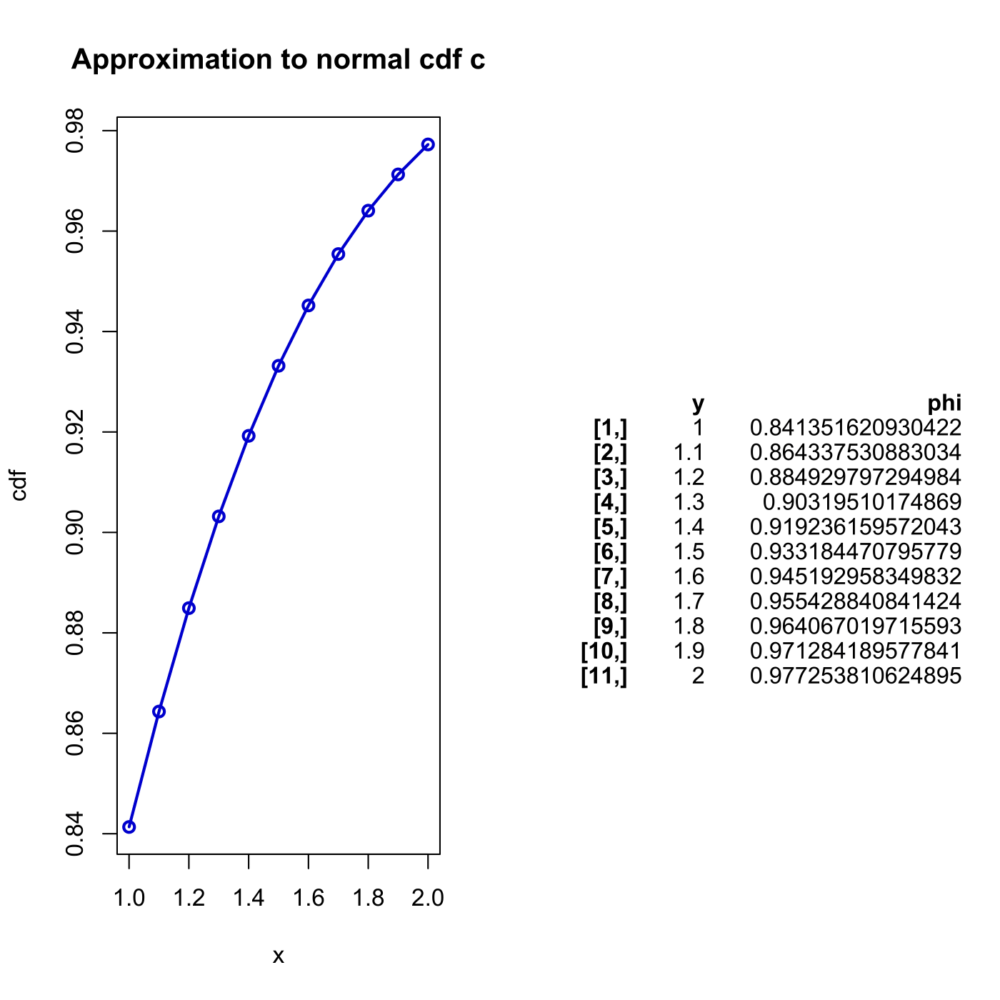

[](http://quantlet.de/)

## [](http://quantlet.de/) **SFENormalApprox3** [](http://quantlet.de/)

```yaml

Name of QuantLet : SFENormalApprox3

Published in : Statistics of Financial Markets

Description : 'Computes numerical approximation to a normal cumulative distribution function (cdf)
using method c).'

Keywords : 'approximation, cdf, distribution, graphical representation, normal,
normal-distribution, numeric, plot'

See also : SFENormalApprox1, SFENormalApprox2, SFENormalApprox4

Author : Wolfgang K. Haerdle

Submitted : Fri, July 24 2015 by quantomas

Output: 
- phi: approximation of Normal cdf at different values

Example : 'Estimated normal cdf at that points 1:0.1:2 are given: [0.8413 0.8643 0.8849 0.9032
0.9192 0.9332 0.9452 0.9554 0.9641 0.9713 0.9772].'

```




### R Code:
```r
# clear variables and close windows
rm(list = ls(all = TRUE))
graphics.off()

# install and load packages
libraries = c("gplots")
lapply(libraries, function(x) if (!(x %in% installed.packages())) {
    install.packages(x)
})
lapply(libraries, library, quietly = TRUE, character.only = TRUE)

# Main computation
y   = seq(1, 2, 0.1)
a1  = 0.09979268
a2  = 0.04432014
a3  = 0.0096992
a4  = -9.862e-05
a5  = 0.00058155
t   = abs(y)
s   = 0.5 - 1/(2 * ((1 + a1 * t + a2 * t^2 + a3 * t^3 + a4 * t^4 + a5 * t^5)^8))  # computer s
phi = 0.5 + s * (-2 * (y < 0) + 1)  # if y<0, 0.5-s if y>0, 0.5+s

# Output
print(" ")
print("Estimation Points")
print(y)
print("Estimated Normal CDF")
print(phi)

# Plot
par(mfrow = c(1, 2))
plot(y, phi, lwd = 2, xlab = "x", type = "o", ylab = "cdf", main = "Approximation to normal cdf c", 
    col = "blue3")
textplot(cbind(y, phi)) 

```
