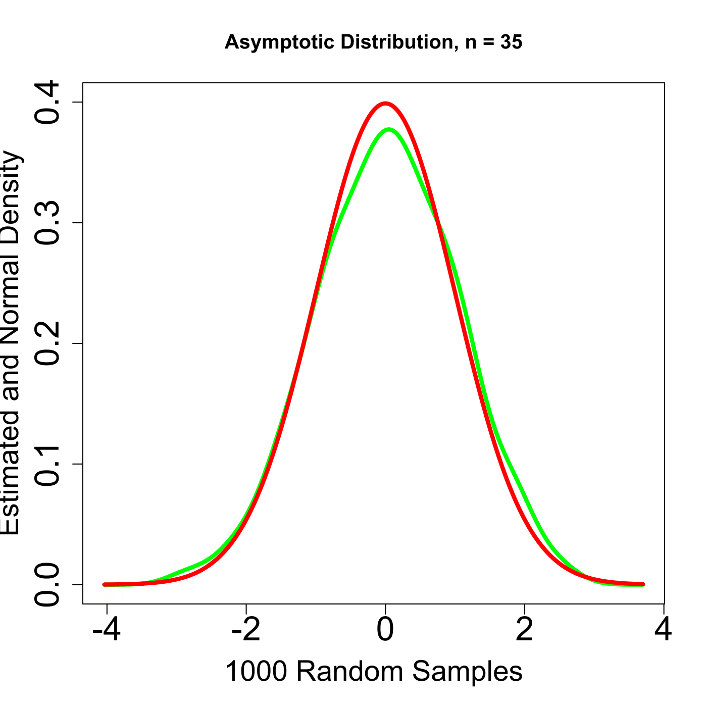

[](http://quantlet.de/)

## [](http://quantlet.de/) **SFEclt** [](http://quantlet.de/)

```yaml

Name of QuantLet : SFEclt

Published in : Statistics of Financial Markets

Description : 'Illustrates the (univariate) Central Limit Theorem (CLT). n*1000 sets of
n-dimensional Bernoulli samples are generated and used to approximate the distribution of t =
sqrt(n)*(mean(x)-mu)/sigma -> N(0,1). The estimated density (red) of t is shown together with the
standard normal (green).'

Keywords : 'CLT, bernoulli, binomial, density, distribution, estimation, graphical representation,
normal, normal-distribution, plot'

Author : Wolfgang K. Härdle

Submitted : Fri, July 24 2015 by quantomas

Example : Two examples are generated with n = 35 and n = 5.

```




### R Code:
```r
# clear variables and close windows
rm(list = ls(all = TRUE))
graphics.off()

# install and load packages
libraries = c("KernSmooth")
lapply(libraries, function(x) if (!(x %in% installed.packages())) {
    install.packages(x)
})
lapply(libraries, library, quietly = TRUE, character.only = TRUE)

# parameter settings
p = 0.5
n = 35

# Random generation of the binomial distribution with parameters 1000*n and 0.5
bsample = rbinom(n * 1000, 1, p)  

# Create a matrix of binomial random variables
bsamplem = matrix(bsample, n, 1000) 

#Compute kernel density estimate
bden = bkde((colMeans(bsamplem) - p)/sqrt(p * (1 - p)/n))  

# Plot
plot(bden, col = "green", type = "l", lty = 1, lwd = 4, xlab = "1000 Random Samples", 
    ylab = "Estimated and Normal Density", cex.lab = 1.7, cex.axis = 2, ylim = c(0, 
        0.4))  #Plot kernel density
lines(bden$x, dnorm(bden$x), col = "red", lty = 1, lwd = 4)  
title(paste("Asymptotic Distribution, n =", n)) 

```
