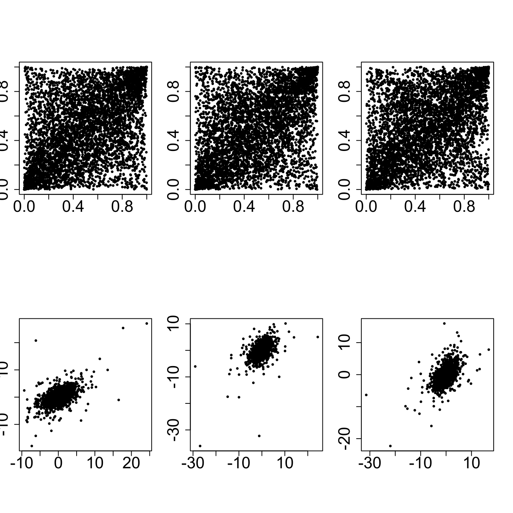

[](http://quantlet.de/)

## [](http://quantlet.de/) **SFEtMC** [](http://quantlet.de/)

```yaml

Name of QuantLet : SFEtMC

Published in : Statistics of Financial Markets

Description : 'Produces scatterplots of Monte Carlo sample (5000 realisations) of pseudo random
variable with uniform (top) and marginal distributions (bottom). Dependence structure is given by
t-copula with df=3 and parameter=0.5.'

Keywords : 'copula, distribution, graphical representation, monte-carlo, plot, random, scatterplot,
t-distribution, uniform'

See also : SFEclaytonMC, SFEplotCop, SFEstaticCop, SFScontourgumbel

Author : Ostap Okhrin

Submitted : Sat, July 25 2015 by quantomas

Example : 'Dependence structure is given by t-copula with nu = 3 and psi(i,j) = 0.5, i, j = 1, 2,
3, i ≠ j.'

```




### R Code:
```r
# clear variables and close windows
rm(list = ls(all = TRUE))
graphics.off()

# install and load packages
libraries = c("copula")
lapply(libraries, function(x) if (!(x %in% installed.packages())) {
    install.packages(x)
})
lapply(libraries, library, quietly = TRUE, character.only = TRUE)

# Main computation
layout(matrix(c(1, 4, 2, 5, 3, 6), 2, 3, byrow = FALSE))
par(mar = c(2, 2, 2, 2), pty = "s")

# Uniform marginal distributions
tMVD	= mvdc(tCopula(param = 0.5, df = 3, dim = 3), margins = c("unif", "unif", "unif"), 
    paramMargins = list(list(min = 0, max = 1), list(min = 0, max = 1), list(min = 0, 
        max = 1)))
X		= rMvdc(tMVD, n = 5000)
plot(X[, 1], X[, 2], xlab = "", ylab = "", cex = 0.5, pch = 19, cex.axis = 2, xlim = c(0, 
    1), ylim = c(0, 1))

tMVD 	= mvdc(tCopula(param = 0.5, df = 3, dim = 3), margins = c("unif", "unif", "unif"), 
    paramMargins = list(list(min = 0, max = 1), list(min = 0, max = 1), list(min = 0, 
        max = 1)))
X 		= rMvdc(tMVD, n = 5000)
plot(X[, 1], X[, 3], xlab = "", ylab = "", cex = 0.5, pch = 19, cex.axis = 2)

tMVD 	= mvdc(tCopula(param = 0.5, df = 3, dim = 3), margins = c("unif", "unif", "unif"), 
    paramMargins = list(list(min = 0, max = 1), list(min = 0, max = 1), list(min = 0, 
        max = 1)))
X 		= rMvdc(tMVD, n = 5000)
plot(X[, 2], X[, 3], xlab = "", ylab = "", cex = 0.5, pch = 19, cex.axis = 2)

# t3 marginal distributions
tMVD 	= mvdc(tCopula(param = 0.5, df = 3, dim = 3), margins = c("t", "t", "t"), paramMargins = list(list(df = 3), 
    list(df = 3), list(df = 3)))
X 		= rMvdc(tMVD, n = 5000)
plot(X[, 1], X[, 2], xlab = "", ylab = "", cex = 0.5, pch = 19, cex.axis = 2)

tMVD 	= mvdc(tCopula(param = 0.5, df = 3, dim = 3), margins = c("t", "t", "t"), paramMargins = list(list(df = 3), 
    list(df = 3), list(df = 3)))
X 		= rMvdc(tMVD, n = 5000)
plot(X[, 1], X[, 3], xlab = "", ylab = "", cex = 0.5, pch = 19, cex.axis = 2)

tMVD 	= mvdc(tCopula(param = 0.5, df = 3, dim = 3), margins = c("t", "t", "t"), paramMargins = list(list(df = 3), 
    list(df = 3), list(df = 3)))
X 		= rMvdc(tMVD, n = 5000)
plot(X[, 2], X[, 3], xlab = "", ylab = "", cex = 0.5, pch = 19, cex.axis = 2) 

```
