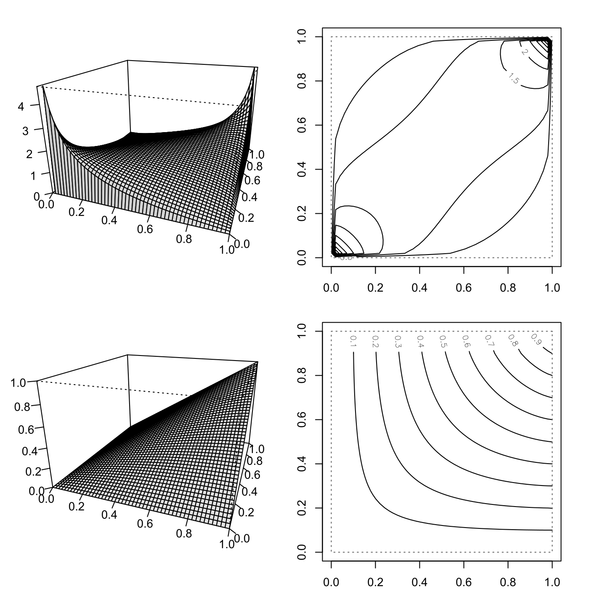

[](http://quantlet.de/)

## [](http://quantlet.de/) **SFEgaussCop** [](http://quantlet.de/)

```yaml

Name of QuantLet : SFEgaussCop

Published in : Statistics of Financial Markets

Description : 'Plots density, distribution, density contour and distribution contour of a Gaussian
(normal) copula with 2 and 3 dimensions and parameter=0.5.'

Keywords : contour, copula, density, distribution, gaussian, graphical representation, normal, plot

Author : Ostap Okhrin

Submitted : Sat, July 25 2015 by quantomas

```




### R Code:
```r
# clear variables and close windows
rm(list = ls(all = TRUE))
graphics.off()

# install and load packages
libraries = c("copula")
lapply(libraries, function(x) if (!(x %in% installed.packages())) {
    install.packages(x)
})
lapply(libraries, library, quietly = TRUE, character.only = TRUE)

# Plot process
layout(matrix(c(1, 2, 3, 4), 2, 2, byrow = TRUE))
par(mar = c(2, 2, 2, 2))

# dcopula gives the density
gaussCop = normalCopula(param = 0.5, dim = 2)
persp(gaussCop, dCopula, phi = 20, theta = 20, ticktype = "detailed", ylab = "", 
    xlab = "", zlab = "", shade = 0.1)
contour(gaussCop, dCopula, method = "edge")
# pcopula gives the distribution
persp(gaussCop, pCopula, phi = 20, theta = 20, ticktype = "detailed", ylab = "", 
    xlab = "", zlab = "", shade = 0.1)
contour(gaussCop, pCopula, method = "edge")

```
