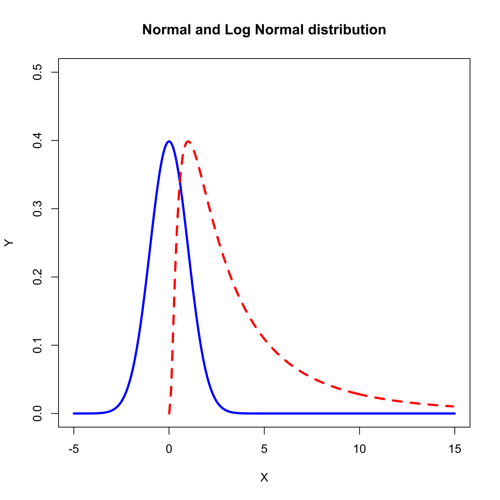

[](http://quantlet.de/)

## [](http://quantlet.de/) **SFElognormal** [](http://quantlet.de/)

```yaml

Name of QuantLet : SFElognormal

Published in : Statistics of Financial Markets

Description : 'Compares and plots densities of lognormally and normally distributed random
variables.'

Keywords : 'density, distribution, graphical representation, lognormal, normal,
normal-distribution, plot, random'

Author : Alexander Ristig

Submitted : Sat, July 25 2015 by quantomas

```




### R Code:
```r
# clear variables and close windows
rm(list = ls(all = TRUE))
graphics.off()

# Main computation
par(mfrow = c(1, 1))
margins     = c(1, 1, 1, 1)
normaxis    = seq(from = -5, to = 15, by = 0.1)
lognormaxis = seq(from = 0.01, to = 15, by = 0.1)
n           = dnorm(normaxis)
ln          = dnorm(log(lognormaxis))

# Plot
plot(normaxis, n, col = "blue", type = "l", lty = 1, lwd = 3, xlim = c(-5, 15), ylim = c(0, 
    0.5), main = "Normal and Log Normal distribution", xlab = "X", ylab = "Y")
points(lognormaxis, ln, col = "red", type = "l", lty = 2, lwd = 3)
```
