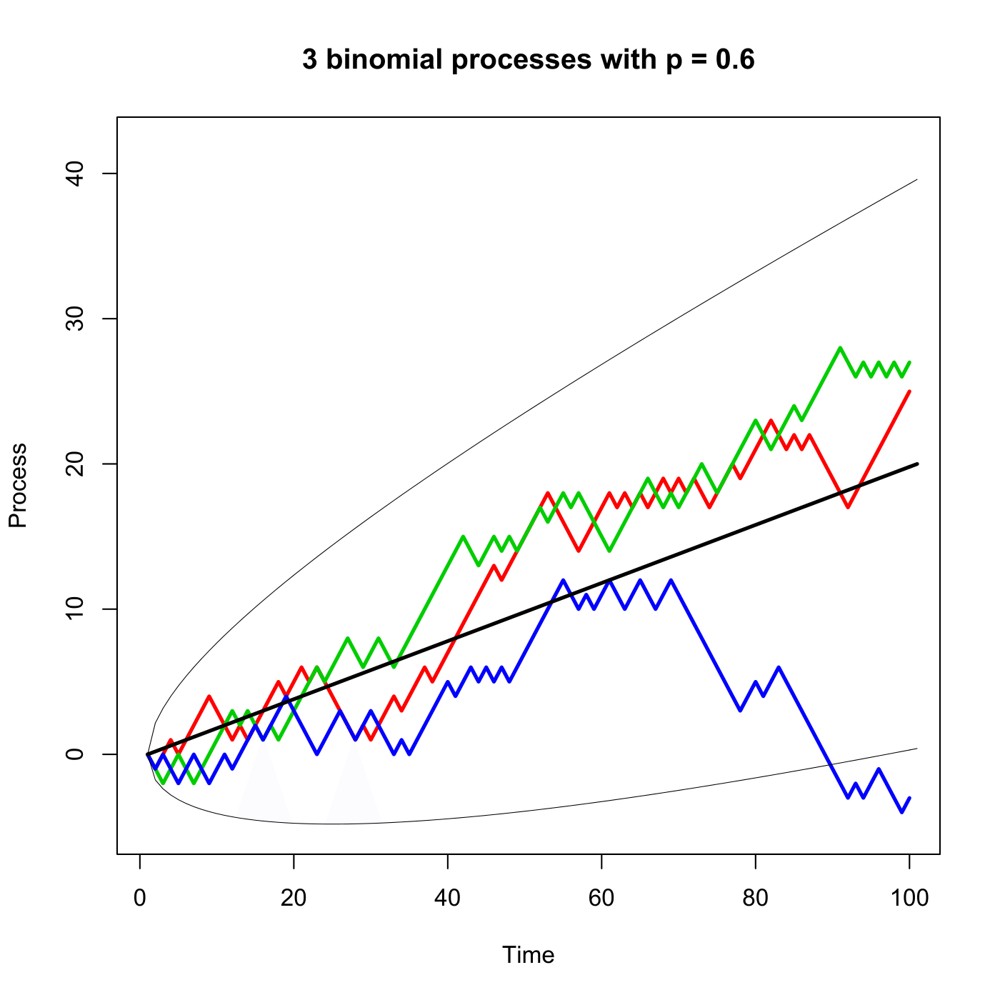

[](http://quantlet.de/)

## [](http://quantlet.de/) **SFEBinomp** [](http://quantlet.de/)

```yaml

Name of QuantLet : SFEBinomp

Published in : Statistics of Financial Markets

Description : 'Generates and plots 3 paths of a binomial process with p = 0.6. (2sigma)-intervals
around the trend are given as well.'

Keywords : 'binomial, discrete, graphical representation, plot, process, random,
random-number-generation, random-walk, simulation, stochastic, stochastic-process, time-series'

See also : SFEbinomv, SFEbinomv_log

Author : Alexander Ristig

Author[Matlab] : Christian Hafner

Submitted : Sat, July 25 2015 by quantomas

Submitted[Matlab] : Tue, April 26 by Ya Qian

Input: 
- n: number of observations
- k: number of trajectories
- p: probability of up movement

Input[Matlab]: 
- obs: number of observations
- traj: number of trajectories
- p: probability of positive step being realised

```

.png)




### R Code:
```r
# clear variables and close windows
rm(list = ls(all = TRUE))
graphics.off()

# parameter settings
set.seed(1)     # pseudo random numbers
n = 100         # number of observations
k = 3           # number of trajectories
p = 0.6         # probability of positive step being realised

# Main computation
t       = c(0:n)
trend   = t * (2 * p - 1)
std     = sqrt(4 * t * p * (1 - p))
s_1     = trend + 2 * std  # upper confidence band
s_2     = trend - 2 * std  # lower confidence band
z       = matrix(runif(k * n, min = (p - 1), max = p), k, n, byrow = TRUE)  # matrix of uniform random numbers
z       = (z > 0) * 1
z       = z * 2 - 1
walk    = matrix(0, k, n, byrow = TRUE)

for (i in 2:n) {
    walk[, i] = walk[, i - 1] + z[, i]
}
if (p == 0.5) {
    bound = c(-20, 20)
} else if (p > 0.5) {
    bound = c(-5, p * 70)
} else {
    bound = c((p - 1) * 70, 5)
}

# Plot first trajectory
plot(walk[1, ], type = "l", lwd = 2.5, col = "red", xlab = "Time", ylab = "Process", 
    ylim = bound, main = paste(k, "binomial processes with p =", p))

# Add remaining trajectories, if they exist
if (k > 1) {
    for (i in 2:k) {
        points(walk[i, ], type = "l", lwd = 2.5, col = (i + 1))  # all other trajectory
    }
}
points(s_1, type = "l", lwd = 0.5)    # upper confidence interval boundary
points(s_2, type = "l", lwd = 0.5)    # lower confidence interval boundary
points(trend, type = "l", lwd = 2.5)  # trend line 

```

### MATLAB Code:
```matlab

clear all
close all
clc

% user inputs parameters
disp('Please input observations,trajectories, p as: [100, 3, 0.6]');
disp(' ') ;
para=input('[observations trajectories p]=');
while length(para) < 3
  disp('Not enough input arguments. Please input in 1*3 vector form like [100, 3, 0.6] or [100 3 0.6]');
  disp(' ') ;
  para=input('[observations trajectories p]=');
end
obs=para(1);
traj=para(2);
p=para(3);

% main simulation
t=1:obs;
trend = t*(2*p-1);
std = sqrt(4*t*p*(1-p));
s1=trend+2*std;
s2=trend-2*std;
z=unifrnd(p-1,p,traj,obs);    % Generate unifrnd in (p-1, p)
z=z>0;
z=z*2-1;                      % z=1 with p, z=-1 with 1-p 
walk=zeros(traj,obs);
for j=2:obs
    walk(:,j)=walk(:,j-1)+z(:,j);
end

% plot of binomial process
plot(walk','LineWidth',2.5)
hold on
plot(trend','k','LineWidth',2.5)
plot([s1;s2]','--k')
hold off 
xlabel('Time')
ylabel('Process')
title(sprintf('Binomial processes with p=%0.5g',p))


```
