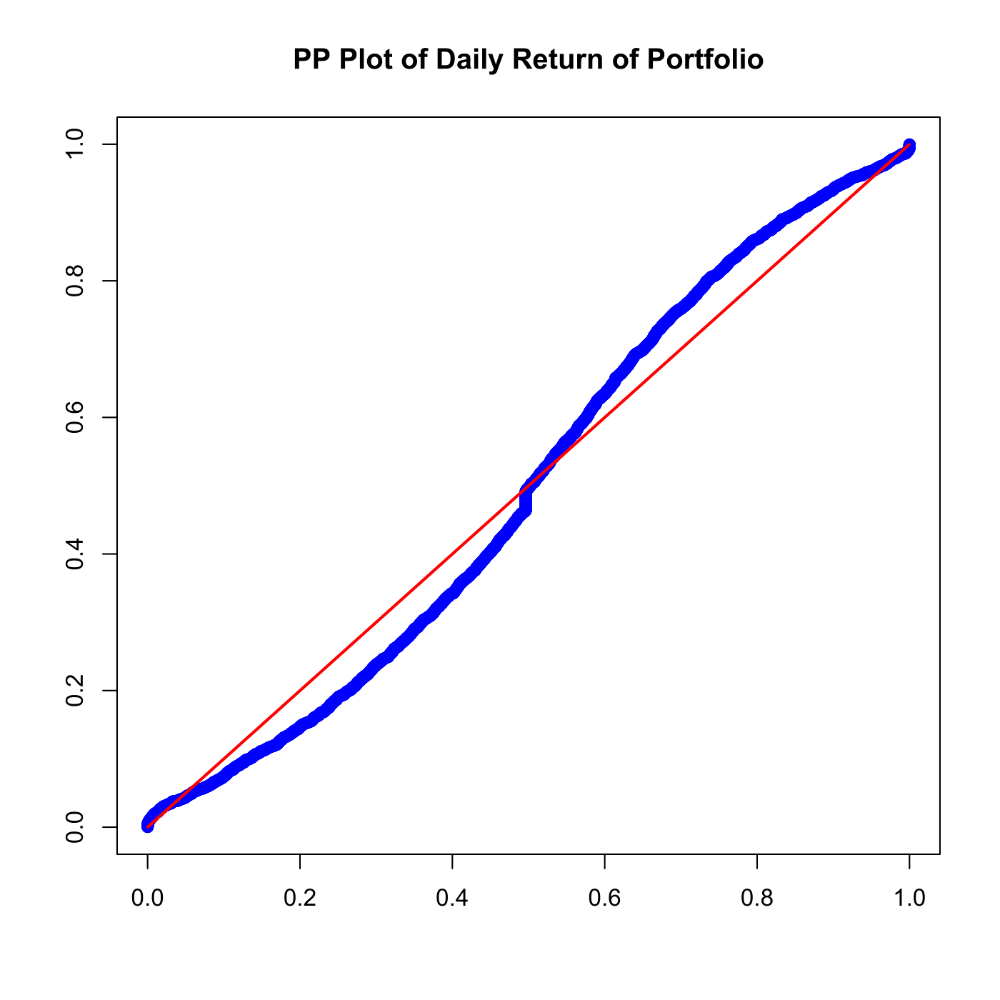
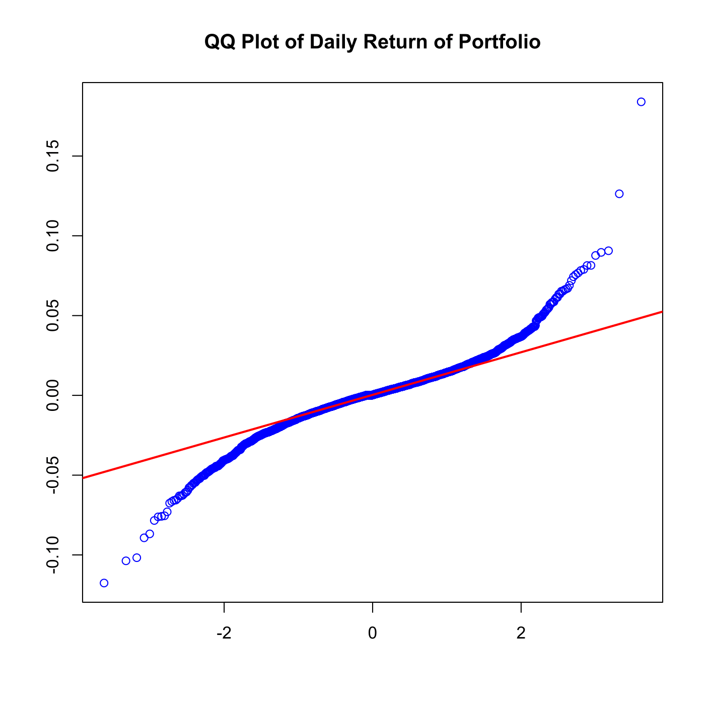

[](http://quantlet.de/)

## [](http://quantlet.de/) **SFEportfolio** [](http://quantlet.de/)

```yaml

Name of QuantLet : SFEportfolio

Published in : Statistics of Financial Markets

Description : 'Produces a PP and a QQ Plot of the portfolio of Bayer, BMW, Siemens and Volkswagen
for the period 1 January 2002 - 31 December 2012, on daily basis.'

Keywords : 'asset, data visualization, dax, financial, graphical representation, plot, portfolio,
pp-plot, qq-plot, returns, stock-price'

See also : 'SFEclose, SFEportlogreturns, SFEtailGEV_pp, SFEtailGEV_qq, SFEtailGPareto_pp,
SFEtailGPareto_qq'

Author : Barbara Choros-Tomczyk, Awdesch Melzer

Submitted : Sat, July 25 2015 by quantomas

Datafiles : BAYER_close_0012.dat, BMW_close_0012.dat, SIEMENS_close_0012.dat, VW_close_0012.dat

```






### R Code:
```r
rm(list = ls(all = TRUE))
graphics.off()

# load data
x1 = read.table("BAYER_close_0012.dat")
x2 = read.table("BMW_close_0012.dat")
x3 = read.table("SIEMENS_close_0012.dat")
x4 = read.table("VW_close_0012.dat")

r1 = diff(as.matrix(log(x1)))
r2 = diff(as.matrix(log(x2)))
r3 = diff(as.matrix(log(x3)))
r4 = diff(as.matrix(log(x4)))

# Variance efficient portfolio
portfolio   = cbind(r1, r2, r3, r4)
opti        = solve(cov(portfolio)) %*% c(1, 1, 1, 1)
opti        = opti/sum(opti)
returns2    = as.matrix(portfolio) %*% opti
x           = returns2

n           = nrow(x)
xf          = apply(x, 2, sort)
t           = (1:n)/(n + 1)
dat1        = cbind(pnorm((xf - mean(xf))/sd(xf)), t)
dat2        = cbind(t, t)

# PP Plot
plot(dat1, col = "blue", ylab = "", xlab = "", main = "PP Plot of Daily Return of Portfolio")
lines(dat2, col = "red", lwd = 2)

# QQ Plot
dev.new()
qqnorm(xf, col = "blue", xlab = "", ylab = "", main = "QQ Plot of Daily Return of Portfolio")
qqline(xf, col = "red", lwd = 2)

```
