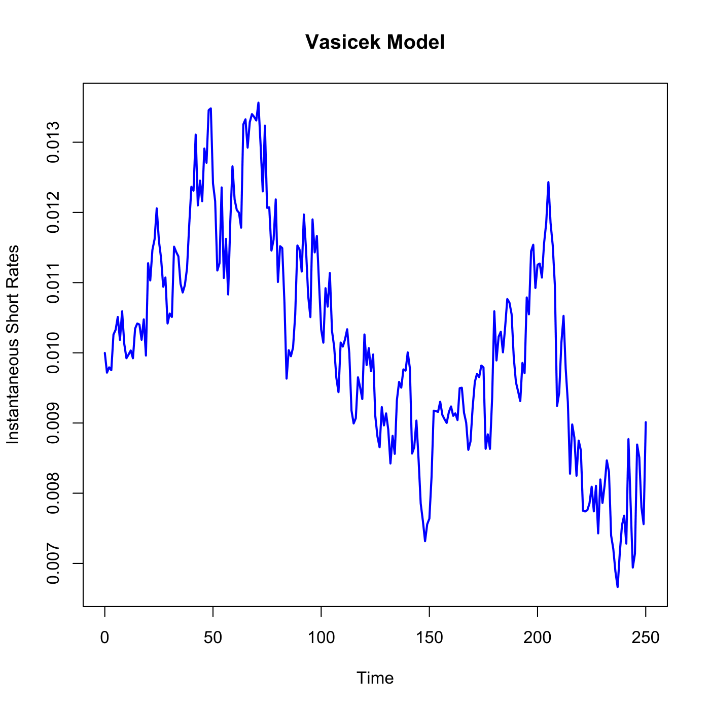

[](http://quantlet.de/)

## [](http://quantlet.de/) **SFEsimVasi** [](http://quantlet.de/)

```yaml

Name of QuantLet : SFEsimVasi

Published in : Statistics of Financial Markets

Description : Simulates and plots a Vasicek process for the instantaneous short term interest rate.

Keywords : 'graphical representation, interest-rate, plot, process, short-rate, simulation,
time-series, vasicek'

See also : SFEVasiml, SFEscomCIR

Author : Li Sun, Awdesch Melzer

Submitted : Sat, July 25 2015 by quantomas

Input: 
- a: adjustment factor
- b: long term average interest rate
- sigma: instantaneous standard deviation
- r0: instantaneous forward rate
- T: time period

Example : An example is produced for a=0.161, b=0.014, sigma=0.009, r0=0.01, T=250.

```




### R Code:
```r
# clear variables and close windows
rm(list = ls(all = TRUE))
graphics.off()

# parameter settings
a     = 0.161   # adjustment factor
b     = 0.014   # long term average interest rate    
sigma = 0.009   # instantaneous standard deviation
r0    = 0.01    # instantaneous forward rate
T     = 250     # time period
dt    = 1       # time intervals
N     = T/dt    # number of time intervals of length dt in long time period T
set.seed(100)

# The initial short rate
R = NULL
R[1] = r0

# Simulation of the short rates
for (i in 1:N) {
    R[i + 1] = R[i] + a * (b - R[i]) * (1/N) + sigma * sqrt(1/N) * rnorm(1, mean = 0, 
        sd = 1)
}

# Plot for the Short Rates vs Time
x = seq(0, T, dt)
plot(x, R, col = "blue", type = "l", lwd = 2, xlab = "Time", ylab = "Instantaneous Short Rates", 
    main = "Vasicek Model") 

```
