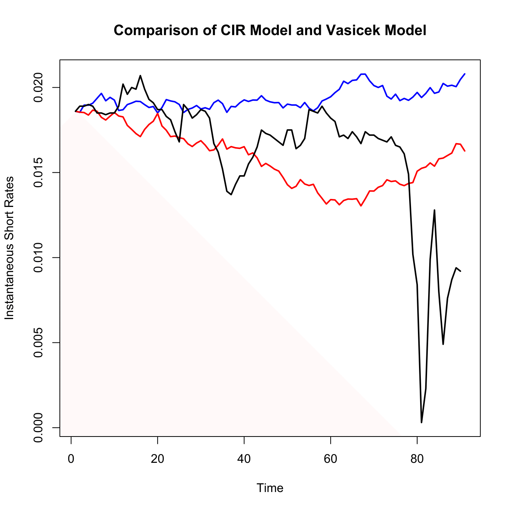

[](http://quantlet.de/)

## [](http://quantlet.de/) **SFEscomCIR** [](http://quantlet.de/)

```yaml

Name of QuantLet : SFEscomCIR

Published in : Statistics of Financial Markets

Description : Compares CIR and Vasicek models with the real data.

Keywords : 'cir, graphical representation, interest-rate, plot, process, short-rate, simulation,
time-series, vasicek'

See also : SFECIRmle, SFEVasiml, SFEcir, SFEcirpricing, SFEsimCIR, SFEsimVasi

Author : Awdesch Melzer, Li Sun

Submitted : Sat, July 25 2015 by quantomas

Datafiles : yield_US3month9808.txt

Input: 
- a: a CIR
- b: b CIR
- sigma: sigma CIR
- a1: a Vasicek
- b1: b Vasicek
- sigma1: sigma Vasicek

Example : 'An example is produced for a=0.221, b=0.020, sigma=0.055, a1=0.161, b1=0.014, sigma1=
0.009.'

```




### R Code:
```r
# clear variables and close windows
rm(list = ls(all = TRUE))
graphics.off()

set.seed(100)

# Load data
x = read.table("yield_US3month9808.txt")

# Parameters of the CIR model (a, b, sigma)
a      = 0.221     # a CIR
b      = 0.02      # b CIR
sigma  = 0.055     # instantaneous standard deviation

# Parameters of the Vasicek model (a1, b1, sigma1)
a1     = 0.161     # a Vasicek
b1     = 0.014     # b Vasicek
sigma1 = 0.009     # sigma Vasicek

T      = 90        # time
dt     = 1         # dt
R0     = 0.0186    # initial rate
N      = T/dt      # Number of time intervals of length dt in long time period T

# The initial short rate
R      = NULL
r      = NULL
R[1]   = R0
r[1]   = R0
R_sum  = 0
r_sum  = 0

# Simulation of the short rates
for (j in 1:10) {
    for (i in 1:N) {
        # CIR model
        R[i + 1] = R[i] + a * (b - R[i]) * (1/N) + sigma * sqrt(R[i]) * sqrt(1/N) * 
            rnorm(1, 0, 1)
    }
    R_sum = R_sum + R
}
Rm = R_sum/10

for (j in 1:10) {
    for (i in 1:N) {
        # Vasicek model
        r[i + 1] = r[i] + a1 * (b1 - r[i]) * (1/N) + sigma1 * sqrt(1/N) * rnorm(1, 
            0, 1)
    }
    r_sum = r_sum + r
}
rm = r_sum/10
y  = x[2601:2690, 1]/100

# Plot for the Short Rates vs Time
plot(Rm, col = "blue", type = "l", lwd = 2, xlab = c("Time"), ylab = c("Instantaneous Short Rates"), 
    ylim = c(min(Rm, rm, y), max(Rm, rm, y)))
lines(rm, col = "red", lwd = 2)
lines(y, col = "black", lwd = 2)
title("Comparison of CIR Model and Vasicek Model") 

```
