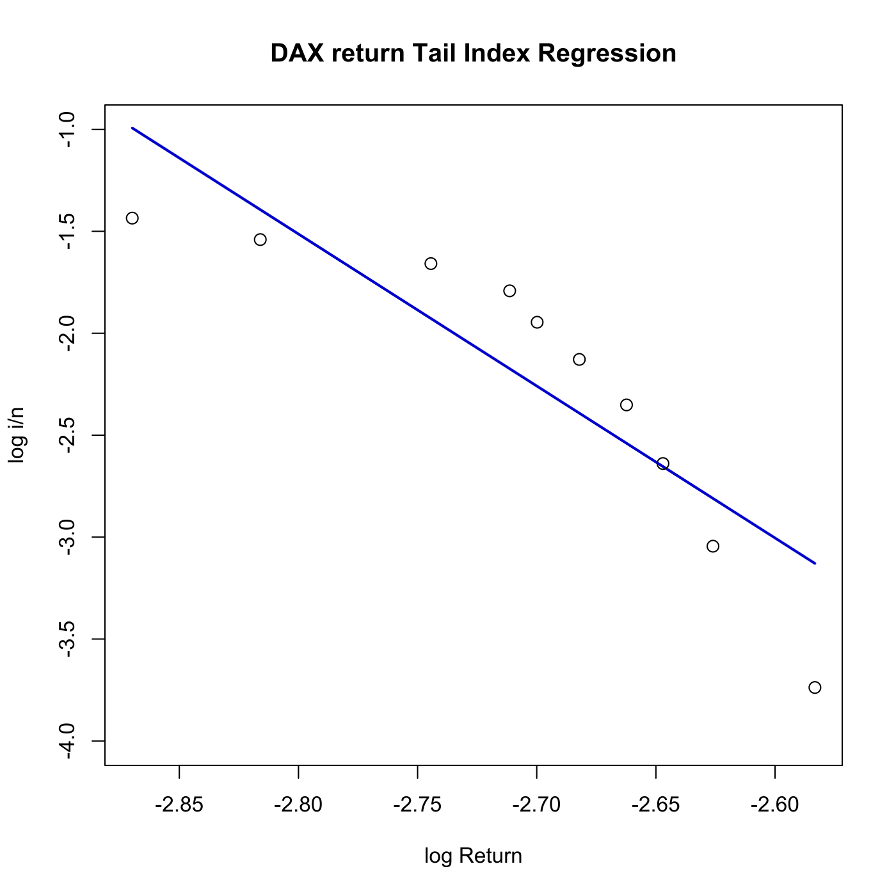
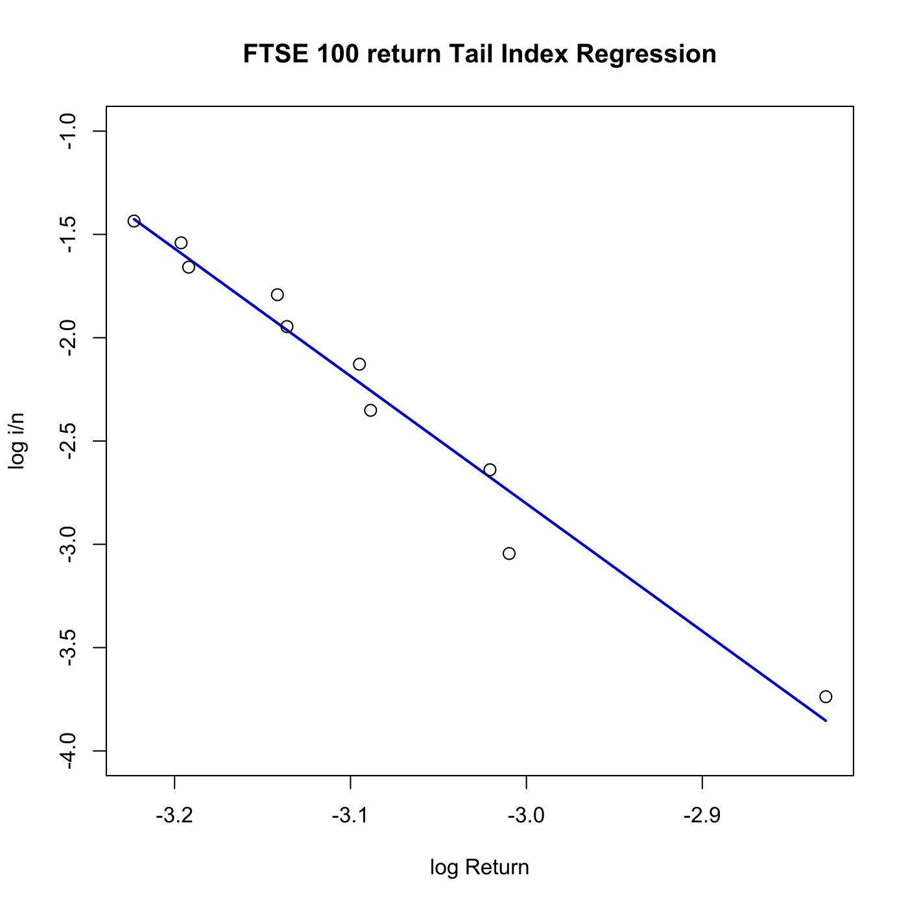

[](http://quantlet.de/)

## [](http://quantlet.de/) **SFEtail** [](http://quantlet.de/)

```yaml

Name of QuantLet : SFEtail

Published in : Statistics of Financial Markets

Description : 'Reads the date, DAX index values, stock prices of 20 largest companies at Frankfurt
Stock Exchange (FSE), FTSE 100 index values and stock prices of 20 largest companies at London
Stock Exchange (LSE) and plots the right sides of the logged empirical distributions of the DAX and
FTSE 100 daily returns from 1998 to 2007 (m=10).'

Keywords : 'asset, data visualization, dax, descriptive-statistics, financial, ftse100, graphical
representation, index, log-returns, plot, regression, returns, stock-price, tail, time-series'

See also : SFElshill, SFEmvol01, SFEmvol03, SFEtimeret, SFEvolgarchest, SFEvolnonparest

Author : Andrija Mihoci, Awdesch Melzer

Submitted : Sun, July 26 2015 by quantomas

Datafiles : FSE_LSE.dat

Example : 'Plots of the tail index regression lines and log observed returns of the DAX index from
1998 to 2007., Plots of the tail index regression lines and log observed returns of the FTSE 100
index from 1998 to 2007.'

```






### R Code:
```r
# clear variables and close windows
rm(list = ls(all = TRUE))
graphics.off()

# install and load packages
libraries = c("matlab", "pracma")
lapply(libraries, function(x) if (!(x %in% installed.packages())) {
    install.packages(x)
})
lapply(libraries, library, quietly = TRUE, character.only = TRUE)

# Read data for FSE and LSE
DS	= read.table("FSE_LSE.dat")
D 	= DS[, 1]  							# date
S 	= DS[, 2:43]  						# S(t)
s 	= log(S)  							# log(S(t))
end	= length(D)
r 	= s[2:end, ] - s[1:(end - 1), ]		# r(t)
n 	= length(r)  						# sample size
t 	= c(1:n)  							# time index, t

# Tail index regression model - estimation of parameters

m1 = 10  # m1 largest observations

rsorted		= apply(r, 2, sort)
rswitched	= flipud(rsorted)

xs1=rswitched[1:m1,]
x1=log(xs1)
ys1 = log(c(1:m1)/n)
y1 	= kronecker(matrix(1, 1, 42), ys1)

pD 	= polyfit(x1[, 1], y1[, 1], 1)
pF 	= polyfit(x1[, 22], y1[, 22], 1)

fD 	= polyval(pD, x1[, 1])
fF 	= polyval(pF, x1[, 22])

# Tail index regression model - plots
plot(x1[, 1], fD, type = "l", col = "blue3", lwd = 2, xlab = "log Return", ylab = "log i/n", 
    ylim = c(-4, -1))
title("DAX return Tail Index Regression")
points(x1[, 1], y1[, 1], cex = 1.2, pch = 1)

dev.new()
plot(x1[, 22], fF, type = "l", col = "blue3", lwd = 2, xlab = "log Return", ylab = "log i/n", 
    ylim = c(-4, -1))
points(x1[, 22], y1[, 22], pch = 1, cex = 1.2)
title("FTSE 100 return Tail Index Regression") 

```
