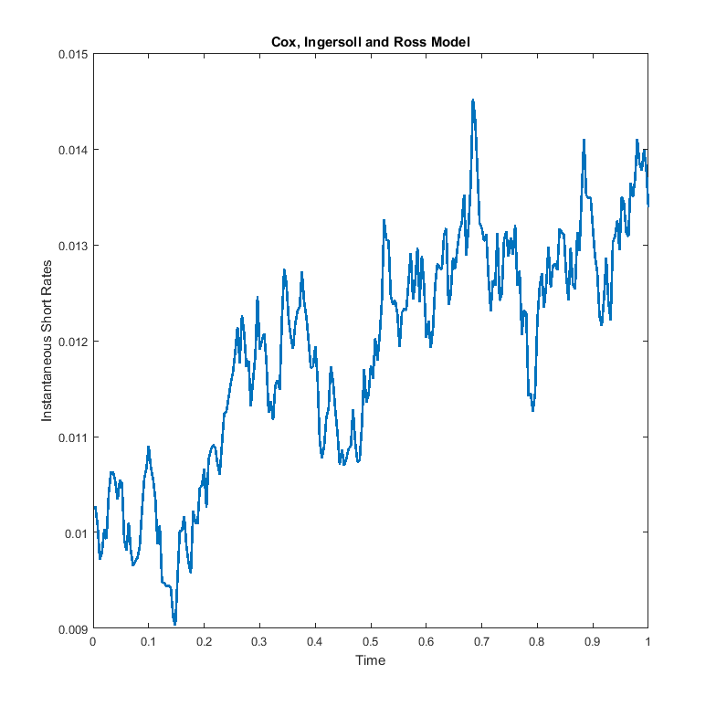

[](http://quantlet.de/)

## [](http://quantlet.de/) **SFEsimCIR2** [](http://quantlet.de/)

```yaml

Name of QuantLet: SFEsimCIR2

Published in: Statistics of Financial Markets

Description: 'Simulates instataneous short rates using the Cox-Ingersol-Ross 
              process. It also plots these simulated rates versus time.'

Keywords: cir, simulation, normal, plot, interest-rate

See also: SFEcapvola, SFEscap, SFEscomCIR, SFEsimCIR, SFEsimVasi, SFEustb, vola

Author: Li Sun, Lasse Groth, Piedad Castro

Submitted: Fri, July 08 2016 by Piedad Castro

Input:
- Tobs: number of observations for the simulation
- a, b, sigma: positive constants, parameters of the CIR model
- r0: initial short rate

```



### MATLAB Code
```matlab

%% clear variables and console and close windows
clear
clc
close all

%% user parameters
Tobs  = 250;
a     = 0.221;
b     = 0.02;
sigma = 0.055;
r0    = 0.01;

dt    = 1/Tobs;

% The initial short rate
r(1) = r0;

% set a seed if you want this simmulation to be reproducible
% rng(123); 

%% Simulation of the short rates
for i = 1:Tobs
    dW = randn * sqrt(dt);
    dr = a * (b - r(i)) * dt + sigma * sqrt(r(i)) * dW;
    r  = [r, r(i) + dr];
end

r = r(2:end);

%% Plot for the simulated Short Rates vs Time
t = (1:Tobs)/Tobs;
plot(t, r, 'LineWidth', 2)
xlabel('Time')
ylabel('Instantaneous Short Rates')
title('Cox, Ingersoll and Ross Model')

```

automatically created on 2018-05-28