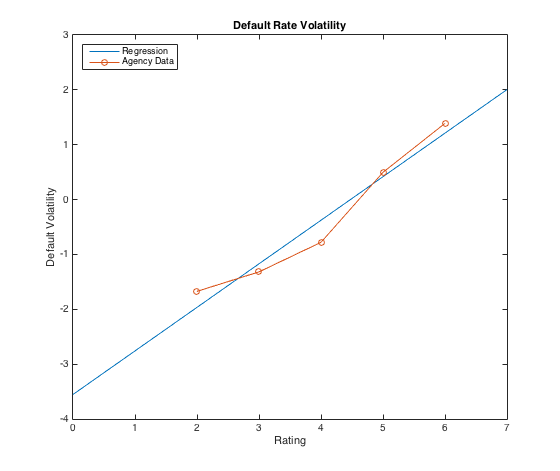
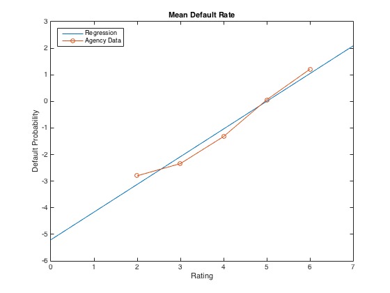

[](http://quantlet.de/)

## [](http://quantlet.de/) **SFEdefault** [](http://quantlet.de/)

```yaml


Name of Quantlet: SFEdefault

Published in: Statistics of Financial Markets 

Description: 'Calculates the historical mean and volatility of default rate 
              bonds belong to different ratings and also the corresponding 
              regression by exponential function fitting. Estimates the asset                     
              correlation using one-factor model.'

Keywords: default rate, regression, volatility, asset correlation 

See also: 'BaseCorrGaussModelCDO, CompCorrGaussModelCDO, ETL, SFEETLGaussTr1,
           SFEbaseCorr, SFEcompCorr, SFEcompCorr, SFEdefaproba, SFEmyfun, 
           lowerTrLossGauss'              

Author[Matlab]: Song Song, Maria Feld

Submitted[Matlab]: Thu, April 28 2016 by Ya Qian

Datafile[Matlab]: SFEMoodydefault.xlsx

Output: 'Historical mean of default rate, default rate volatility, the corresponding                    
         regression by exponential function fitting and the estimated one-factor  
         model asset correlation.'

```





### MATLAB Code
```matlab


clear
clc
close all

%% Input the default frequency data 
default = xlsread('SFEMoodydefault.xlsx','SFEMoodydefault','b2:g96');

%% For mean 

%calculate mean for each rating class
defmean = mean(default);

%calculate the overall mean
ratmean = mean(defmean);

% for each rating
c=(2:6);

%select last 5 classes
y=defmean(:,2:6);

%take log of y
lny=log(y);

%estimate the regression coefficients
p=polyfit(c,lny,1);

% estimate regression values
x=(1:6);
yest=polyval(p,x);

%switch to default probabilities
est = exp(yest);

%increase preciseness FOR TABLE
est1=vpa(est,6);
meanest1=mean(est1);

% plot
figure;
w1=p(:,[2 1]);
w=w1';
T=(0:0.1:7)';
Y=[ones(size(T)) T]*w;
plot(T,Y,'-',c,lny,'-o') 
legend('Regression','Agency Data','Location','NorthWest')
title('Mean Default Rate')
xlabel('Rating')
ylabel('Default Probability')

%% For standard deviation

defvar = std(default);
varmean = mean(defvar);

%for each rating
c1=(2:6);
y1 = defvar(:,2:6);
lny1=log(y1);

%estimating regression
p1=polyfit(c1,lny1,1);
x1=(1:6);

%y estimated
y2=polyval(p1,x1);

%restore to probabilities
esty1=exp(y2);

est2=vpa(esty1,6);
meanest2=mean(est2);

% plot
figure;
w2=p1(:,[2 1]);
w3=w2';
T1=(0:0.1:7)';
Y1=[ones(size(T1)) T1]*w3;
plot(T1,Y1,'-',c1,lny1,'-o') 
legend('Regression','Agency Data','Location','NorthWest')
title('Default Rate Volatility')
xlabel('Rating')
ylabel('Default Volatility')

%% Results
disp('     mean   stand.dev. def.prob. fit.volatility')
disp([defmean'*100 defvar'*100 est'*100 esty1'*100 ])

%For calculating \rho, please use function SFErho.m
```

automatically created on 2018-05-28