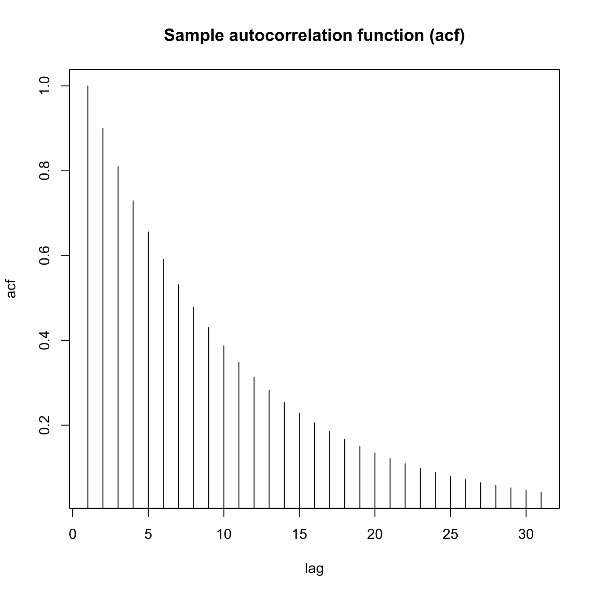
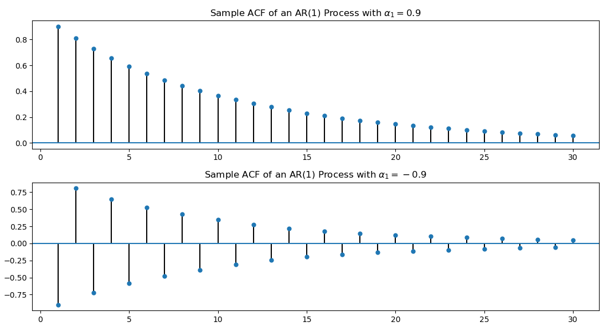

[](http://quantlet.de/)

## [](http://quantlet.de/) **SFEacfar1** [](http://quantlet.de/)

```yaml

Name of QuantLet: SFEacfar1

Published in: Statistics of Financial Markets

Description: 'Plots the autocorrelation function of an AR(1) (autoregressive) process.'

Keywords: acf, autocorrelation, autoregressive, discrete, graphical representation, linear, plot, process, simulation, stationary, stochastic, stochastic-process, time-series

See also: SFEacfar2, SFEacfma1, SFEacfma2, SFEpacfar2, SFEpacfma2, SFEfgnacf

Author: Joanna Tomanek, WK Härdle
Author[Python]: Justin Hellermann

Submitted: Fri, June 13 2014 by Felix Jung, 20190704 changes by WKH
Submitted[Python]: Thu 01 2019 by Justin Hellermann

Input: 
- a : alpha value
- lag : lag value

Example: 
- 1: a=0.9, lag=30
- 2: a=-0.9, lag=30

```






### R Code
```r


# clear variables and close windows
rm(list = ls(all = TRUE))
graphics.off()

# parameter settings, you might want to change these, check also the ACF if you enter e.g. a = -0.9
lag = 30  # lag value
a   = 0.9  # value of alpha_1

# Plot
plot(ARMAacf(ar = a, ma = numeric(0), lag.max = lag, pacf = FALSE), type = "h", 
    xlab = "lag", ylab = "acf")
title("Sample autocorrelation function (acf)")

```

automatically created on 2019-08-01

### PYTHON Code
```python

import pandas as pd
import numpy as np
import statsmodels
from statsmodels.graphics.tsaplots import plot_acf
from statsmodels.tsa.arima_process import ArmaProcess
import matplotlib
import matplotlib.pyplot as plt

# parameter settings
lag = 30    # lag value
n = 1000
a = 0.9

np.random.seed(123)
# Obtain MA(1) sample by sampling from a ARMA() model with no AR coefficient
ar1 = np.array([1,-a])
ma1 = np.array([1])
MA_object1 = ArmaProcess(ar1,ma1)
simulated_data_1 = MA_object1.generate_sample(nsample=50000)

ar1 = np.array([1,a])
ma1 = np.array([1])
MA_object2 = ArmaProcess(ar1,ma1)
simulated_data_2 = MA_object2.generate_sample(nsample=50000)


f, axarr = plt.subplots(2, 1,figsize=(11, 6))
plot_acf(simulated_data_1,lags=lag,ax=axarr[0],zero=False,alpha=None,title='Sample ACF of an AR(1) Process with '+r'$\alpha_1=0.9$')
plot_acf(simulated_data_2,lags=lag,ax=axarr[1],zero=False,alpha=None,title='Sample ACF of an AR(1) Process with '+r'$\alpha_1=-0.9$')
plt.tight_layout()
plt.savefig('SFEacfar1_py.png')
plt.show()
```

automatically created on 2019-08-01