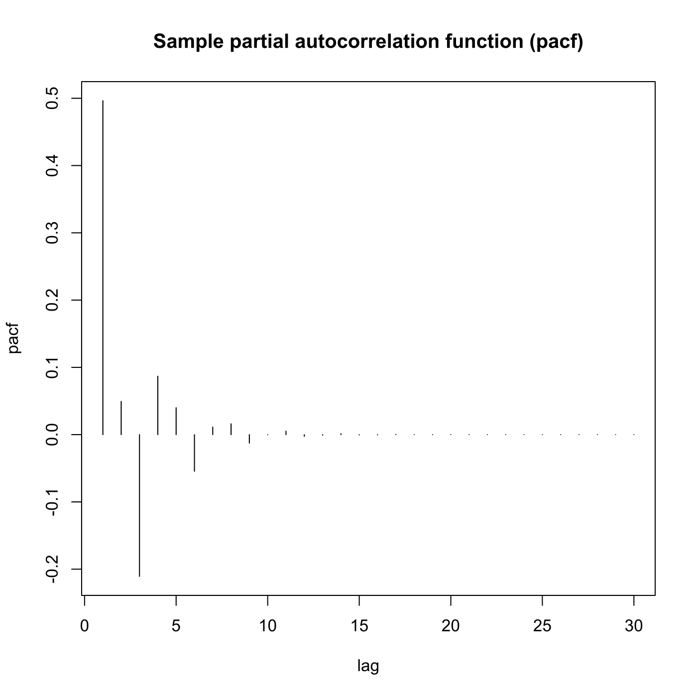
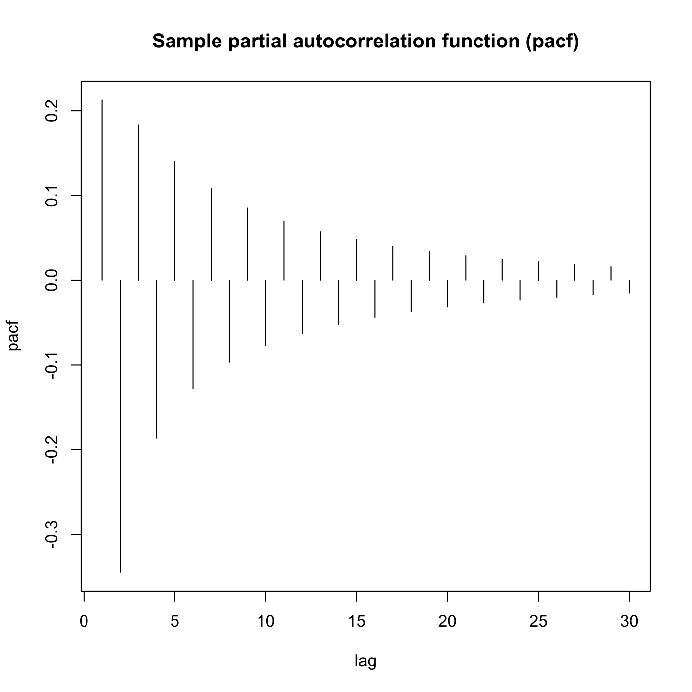
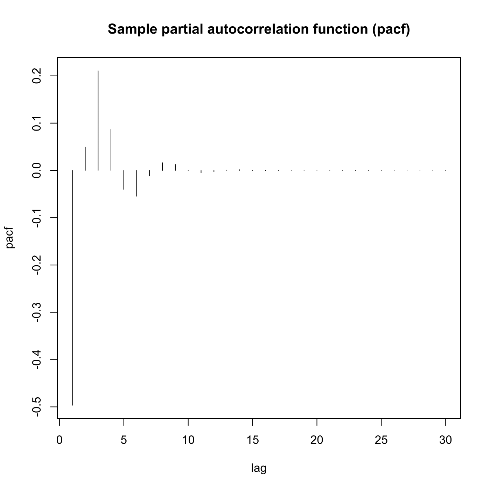
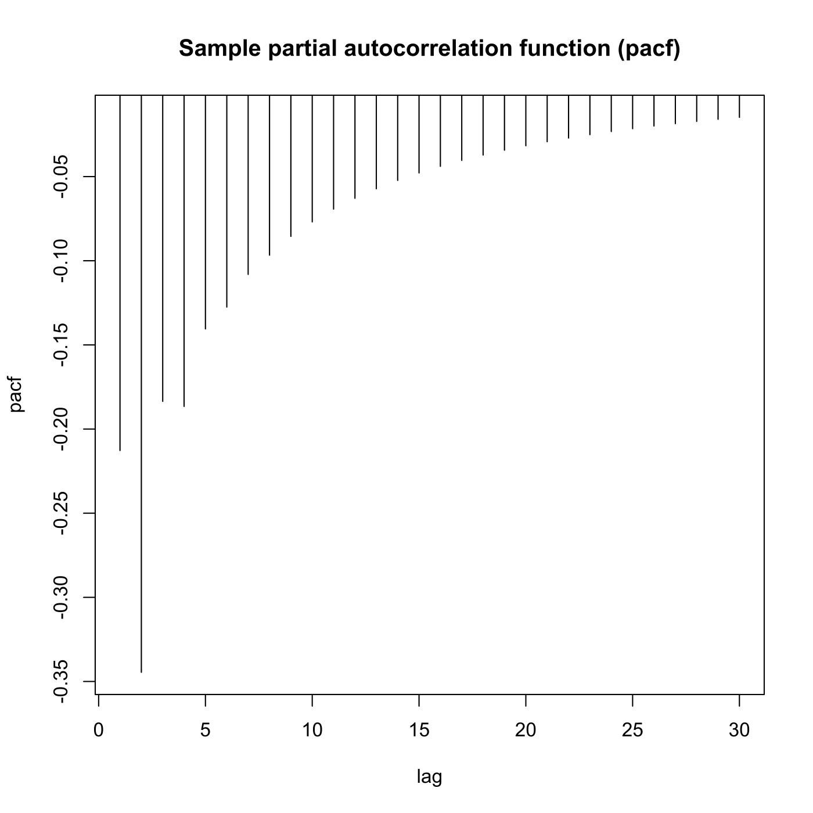

[](http://quantlet.de/)

## [](http://quantlet.de/) **SFEpacfma2** [](http://quantlet.de/)

```yaml

Name of QuantLet : SFEpacfma2

Published in : Statistics of Financial Markets

Description : Plots the partial autocorrelation function of an MA(2) (moving average) process.

Keywords : 'acf, partial, PACF, autocorrelation, moving-average, discrete, graphical
representation, linear, plot, process, simulation, stationary, stochastic, stochastic-process,
time-series'

See also : SFEacfar1, SFEacfar2, SFEacfma1, SFEacfma2, SFEpacfar2, SFEfgnacf

Author : Christian M. Hafner, Ying Chen

Submitted : Tue, June 17 2014 by Franziska Schulz

Input: 
- lag: lag value
- b1: beta_1
- b2: beta_2

Example: 
- 1: b1=0.5, b2=0.4 and lag=30
- 2: b1=0.5, b2=-0.4 and lag=30
- 3: b1=-0.5, b2=0.4 and lag=30
- 4: b1=-0.5, b2=-0.4 and lag=30

```










### R Code:
```r

# clear variables and close windows
rm(list = ls(all = TRUE))
graphics.off()

# parameter settings
lag = "30"  # lag value
b1  = "0.5"  # value of beta_1
b2  = "0.4"  # value of beta_2

# Input beta_1
message = "      give beta1"
default = b1
b1 = winDialogString(message, default)
b1 = type.convert(b1, na.strings = "NA", as.is = FALSE, dec = ".")

# Input beta_2
message = "      give beta2"
default = b2
b2 = winDialogString(message, default)
b2 = type.convert(b2, na.strings = "NA", as.is = FALSE, dec = ".")

# Input lag
message = "      give lag"
default = lag
lag = winDialogString(message, default)
lag = type.convert(lag, na.strings = "NA", as.is = FALSE, dec = ".")

# Plot
plot(ARMAacf(ar = numeric(0), ma = c(b1, b2), lag.max = lag, pacf = TRUE), type = "h", 
    xlab = "lag", ylab = "pacf")
title("Sample partial autocorrelation function (pacf)")


```
