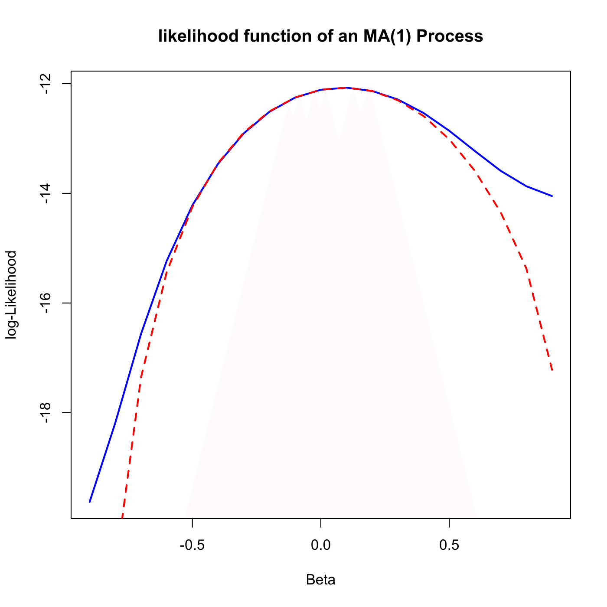

[](http://quantlet.de/)

## [](http://quantlet.de/) **SFElikma1** [](http://quantlet.de/)

```yaml

Name of QuantLet: SFElikma1

Published in: Statistics of Financial Markets

Description: 'Plots the exact and conditional likelihood function of an MA(1) (moving average) process.'

Keywords: discrete, graphical representation, linear, moving-average, plot, process, simulation, stationary, stochastic, stochastic-process, time-series, autoregressive, likelihood, log-likelihood, normal

See also: SFEacfar1, SFEacfar2, SFEacfma2, SFEpacfar2, SFEpacfma2, SFElikgarch, SFElikarch1

Author: Joanna Tomanek, Lasse Groth, WK Härdle

Submitted: Tue, June 17 2014 by Thijs Benschop, 20190704 WKH changed the interface, no more dialogue

Code warning:
- 'In min(Mod(polyroot(c(1, -model$ar)))) :'
- no non-missing arguments to min; returning Inf

Input: 
- beta : moving average coefficient
- n : lags

Example: 
- 1: An example is produced for beta=0.5, n=10.
- 2: An example is produced for beta=0.5, n=20.

```



### R Code
```r


# clear variables and close windows
rm(list = ls(all = TRUE))
graphics.off()

# parameter settings
n    = 100
beta = 0.5

# Simulation of MA(1)-processes as the true values
x = arima.sim(n, model = list(ar = 0, d = 0, ma = beta), rand.gen = function(n) rnorm(n, 
    0, 1))
x = as.matrix(x)

# Estimated values for beta
k = 19
theta = seq(-0.9, by = 0.1, 0.9)

l1 = matrix(1, k, 1)
l2 = l1

for (i in 1:k) {
    b = theta[i]  # beta estimate [i]
    g = diag((b^2 + 1), n, n)
    h1 = diag(b, n - 1, n - 1)
    h = cbind(rbind(0, h1), 0)
    g = g + h + t(h)  # Covariance matrix
    l1[i] = -(n/2) * log(2 * pi) - 0.5 * log(det(g)) - 0.5 * t(x) %*% solve(g) %*% 
        x  # exact Log likelihood 
    arcoeff = (-b)^(1:(n - 1))  # coefficients of AR(1) process for lag=2:10
    e = matrix(1, n, 1)
    
    # Approximation of errors
    e[1] = x[1]
    for (t in 2:10) {
        e[t] = x[t] + sum(t(arcoeff[1:(t - 1)]) * x[(t - 1):1])
    }
    l2[i] = -(n/2) * log(2 * pi) - 0.5 * sum(e^2)  # Conditional log likelihood
}

# Plots
dat1 = cbind(theta, l1)
plot(dat1, col = 4, xlab = "Beta", ylab = "log-Likelihood", main = "likelihood function of an MA(1) Process", 
    type = "l", lwd = 2)
dat2 = cbind(theta, l2)
points(dat2, type = "l", col = 2, lty = 2, lwd = 2)

```

automatically created on 2019-07-04