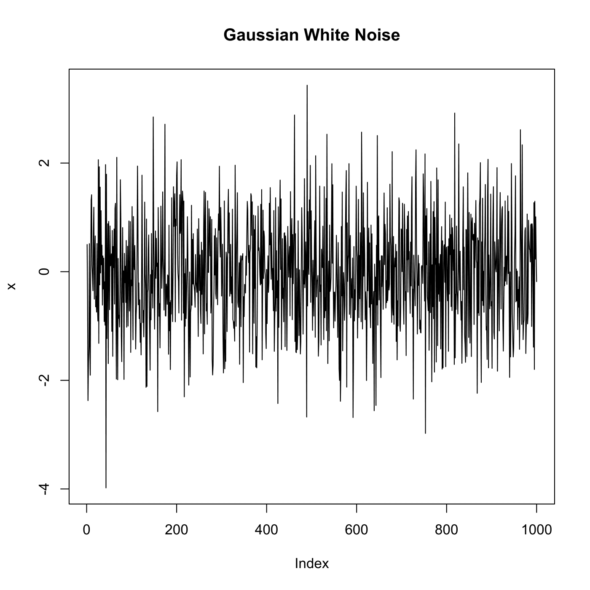

[](http://quantlet.de/)

## [](http://quantlet.de/) **SFEtimewn** [](http://quantlet.de/)

```yaml

Name of QuantLet : SFEtimewn

Published in : Statistics of Financial Markets

Description : Plots the time series of a Gaussian white noise.

Keywords : 'distribution, normal, normal-distribution, simulation, stochastic-process, stochastic,
process, white noise, gaussian, time-series, plot, graphical representation'

See also : SFEtimegarch, SFEtimedax

Author : Joanna Tomanek

Submitted : Fri, June 13 2014 by Felix Jung

```




### R Code:
```r

# clear variables and close windows
rm(list = ls(all = TRUE))
graphics.off()

x = rnorm(1000)  # Generate random normal distributed variable
plot(x, main = "Gaussian White Noise", type = "l")  # Plot
```
