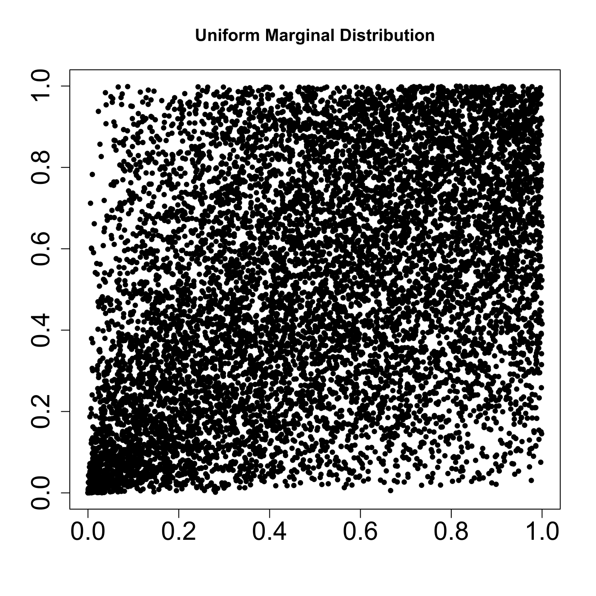
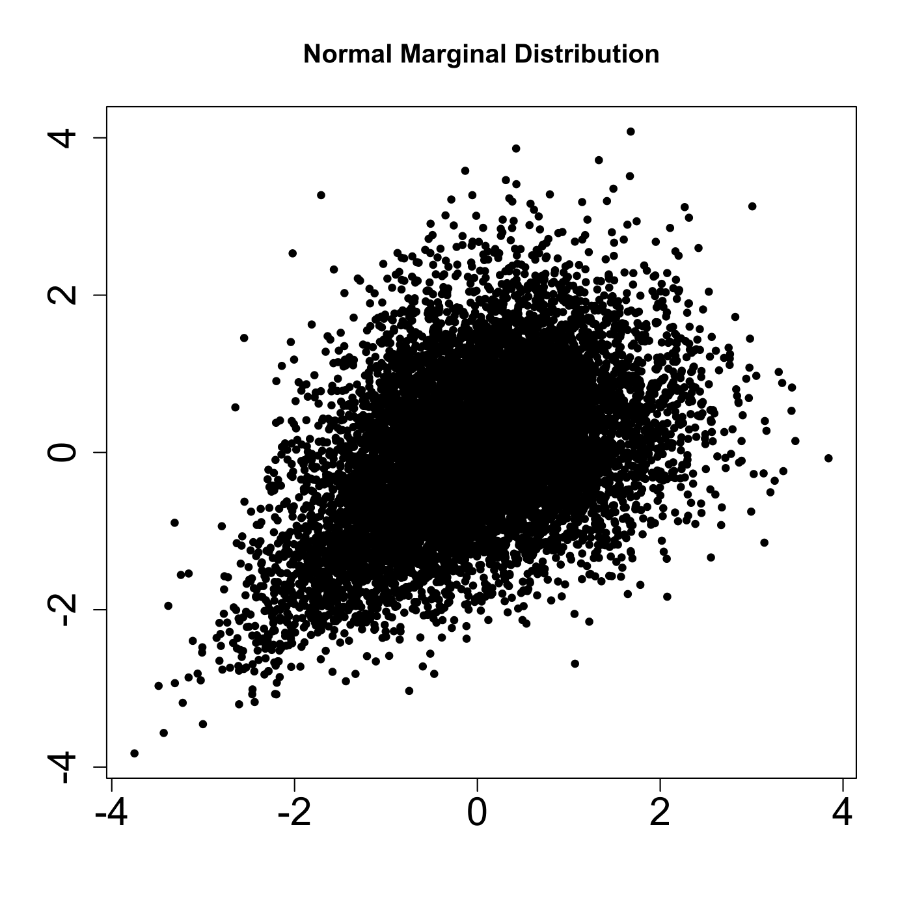

[](http://quantlet.de/index.php?p=info)

## [](http://quantlet.de/) **SFEclaytonMC** [](http://quantlet.de/d3/ia)

```yaml

Name of QuantLet : SFEclaytonMC

Published in : Statistics of Financial Markets

Description : 'Plots two pseudo random variables with uniform distribution and N(0,1) distribution
with dependence structure given by Clayton copula, theta=0.79.'

Keywords : 'copula, distribution, normal, normal distribution, uniform, plot, graphical
representation, clayton, random'

See also : 'SFEplotCop, SFEstaticCop, SFEtCop, SFEVaRcopulaSIM2ptv, SFEArchCopDensity,
BCS_ClaytonMC, SFEfrechet, SFEgaussCop, SFEresDens, SFEtMC, SFScontourgumbel, SFEgaussCop'

Author : Ostap Okhrin

Submitted : Mon, November 10 2014 by Felix Jung

Example : 
- 1: 'Monte Carlo sample of 10.000 realizations of pseudo random variable with uniform
marginals in [0,1] with clayton (theta=0.79) dependence structure.'
- 2: 'Monte Carlo sample of 10.000 realizations of pseudo random variable with standard
normal marginals with clayton (theta=0.79) dependence structure.'

```






```r

# clear variables and close windows
rm(list = ls(all = TRUE))
graphics.off()

# install and load packages
libraries = c("copula")
lapply(libraries, function(x) if (!(x %in% installed.packages())) {
install.packages(x)
})
lapply(libraries, library, quietly = TRUE, character.only = TRUE)

theta = 0.79  # Set theta [0,1]

# Variables uniformly distributed:
uniclayMVD = mvdc(claytonCopula(theta), margins = c("unif", "unif"), paramMargins = list(list(min = 0, 
    max = 1), list(min = 0, max = 1)))
uniclay = rMvdc(uniclayMVD, n = 10000)

# Variables standard normally distributed:
normclayMVD = mvdc(claytonCopula(theta), margins = c("norm", "norm"), paramMargins = list(list(mean = 0, 
    sd = 1), list(mean = 0, sd = 1)))
normclay = rMvdc(normclayMVD, n = 10000)

# Set up plotting grid
plot(uniclay, main="Uniform Marginal Distribution", xlab = "", ylab = "", cex = 0.7, pch = 19, cex.axis = 1.8)
dev.new()
plot(normclay, main="Normal Marginal Distribution", xlab = "", ylab = "", cex = 0.7, pch = 19, cex.axis = 1.8)
```
