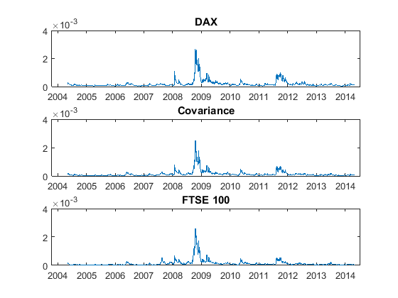

[](http://quantlet.de/)

## [](http://quantlet.de/) **SFEmvol2** [](http://quantlet.de/)

```yaml

Name of QuantLet: SFEmvol2

Published in: Statistics of Financial Markets

Description: 'Estimates parameters of a multivariate GARCH model for the daily log-returns 
of DAX and FTSE100 from 10.05.2004 to 07.05.2014. It also plots the estimated variance and 
covariance processes.'

Keywords: covariance, garch, multivariate analysis, volatility, log-returns

See also: SFEmvol1

Author: Andrija Mihoci, Kevin Sheppard

Submitted: Wed, Nov 16 2016 by Piedad Castro

Datafile: 2004-2014_dax_ftse.csv

Input: 'The datafile contains daily price data from 07.05.2004 to 07.05.2014 for 
selected companies which are part of DAX30 and FTSE100 as well as the 
corresponding index data. This code makes only use of the date and DAX variables.'

Output:
- Par: vector of estimated parameters
- L: log-likelihood function sum
- plot of the estimated variance and covariance processes


```

