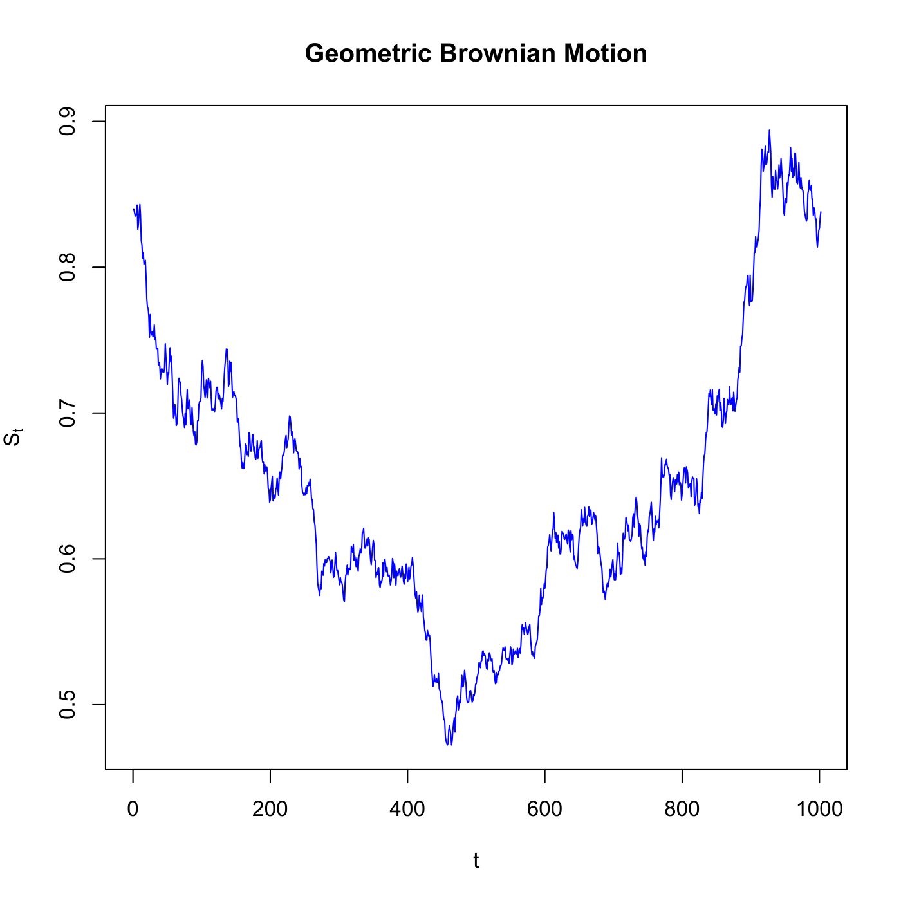
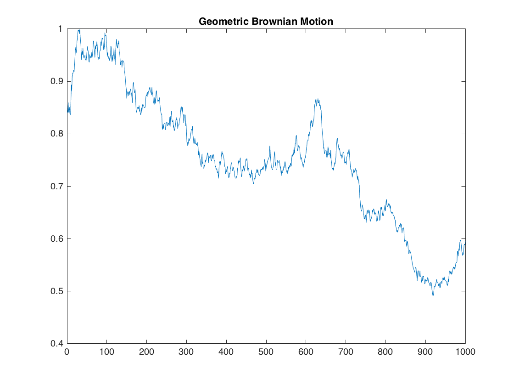
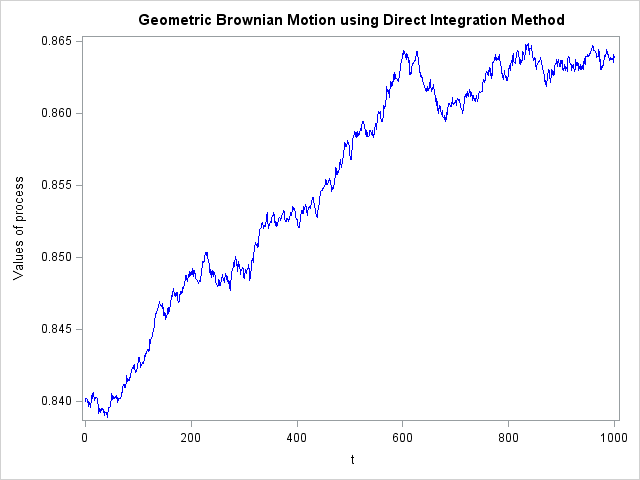

[](http://quantlet.de/)

## [](http://quantlet.de/) **SFEGBMProcess** [](http://quantlet.de/)

```yaml

Name of QuantLet : SFEGBMProcess

Published in : Statistics of Financial Markets

Description : 'Simulation of discrete observations of a Geometric Brownian Motion (GBM) via direct
integration (method=1) or Euler scheme (method=2). The process follows the stochastic differential
equation: dX(t) = mu X(t) dt + sigma X(t) dW(t).'

Keywords : 'Euler, brownian-motion, direct integration, discrete, geometric-brownian-motion,
graphical representation, normal-distribution, plot, process, random-number-generation, simulation,
stochastic, stochastic-process, wiener-process'

See also : SFEsimGBM, SFEbsbm, SFEDeltaHedging, SFEWienerProcess, SFSbb, SFEwienerdens, SFEsimCIR

Author : Alexander Ristig

Author[Matlab] : Ekaterina Ignatieva

Author[SAS] : Daniel T. Pele

Submitted : Tue, June 17 2014 by Franziska Schulz

Input: 
- method: 'type of method used: 1 - direct integration, 2 - Euler scheme'

Example : 'A plot of typical path of a geometric brownian motion is provided for the case n=1,
x0=0.084, mu=0.02, sigma=sqrt(0.1) delta=1/1000.'

```








### R Code:
```r

# clear variables and close windows
rm(list = ls(all = TRUE))
graphics.off()

print("Please input method type as: 1 - Direct Integration, 2 - Euler Scheme")
method = 1  # if you want to apply Euler Scheme take 2 instead of 1

n      = 1
x_0    = 0.84
mu     = 0.02
sigma  = sqrt(0.1)
delta  = 1/1000
t      = c(0:ceiling(n/delta))
dimt   = dim(t(t))
x      = array(1, dim = dimt)
x[1]   = x_0
no     = rnorm((dimt[2] - 1), mean = 0, sd = 1) * sqrt(delta)

if (method == 1) {
    x = x_0 * exp(cumsum((mu - 0.5 * sigma^2) * delta + sigma * no))
}
{
    for (i in 2:dimt[2]) {
        x[i] = x[i - 1] + mu * x[i - 1] * delta + sigma * x[i - 1] * no[i - 1]
    }
}

if (method == 1) {
    x = c(x_0, x)
}
x = c(t(x))

# plot
par(mfrow = c(1, 1))
margins = c(1, 1, 1, 1)
plot(x, type = "l", col = "blue", main = "Geometric Brownian Motion", xlab = "t", 
    ylab = expression(S[t]), xlim = c(0, 1000))

```

### MATLAB Code:
```matlab
clear all
close all
clc

% user inputs parameters
disp('Please input method type as: 1 - Direct Integration, 2 - Euler Scheme') ;
disp(' ') ;
method = input('Input method ');
disp(' ') ;

% set parameters
n     = 1;
x0    = 0.84;
mu    = 0.02;
sigma = sqrt(0.1);
delta = 1 / 1000;

% main computation
t     = (0:ceil(n / delta));
sizet = size(t);
for i = 1:sizet(1, 2)
    aux(i) = 1;
end
x    = aux';
x(1) = x0;
no   = normrnd(0, 1, sizet(1, 2) - 1, 1) * sqrt(delta);

if method == 1 
    x = x0 * exp(cumsum((mu - 0.5 * sigma ^ 2) * delta + sigma .* no));
    x = [x0; x];
else
    i = 2;
    while (i <= sizet(1, 2))
        x(i) = x(i - 1) + mu * x(i - 1) * delta + sigma * x(i - 1) * no(i - 1);
        i    = i + 1;
    end
end

% output
plot(x)
title('Geometric Brownian Motion')
xlim([0 1000])
```

### SAS Code:
```sas

goptions reset = all;

**********************************************************************
*Please input method type as: 1 - Direct Integration, 2 - Euler Scheme.
**********************************************************************;

%let method	  = 	2;	*By default the method of Direct Integration. Put 2 for Euler Scheme;	


**********************************************************************
*Please input parameters! 
**********************************************************************;

%let x0		  =   0.84; *Input intial value;
%let mu  	  =   0.02; *Input mean;
%let sigma 	  =   0.01; *Input sigma;
%let obs	  =   1000; *Input number of observations;

*Main computation;

proc iml;
n 		= 1;
x0 		= &x0;
mu 		= &#956;
sigma 	= &#963;
delta 	= 1/&obs;

t = (0:floor(n/delta))`;
x = j(nrow(t),1,0);
no = j(nrow(t)-1,1,0);

call randgen(no, "Normal");  *Generate random normal numbers;
no = no*sqrt(delta);


*Compute Geometric Brownian Motion by Direct Integration;
if &method = 1 then do;
    x  = ( x0||(x0 * exp(cusum((mu - 0.5*sigma**2)*delta + sigma*no )))`)`;
end;
*Compute Geometric Brownian Motion by Euler Scheme;
if &method = 2 then do;
x[1,1] = x0;
do i = 2 to nrow(t);
    x[i,1]  =  x[i-1,1] + mu*x[i-1,1]*delta + sigma*x[i-1,1]*no[i-1,1];
end;
end;

x = x||t;
*create dataset GBM;

create gbm from x; append from x;
close gbm;

if &method=1 then  vmethod='Direct Integration Method';
else vmethod='Euler Scheme Method';

call symput ('vmethod',vmethod);
quit;


*Plot the graph of Geometric Brownian Motion;

data gbm;set gbm;
rename col1  =  GBM 
	   col2  =  t;

title Geometric Brownian Motion using &vmethod;

proc sgplot data  =  gbm;
series x  =  t y  =  gbm/lineattrs  =  (color  =  blue THICKNESS  =  1.5);
yaxis label  =  'Values of process';
run;
quit;

```
