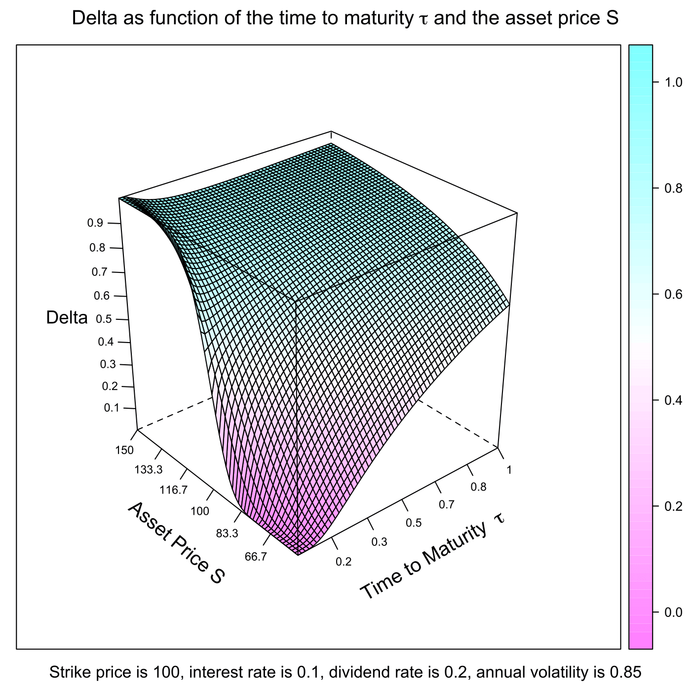
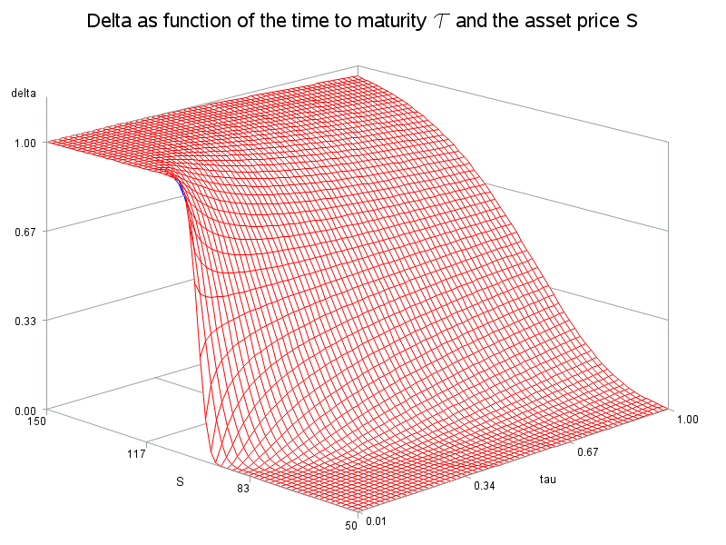

[](http://quantlet.de/)

## [](http://quantlet.de/) **SFEdelta** [](http://quantlet.de/)

```yaml

Name of QuantLet : SFEdelta

Published in : Statistics of Financial Markets

Description : 'Plots the Delta of a call option as a function of the time to maturity and the asset
price.'

Keywords : 'asset, black-scholes, call, european-option, financial, graphical representation,
greeks, option, option-price, plot'

See also : 'SFEvanna, SFEvolga, SFEgamma, SFEvega, SFEtheta, SFEspeed, SFEcharmcall, SFEcolor,
SFEultima, SFEvomma, SFEzomma, SFEdvegadtime'

Author : Ying Chen, Christian M. Hafner

Author[SAS] : Daniel T. Pele

Submitted : December 04 2011 by Dedy Dwi Prastyo; Dec 25 2015 by Lukas Borke

Submitted[Matlab] : December 04 2011 by Dedy Dwi Prastyo; May 19 2016 by Petra Burdejova

Submitted[SAS] : Tue, June 17 2014 by Franziska Schulz

Example : 'For given [lower, upper] bound of Asset price S like [50,150] and [lower, upper] bound
of time to maturity tau like [0.01, 1] a plot of the Delta of a call option is produced.'

```

.png)






### R Code:
```r

# clear variables and close windows
rm(list = ls(all = TRUE))
graphics.off()

# install and load packages
libraries = c("lattice")
lapply(libraries, function(x) if (!(x %in% installed.packages())) {
install.packages(x)
})
lapply(libraries, library, quietly = TRUE, character.only = TRUE)

# parameter settings
S_min   = 50          # lower bound of Asset Price
S_max   = 150         # upper bound of Asset Price 
tau_min = 0.01        # lower bound of Time to Maturity
tau_max = 1           # upper bound of Time to Maturity
K       = 100         # exercise price
r       = 0.1         # riskfree interest rate                  
sig     = 0.85        # volatility               
d       = 0.2         # dividend rate                
steps   = 60          # steps 

Tau = seq(tau_min, tau_max, by = (tau_max - tau_min)/(steps - 1))
S   = seq(S_max, S_min, by = -(S_max - S_min)/(steps - 1))

delta = function(Tau, S, K, r, d, sig) {
    y = (log(S/K) + (r - d + sig^2/2) * Tau)/(sig * sqrt(Tau))
    return(pnorm(y + sig * sqrt(Tau)))
}

mesh = outer(Tau, sort(S), delta, K = K, r = r, d = d, sig = sig)
title = bquote(expression(paste("Strike price is ", .(K), ", interest rate is ", 
    .(r), ", dividend rate is ", .(d), ", annual volatility is ", .(sig))))

# Plot
wireframe(mesh, drape = T, main = expression(paste("Delta as function of the time to maturity ", 
    tau, " and the asset price S")), sub = title, scales = list(arrows = FALSE, 
    col = "black", distance = 1, tick.number = 8, cex = 0.7, x = list(labels = round(seq(tau_min, 
        tau_max, length = 7), 1)), y = list(labels = round(seq(S_min, S_max, length = 7), 
        1))), xlab = list(expression(paste("Time to Maturity  ", tau)), rot = 30, 
    cex = 1.2), ylab = list("Asset Price S", rot = -40, cex = 1.2), zlab = list("Delta", 
    cex = 1.1))

```

### MATLAB Code:
```matlab
% user inputs parameters
disp('Please input [lower, upper] bound of Asset price S as: [50,150]') ;
disp(' ') ;
para=input('[lower, upper] bound of S =');
while length(para) < 2
  disp('Not enough input arguments. Please input in 1*2 vector form like [50,150] or [50 150]');
  para=input('[lower, upper] bound of S=');
end
S_min = para(1);
S_max = para(2);

disp(' ') ;
disp('Please input [lower, upper] bound of time to maturity tau as: [0.01, 1]') ;
disp(' ') ;
para2=input('[lower, upper] bound of tau =') ;
while length(para2) < 2
  disp('Not enough input arguments. Please input in 1*2 vector form like [0.01, 1] or [0.01 1]');
  para2=input('[lower, upper] bound of tau =');
end
tau_min=para2(1);
tau_max=para2(2);

% main computation
K     = 100;                   % exercise price 
r     = 0   ;                  % interest rate
sig   = 0.25 ;                 % volatility
d     = 0;                     % dividend rate
b     = r-d;                   % cost of carry
steps = 60;

[tau,dump] = meshgrid([tau_min:(tau_max-tau_min)/(steps-1):tau_max]);
[dump2,S]  = meshgrid([S_max:-(S_max-S_min)/(steps-1):S_min]);

d1    = (log(S/K)+(r-d+sig^2/2).*tau)./(sig.*sqrt(tau));
delta = normcdf(d1);

% plot
mesh(tau,S,delta);
title('Delta')
ylabel('Asset Price S');
xlabel('Time to Maturity \\tau');

```

### SAS Code:
```sas

* Reset the working evironment;
goptions reset = all;
proc datasets lib = work nolist kill;
run;

***************************************************************************
..................Please input the parameters!.............................
***************************************************************************;

%let S_min 	= 50	;     *Lower Bound of Asset Price S;
%let S_max 	= 150 ;    *Upper Bound of Asset Price S;
%let tau_min	= 0.01 ;   *Lower Bound of Time to Maturity tau;
%let tau_max 	= 1	;     *Upper Bound of Time to Maturity tau;

* main computation;

proc iml;
S_min = &S_min; S_max = &S_max; tau_min = &tau_min; tau_max = &tau_max;

K      = 100;                   * exercise price; 
r      = 0   ;                  * interest rate;
sig    = 0.25 ;                 * volatility;
d      = 0;                     * dividend rate;
b      = r-d;                   * cost of carry;
steps  = 60;

*Computing tau;

tau = j(steps,steps,0);

do i = 1 to nrow(tau);
tau[i,] = (0:59)*(tau_max-tau_min)/(steps-1) +tau_min;
end;

*Computing S;

S = j(steps,steps,0);
do i = 1 to nrow(tau);
S[,i] = (0:59)`*(-(s_max-s_min)/(steps-1)) +s_max;
end;

*Computing delta;

d1 = (log(S/K)+(r-d+sig**2/2)*tau)/(sig*sqrt(tau));
delta  =  cdf('Normal',d1);

*Creating frid for 3d surface plot;

S = (shape(S,1))`;
delta = (shape(delta,1))`;
tau = (shape(tau,1))`;
d3d = S||delta||tau;

create d3d from d3d; append from d3d;
close d3d;

quit;


data d3d;set d3d;
rename col1 = S col2 = delta col3 = tau;

*Plot the 3d surface graph;

 title h = 2 f = default 'Delta as function of the time to maturity ' 
h = 3 f = greek '74'x h = 2 f = default ' and the asset price S';
proc g3d data = d3d ;
 plot S*tau = delta/  cbottom = blue ctop = red 
 rotate = 45 
grid zmin = 0 zmax = 1 ;
run;
quit;

*The following section creates an animated 3D plot;

/* Designate a GIF file for the G3D output, like below. */
filename anim 'd:delta.gif'; 
** Set the GOPTIONs necessary for the **/
/** animation. **/;
goption reset dev=gifanim gsfmode=replace
border gsfname=anim xpixels=640 ypixels=480 iteration=0 delay=60 gepilog='3B'x
/* add a termination char to the end of the GIF file */
disposal=background; 

proc g3d data = d3d ;
 plot S*tau = delta/  cbottom = blue ctop = red 
 rotate = 45 to 350 by 10 
grid zmin = 0 zmax = 1 ;
run;
quit;


*Open the file 'd:delta.gif' and enjoy the 3D animation;

```
